# DSP STM32 1_CMSIS DSP库的移植

## 1. CMSIS DSP库的移植

### 官方 CMSIS 库移植

略

### STM32CubeMX 移植

1. CMSIS DSP库架构介绍

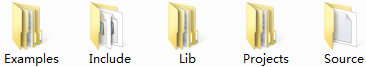

- `Examples`文件夹为DSP库使用例程：

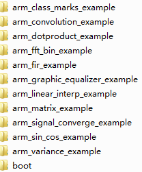

- `Include`文件夹为DSP库的头文件：

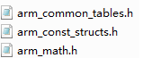

- `Lib`文件夹为DSP库的库文件：

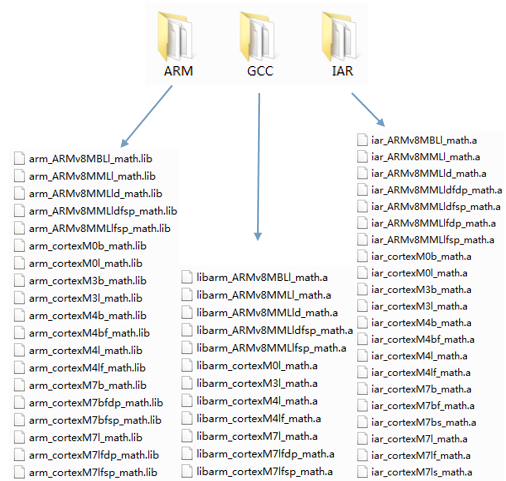

- `Projects`文件夹提供了三个版本的工程模板。
- `Source`文件夹为DSP的源码文件：

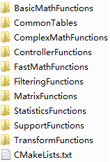

2. DSP库版本的区别

以 ARM 版本为例：

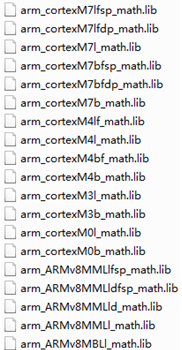

> `arm_cortexM4lf_math.lib`：Cortex-M4内核，l表示小端格式，f表示带FPU单元，M4仅支持Single Precision单精度浮点。
>
> `arm_cortexM4l_math.lib`：Cortex-M4内核，l表示小端格式。
>
> `arm_cortexM4bf_math.lib`：Cortex-M4内核，b表示大端格式，f表示带FPU单元，M4仅支持Single Precision单精度浮点。
>
> `arm_cortexM4b_math.lib`：Cortex-M4内核，b表示大端格式。

3. STM32CubeMX CMSIS DSP库的移植

1. 在工程中点击`Software Packs`

2. 选择`X-CUBE-ALGOBUILD`进行下载

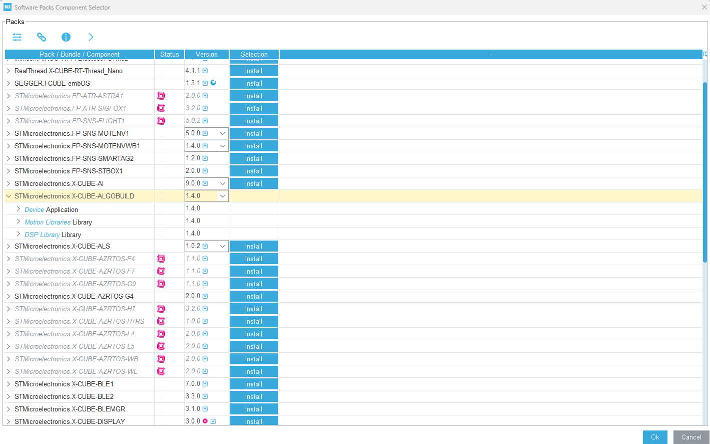

3. 选中 DSP 库

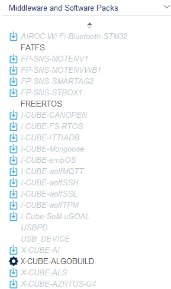

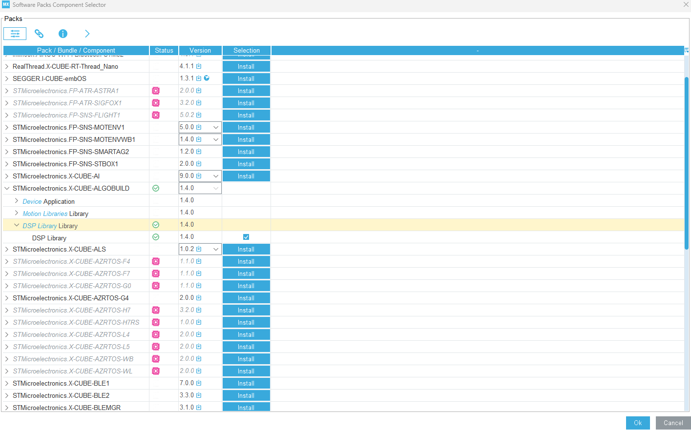

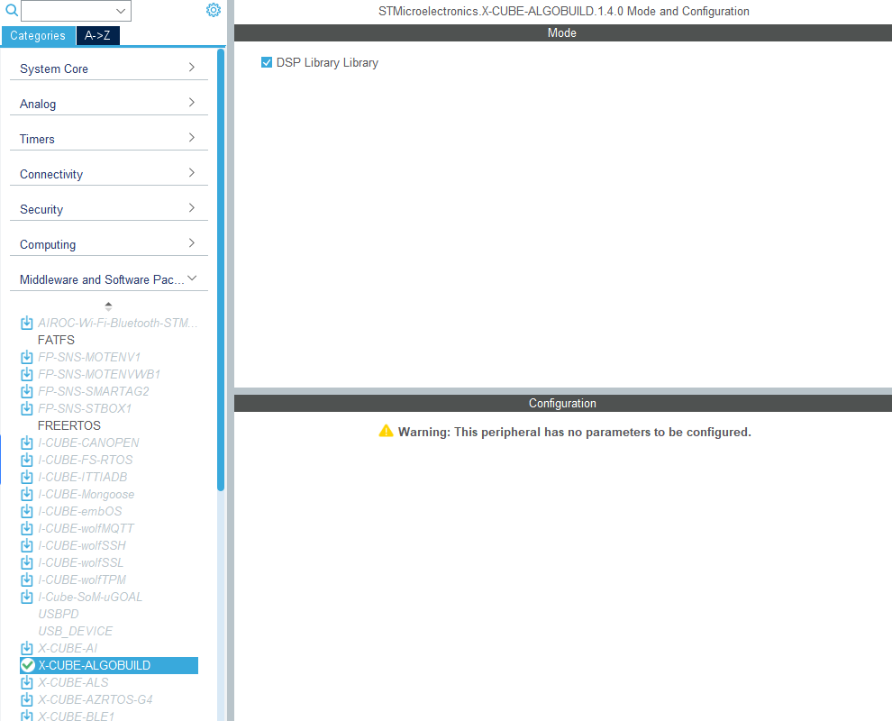

4. GCC 工程中 CMSIS DSP 库的移植

> 本笔记记录使用 EIDE 的移植过程，如果使用其他(ARM,STM32CubeIDE)移植，和本方法略有差别。

1. 添加全局宏定义：`__TARGET_FPU_VFP`，`ARM_MATH_CM4`。
2. 添加库搜索目录：`Middlewares/ST/ARM/DSP/Lib`
3. 添加链接指令：`-l:libarm_cortexM4lf_math.a`

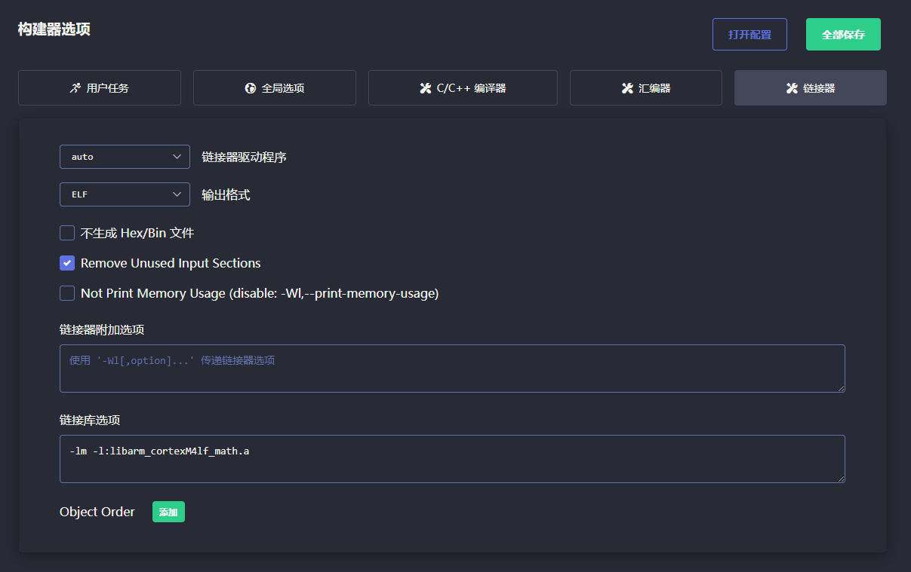

4. 硬件浮点选项选择`single`，编译选项选择`hard`即可。