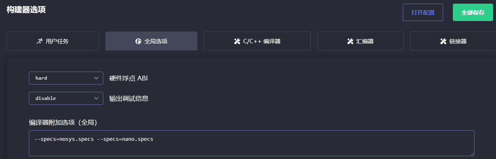

# DSP STM32 1_CMSIS DSP库的移植

## 1. FPU 介绍

浮点运算单元是处理器内部用于执行浮点数计算的逻辑部件，或者说硬件电路。不是所有的处理器都有该功能（Cortex M4以上的内核中会有 FPU 单元，支持单精度浮点数运算；对于Cortex M7，可以支持双精度浮点数运算）。浮点运算满足IEEE 754的标准，所谓IEEE 754标准，定义了浮点数字的存储和计算方式、计算异常等，比如IEEE 754标准准确地定义了单精度（32位）和双精度（64位）浮点格式。

对于含有FPU的处理器，可以通过控制编译选项的方式使编译器编译出的代码使用FPU指令。

1. Keil 中打开 FPU

如果不调用`<math.h>`，FPU可以停用；如果调用`<math.h>`，FPU必须开启。开启Single Precision即可开启FPU。

2. EIDE 中打开 FPU

选择硬件浮点选项为 single，同时选择硬件浮点 ABI 为 hard（只有同时选择才能生成 FPU 汇编指令）。

> 实际测试中：
>
> 1. 如果未调用`<math.h>`，开启硬件浮点选项为 single 即可使用 FPU；
> 2. 如果调用`<math.h>`，必须开启硬件浮点 ABI 为 hard。

## 2. CMSIS DSP库的移植

### 官方 CMSIS 库移植

略

### STM32CubeMX 移植

1. CMSIS DSP库架构介绍

- `Examples`文件夹为DSP库使用例程：

- `Include`文件夹为DSP库的头文件：

- `Lib`文件夹为DSP库的库文件：

- `Projects`文件夹提供了三个版本的工程模板。
- `Source`文件夹为DSP的源码文件：

2. DSP库版本的区别

以 ARM 版本为例：

> `arm_cortexM4lf_math.lib`：Cortex-M4内核，l表示小端格式，f表示带FPU单元，M4仅支持Single Precision单精度浮点。
>
> `arm_cortexM4l_math.lib`：Cortex-M4内核，l表示小端格式。
>
> `arm_cortexM4bf_math.lib`：Cortex-M4内核，b表示大端格式，f表示带FPU单元，M4仅支持Single Precision单精度浮点。
>
> `arm_cortexM4b_math.lib`：Cortex-M4内核，b表示大端格式。

3. STM32CubeMX CMSIS DSP库的移植

1. 在工程中点击`Software Packs`

2. 选择`X-CUBE-ALGOBUILD`进行下载

3. 选中 DSP 库

4. GCC 工程中 CMSIS DSP 库的移植

> 本笔记记录使用 EIDE 的移植过程，如果使用其他(ARM,STM32CubeIDE)移植，和本方法略有差别。

1. 添加全局宏定义：`__TARGET_FPU_VFP`，`ARM_MATH_CM4`。
2. 添加库搜索目录：`Middlewares/ST/ARM/DSP/Lib`
3. 添加链接指令：`-l:libarm_cortexM4lf_math.a`

4. 硬件浮点选项选择`single`，编译选项选择`hard`（二者必须）。