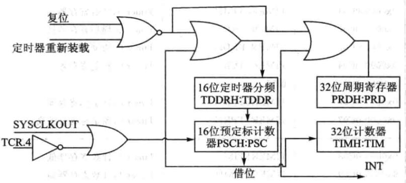
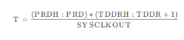
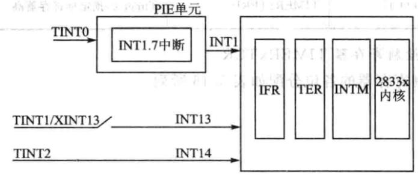
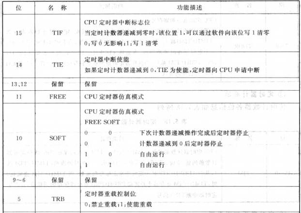
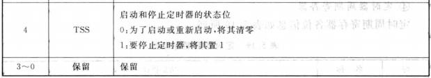
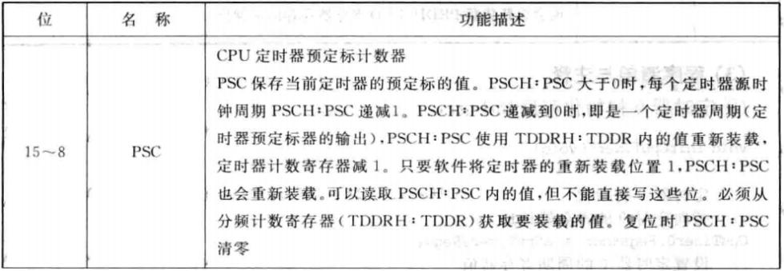
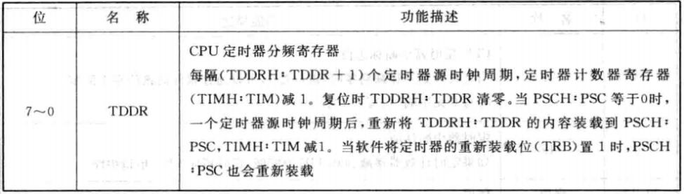
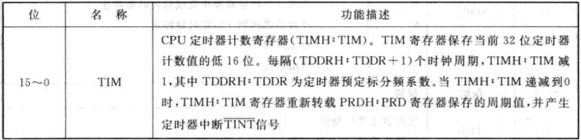
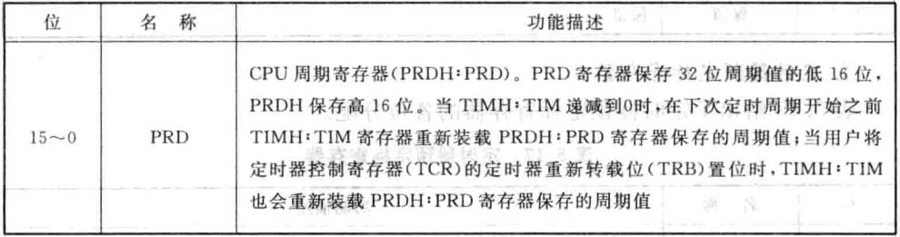

# DSP TI C2000 10_CPU_TIM（Timer，定时器）

## 1. CPU_TIM 简介

- CPU_TIM 简介

F28335的 CPU定时器 有3个且均为32位，分别是 Timer0、Timer1、Timer2，其中 Timer2 是为操作系统 DSP/BIOS 保留的，当未移植操作系统时，可用来做普通的定时器。这三个定时器的中断信号分别为 TINT0 , TINT1, TINT2，分别对应于中断向量 INT1，INT13，INT14。

- CPU_TIM 结构



定时器有一个预分频模块和一个定时/计数模块，其中预分频模块包括一个 16 位的定时器分频寄存器`TDDRH:TDDR`和一个 16 位的预定标计数器`PSCH:PSC`；定时/计数模块包括一个 32 位的周期寄存器`PRDH:PRD`和一个 32 位的计数寄存器`TIMH:TIM`。

- CPU_TIM 运行

当系统时钟`SYSCLKOUT`来一个脉冲，`PSCH:PSC` 预定标计数器减 1，当 `PSCH：PSC` 预定标计数器减到 0 的时候，预定标计数器产生下溢后向定时器的 32 位计数器 `TIMH:TIM` 借位，即 `TIMH:TIM` 计数器减 1，同时 `PSCH:PSC` 可以重载定时器分频寄存器`TDDRH:TDDR`的值；当计数寄存器 `TIMH:TIM` 减到 0 产生下溢的时候，计数寄存器会重载周期寄存器`PRDH:PRD`的值，同时定时器会产生一个中断信号给 CPU。





## 2. CPU_TIM 寄存器

### 控制寄存器 `TIMERxTCR`





### 定时器预定标寄存器`TIMERxTPR:TIMERxTPRH`





### 定时器计数器寄存器`TIMERxTIM:TIMERxTIMH`



### 定时器周期寄存器`TIMERxPRD:TIMERxPRDH`



## 3. CPU_TIM 配置

<font color=LightGreen>1. 使能定时器时钟</font>

```c
EALLOW;
SysCtrlRegs.PCLKCR3.bit.CPUTIMER0ENCLK = 1; // CPU Timer 0
EDIS;
```

<font color=LightGreen>2. 初始化定时器参数，包括制定定时器寄存器地址、周期寄存器值、预定标计数器值</font>

```c
CpuTimer0.RegsAddr = &CpuTimer0Regs;	// 指向定时器 0 的寄存器地址
CpuTimer0Regs.PRD.all = 0xFFFFFFFF;		// 设置定时器 0 的周期寄存器值
CpuTimer0Regs.TPR.all = 0;
CpuTimer0Regs.TPRH.all = 0;			   // 设置定时器预定标计数器值为 0
CpuTimer0Regs.TCR.bit.TSS = 1;		   // 确保定时器 0 为停止状态
CpuTimer0Regs.TCR.bit.TRB = 1;		   // 重载使能
CpuTimer0.InterruptCount = 0;		   // Reset interrupt counters
```

<font color=LightGreen>3. 设置定时周期以及控制寄存器</font>

TI 提供 `ConfigCpuTimer()`函数配置定时器参数：

```c
/**
  * @brief	定时器设置函数
  * @param  Timer	定时器句柄
  * @param	Freq	CPU时钟频率(MHz)
  * @param	Period	定时器周期值(us)
  */
void ConfigCpuTimer(struct CPUTIMER_VARS *Timer, float Freq, float
Period);
```

<font color=LightGreen>4. 开启定时器中断功能，并使能定时器</font>

```c
// 设置定时器 0 的中断入口地址为中断向量表的 INT0
EALLOW;
PieVectTable.TINT0 = &TIM0_IRQn;
EDIS;

// 开始定时器功能
CpuTimer0Regs.TCR.bit.TSS=0;

// 开启 CPU 第一组中断并使能第一组中断的第 7 个小中断，即定时器 0
IER |= M_INT1;
PieCtrlRegs.PIEIER1.bit.INTx7 = 1;

// 使能总中断
EINT;
ERTM;
```

<font color=LightGreen>5. 编写定时器中断服务函数</font>

在中断执行结束前要清除相应的中断标志位，以等待下次中断的到来。

```c
interrupt void TIM0_IRQn(void)
{
	;
}
```

