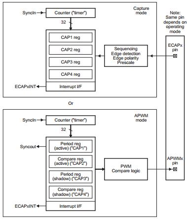
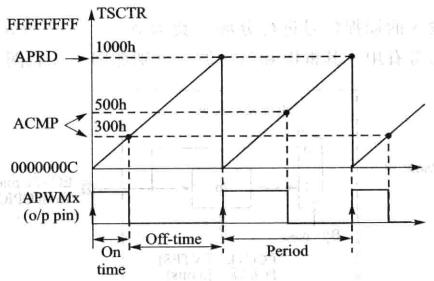
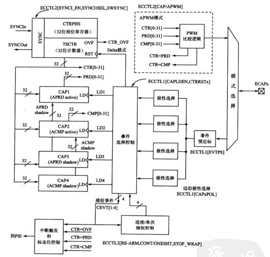
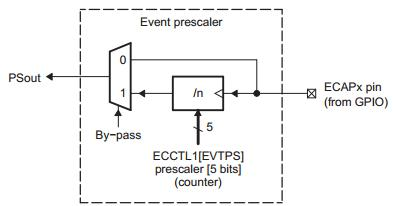
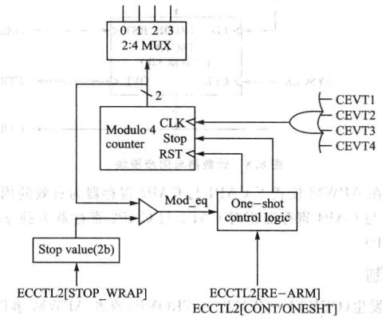
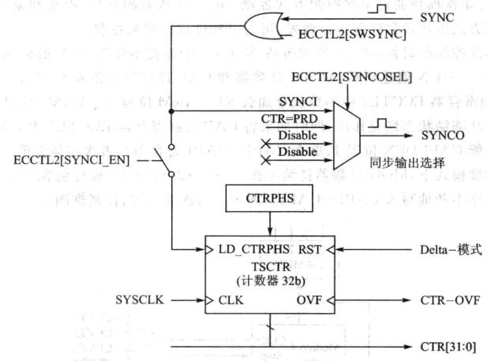

# DSP TI C2000 11_eCAP(增强型脉冲捕获模块)

## 1. F28335 eCAP简介

### eCAP 模块

捕获单元模块（eCAP）能够捕获外部输入引脚的逻辑状态（电平的高或者低、低电平翻转时的上升沿或下降沿），并利用内部定时器对外部事件或者引脚状态变化进行处理。典型应用如下：

> - 电机测速
> - 测量脉冲电平宽度
> - 测量一系列脉冲占空比和周期
> - 电流/电压传感器的 PWM 编码信号的解码

F28335 内含有 6 组 eCAP 模块，每个 eCAP 除了具有输入捕获功能，还可通过相关配置用作 PWM 输出功能。

> - 150MHz 系统时钟的情况下，32 位的时基的时间分辨率为 6.67ns。
>
> - 4 组 32 位的时间标志寄存器。
>
> - 4 级捕获事件序列，可以灵活配置捕获事件边沿极性。
>
> - 4 级触发事件均可以产生中断。
>
> - 软件配置一次捕获可以最多得到 4 个捕获时间。
>
> - 可连续循环 4 级捕获。
>
> - 绝对时间捕获。
>
> - 不同模式的时间捕获。
>
> - 所有捕获都发生在一个输入引脚上。
>
> - 如果 eCAP 模块不作捕获使用，可以配置成一个单通道输出的 PWM 模式。

eCAP 模块中一个捕获通道完成一次捕获任务，需要以下关键资源：
> - 专用捕获输入引脚
- 32 位时基（计数器）
- 4 × 32 位时间标签捕获寄存器
- 4 级序列器，与外部 eCAP 引脚的上升/下降沿同步。
- 4 个事件可独立配置边沿极性。
- 输入捕获信号预定标（2~62）。
- 一个 2 位的比较寄存器，一次触发后可以捕获 4 个时间标签事件。
- 采用 4 级深度的循环缓冲器以进行连续捕获。
- 4 个捕获事件中任意一个都可以产生中断。

### APWM 操作模式

如果 eCAP 模块不用作输入捕获，可以将它用来产生一个单通道的 PWM。计数器工作在计数增模式，可以提供时基能产生不同占空比的 PWM。**`CAP1` 与 `CAP2` 寄存器作为主要的周期和比较寄存器，`CAP3` 与 `CAP4` 寄存器作为周期和比较寄存器的影子寄存器**。



> - 时间计数器不断与 2 个 32 位的比较寄存器比较。
> - `CAP1` 与 `CAP2` 用作周期与比较寄存器。
> - 与影子寄存器 `APRD`、`ACMP`(`CAP3`、`CAP4`)配合形成双缓冲机制。如果选择立即模式，只要数据写入影子寄存器，影子寄存器的值就会立即加载到 `CAP1` 或者 `CAP2` 寄存器。如果选择周期加载模式，在 `CTR=PRD` 的时候，影子寄存器的值就会加载到 `CAP1` 或者 `CAP2` 寄存器。
> - 写数值到有效寄存器 `CAP1/2` 后，数值也将写到各自相应的影子寄存器`CAP3/4` 里。
> - 在初始化的时候，周期值与比较值必须写到有效寄存器 `CAP1` 与 `CAP2`，模块会自动复制初始化数值到影子寄存器中。在之后的数据更改时，只需要使用影子寄存器就可以了。



### 捕获操作模式



<font color=LightGreen>1. 事件分频</font>

可以对一个输入的捕获信号进行分频系数为 2-62 的分频，这在输入信号
频率很高的时候非常有用。



<font color=LightGreen>2. 边沿极性选择</font>

- 4 个独立的边沿极性选择器，每个捕获时间可以设置不同的边沿极性。

- 每个边沿事件由 `MODULE4` 序列发生器进行事件量化。

- 通过 `Mod4` 计数器将边沿事件锁存到相应的 `CAP` 寄存器中，`CAP` 寄存器工作在下降沿。

<font color=LightGreen>3. 连续/单次控制</font>

- 2 位的 `Mod4` 计数器对相应的边沿捕获事件递增计数（`CEVT1`~`CEVT4`）。

- `Mod4` 计数器循环计数（0→1→2→3→0），直至停止工作。

- 在单次模式下，一个 2 位的停止寄存器与 `Mod4` 计数器的输出值进行比较，如果等于停止寄存器的值，`Mod4` 计数器将不再计数，并且阻止 `CAP1`~`CAP4` 寄存器加载数值。

连续/单次模块通过单次控制方式控制 `Mod4` 计数器的开始、停止和复位，这种单次控制方式由比较器的停止值触发，可通过软件进行强制控制。

在单次控制的时候，eCAP 模块等待 N(1~4) 个捕捉事件发生，N 的值为停止寄存器的值。一旦 N 值达到后，`Mod4` 计数器和 `CAP` 寄存器的值都被冻结。如果向 `CAP` 控制寄存器 `ECCTL2 `中的单次重载 `RE-ARM` 位写入 1 后，`Mod4` 计数器就会复位。并且从冻结状态恢复作用，同时如果将 `CAP` 控制寄存器 `ECCTL1` 中 `CAP` 寄存器加载使能 `CAPLDEN` 位置 1，那么 `CAP1`~`CAP4` 寄存器会再次加载新值。

在连续模式下，`Mod4` 计数器持续工作（0→1→2→3→0），捕捉值在一个环形缓冲里按顺序不断的写入 `CAP1`~`CAP4`。



<font color=LightGreen>4. 32 位计数器与相位控制</font>

计数器为事件捕获提供了时基，其时钟信号为系统时钟的分频。通过软件或硬件强制，可以用相位寄存器与其他计数器同步。

在 4 个捕捉事件的数值加载中，可以选择复位这个 32 位计数器，这点对时间偏差捕捉很有用。首先 32 位计数器的值被捕获到，然后被 LD1~LD4 中的任意一个信号复位为 0。



<font color=LightGreen>5. `CAP1`-`CAP4` 寄存器</font>

`CAP1`-`CAP4` 寄存器通过 32 位的定时/计数器总线加载数值，当相应的捕获事件发生时，`CTR[0:31]`值加载到相应的 `CAP` 寄存器中。通过控制 `CAP` 控制寄存器 `ECCTL1[CAPLDEN]`位可以阻止捕捉寄存器数值的加载。在单次模式下，一个停止信号产生的时候，该位被自动清除。

<font color=LightGreen>6. 中断控制</font>

捕捉事件的发生（`CEVT1`~`CEVT4`,`CTROVF`）或者 APWM 事件的发生（`CTR=PRD`，`CTR=CMP`）都将会产生中断请求。这些事件中的任何一个事件都可以被选作中断源（从 `eCAPx` 模块中）连接到PIE。

## 2. F28335 eCAP 使用

<font color=LightGreen>1. 使能 eCAP 外设时钟</font>

```c
EALLOW;
SysCtrlRegs.PCLKCR1.bit.ECAP1ENCLK = 1; // eCAP1
EDIS;
```

<font color=LightGreen>2. 选择 GPIO 复用功能</font>

```c
InitECap1Gpio();
```

<font color=LightGreen>3. eCAP 外设相关参数设置，包括捕捉模式、捕获边沿信号、捕获后计数器是否清零、捕获中断</font>

```c
ECap1Regs.ECEINT.all = 0x0000; 		// 失能能捕获中断
ECap1Regs.ECCLR.all = 0xFFFF; 		// 清除中断标志位
ECap1Regs.ECCTL1.bit.CAPLDEN = 0; 	// 禁止CAP1-4寄存器载入
ECap1Regs.ECCTL2.bit.TSCTRSTOP = 0; // 确定计数器停止

ECap1Regs.ECCTL2.bit.CONT_ONESHT = 1; 	// 单次模式
ECap1Regs.ECCTL2.bit.STOP_WRAP = 3; 	// 计数器在四次捕获事件后停止
ECap1Regs.ECCTL1.bit.CAP1POL = 1;       // CAP1:Falling edge
ECap1Regs.ECCTL1.bit.CAP2POL = 0; 	    // CAP2:Rising edge
ECap1Regs.ECCTL1.bit.CAP3POL = 1; 		// CAP3:Falling edge
ECap1Regs.ECCTL1.bit.CAP4POL = 0; 		// CAP4:Rising edge
ECap1Regs.ECCTL1.bit.CTRRST1 = 1; 		// Difference operation
ECap1Regs.ECCTL1.bit.CTRRST2 = 1; 		// Difference operation
ECap1Regs.ECCTL1.bit.CTRRST3 = 1; 		// Difference operation
ECap1Regs.ECCTL1.bit.CTRRST4 = 1; 		// Difference operation

ECap1Regs.ECCTL2.bit.SYNCI_EN = 1; 		// 使能同步信号
ECap1Regs.ECCTL2.bit.SYNCO_SEL = 0; 	// 旁路，不分频
ECap1Regs.ECCTL1.bit.CAPLDEN = 1; 		// 使能CAP1-4寄存器载入
```

<font color=LightGreen>4. 开启中断并编写中断函数</font>
