# DSP TI C2000 12_eQEP(增强型正交编码器模块)

## 1. F28335 eQEP简介

### 正交编码器简介

光电编码器是集光、机和电技术于一体的数字化传感器，通过光电转换将输出轴上的机械几何位移量转换成脉冲或者数字量的传感器，可以高精度测量被测物的转角或直线位移量，是目前应用最多的传感器之一。

一般来说，根据光电编码器产生脉冲的方式不同，可以分为增量式、绝对式以及复合式 3 大类。按编码器运动部件的方式来分，可以分为旋转式和直线式两种。由于直线式运动可以借助机械连接转变为旋转式运动，反之亦然。因此，只有在那些结构形式和运动方式都有利于直线式光电编码器的场合才使用。旋转式光电编码器容易做成全封闭型式，易于实现小型化，传感长度较长，具有较长的环境适用能力，因而在实际工业生产中应用较广。

**增量式光电编码器的特点是每产生一个输出脉冲信号就对应一个增量位移，但是不能通过输出脉冲区别出在哪个位置上的增量。**它能够产生与位移增量等值的脉冲信号，其作用是提供一种对连续位移量离散化或增量化以及位移变化（速度）的传感方法，它是相对于某个基准点的相对位置增量，不能直接检测出轴的绝对位置信息。一般来说，**增量式光电编码器输出 A、B 两相互差 90 度电度角的脉冲信号（即所谓的两组正交输出信号）**，从而可方便的判断出旋转方向。**同时还有用作参考零位的 Z 相标志（指示）脉冲信号**，码盘每旋转一周，只发出一个标志信号。标志脉冲通过用来指示机械位置或者对积累量清零。

**增量式编码器以转动时输出脉冲，通过计数设备来知道其相对参考点的位置，当编码器不动或停电时，依靠计数设备的内部记忆来记住位置。这样当停电后，编码器不能有任何的移动**，当来电工作是，编码器输出脉冲过程中，也不能有干扰而丢失脉冲，不然计数设备记忆的零点就会偏移，而且这种偏移量是无法知道的，只有错误的生产结果出现后才能知道。解决的方法是增加参考点，编码器每经过参考点，将参考点位置修正进行计数设备的记忆位置。在参考点以前，是不能保证位置的准确性。因此，在工控中就有每次操作前先找参考点，即开机找零等方法。

绝对式编码器的基本原理及组成部件与增量式光电编码器基本相同。与增量式光电编码器不同的是，**绝对式光电编码器用不同的数码分别指示每个不同的增量位置，它是一种直接输出数字量的传感器。**在它的圆形码盘上沿径向有若干同心码道，每条上由透光和不透光的扇形区相间组成，相邻码道的扇区数目是双倍关系，码盘上的码道数就是它的二进制数码的位数，在码盘的一侧是光源，另一侧对应每一码道有一光敏元件；当码盘处于不同位置时，各光敏元件根据受光照与否转换出相应的电平信号，形成二进制数。这种编码器的特点是不要计数器，在转轴的任意位置都可以读出一个固定的与位置相对应的数字码。显然，码道越多，分辨率就越高，对于一个具有 N 位二进制分辨率的编码器，其码盘必须有 N 条码道。

**F28335 中的 eQEP 模块主要针对的是增量式的编码器**。

- 电机旋转方向的判别

增量式编码器一般安装在电机或者其他旋转机构的轴上，在码盘旋转过程中，输出两个信号称为 `QEPA` 和 `QEPB`，两路型号相差 90 度，这就是所谓的正交信号，当电机正转时，脉冲信号 A 的相位超前脉冲信号 B 的相位 90 度，此时逻辑电路处理后可形成高电平的方向信号 `Dir`。当电机反转时，脉冲信号 A 的相位滞后脉冲信号 B 的相位 90 度，此时逻辑电路处理后的方向信号 `Dir` 为低电平。因此**根据超前和滞后的关系可以确定电机的旋转方向**。

- 电机速度的判别

可以利用定时器/计数器配合光电编码器的输出脉冲信号来测量电机的转速。具体的测速方法有 M 法、T 法和 M/T 法 3 种。

> 1. M 法又称为测频法，其测速原理是在规定的检测时间 $T_c$ 内，对光电编码器输出的脉冲信号计数的测速方法。适用于测量高转速。
> 2. T 法也称之为测周法，该测速方法是在一个脉冲周期内对时钟信号脉冲进行计数的方法。适用于低速运行的场合。
> 3. M/T 法测速是将 M 法和 T 法两种方法结合在一起使用，在一定的时间范围内，同时对光电编码器输出的脉冲个数 M1 和 M2 进行计数。

### eQEP 模块

F28335 有两路 eQEP 模块，每个模块有 4 个管脚，分别是：`QEPA/XCLK`、`QEPB/XDIR`、`eQEPI` 和 `QPES`。

1. 正交时钟模式

正交编码器提供两路相位差为 90 度的脉冲，相位关系决定了电机旋转方向信息，脉冲的个数可以决定电机的绝对位置信息。超前或者顺时钟旋转时，A 路信号超前 B 路信号，滞后或者逆时针旋转时，B 路信号超前 A 路信号。正交编码器使用这两路输入引脚可以产生正交时钟和方向信号。

2. 直接计数模式

在直接计数模式中，方向和时钟信号直接来自外部，此时 `QEPA` 引脚提供时钟输入，`QEPB` 引脚提供方向输入。

- `eQEPI` 是索引或者起始标记脚，正交编码器使用索引信号来确定一个绝对的起始位置，此引脚直接与正交编码器的索引输出端相连，当此信号到来时，可以将位置计数器复位清零，也可以初始化或者锁存位置计数器的值。

- `QEPS` 是锁存输入引脚，锁存引脚输入的主要作用是当规定时间信号到来时，初始或者锁存位置计数器的值，该引脚通常和传感器或者限制开关连接，用于通知电机是否达到预定位置。

- eQEP 主要包含以下几个功能单元：
> - 通过 GPIOMUX 寄存器编程锁定 QEPA 或者 QEPB 功能。
> - 正交解码单元（`QDU`）。
> - 位置计数器和位置计算控制单元（`PCCU`）。
> - 正交边沿捕获单元，用于低速测量（`QCAP`）。
> - 用于速度/频率测量的时基单元（`UTIME`）。
> - 用于检测的看门狗模块。

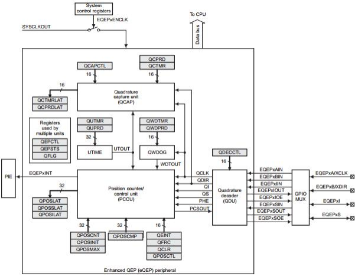

#### 正交解码单元 QDU

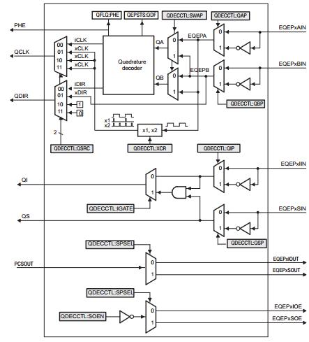

1. 输入模式

在正交计数模式下，正交解码模块产生位置计数器时钟信号和方向信号，位置计数器的计数模式由 `QDECCTL` 寄存器中的 `QSRC` 位决定。

- 正交计数模式

在正交-计数模式下，正交解码器产生方向信号和时钟信号送给位置计数器。通过确定 `QEPA` 和 `QEPB` 两个脉冲信号哪一个超前，来解码出旋转方向逻辑，并且将此方向逻辑更新到 `QEPSTS` 的 `QDF` 位。

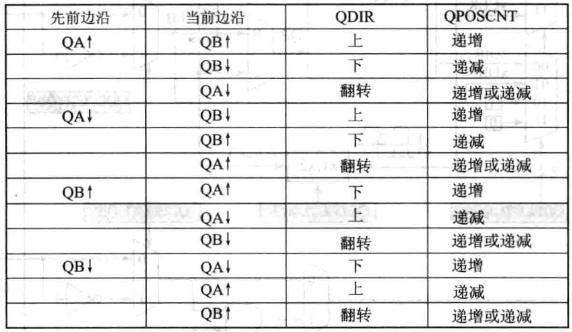

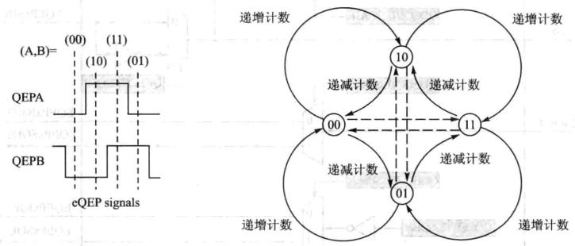

> - 当 `QEPA` 和 `QEPB` 信号同步到来时，eQEP 中的相位错误标志会置位，而且会申请中断。
> - eQEP 中的解码模块会对 `QEPA` 和 `QEPB` 脉冲的上升沿以及下降沿进行计数，所以最后解码的时钟频率将会是实际输入 `QEPA` 或者 `QEPB` 的 4 倍。
> - 在正常正交计数模式操作时，`QEPA` 输入送到正交解码器的 `QA` 输入，`QEPB `输入送到正交解码器的 `QB` 输入。反向计数通过设置 `QDECCTLL` 寄存器的 `SWAP` 位被使能，此时正交解码器的输入取反，从而计数方向也取反。

- 方向计数模式

`QEPA` 只能作为时钟输入，`QEPB` 只能作为方向输入。如果方向为高时，那么计数器会在 `QEPA` 输入的上升沿时递增计数，当方向为低时，那么计数器会在 `QEPA` 输入的上升沿自动递减计数。

- 递增/递减计数模式

计数器的方向信号被硬件规定为递增/递减计数，此时位置计数器根据 `QDECCTL` 中的 `XCR` 位规定，对 `QEPA` 信号计数或者 2 倍关系计数。

2. 输入极性

每个 eQEP 输入都可以通过 `QDECCTL` 寄存器的 8~15 位决定极性。

3. 同步信号输出

eQEP 包括一个位置比较单元，主要用于产生位置比较同步信号。当位置计数器的值与位置比较寄存器 `QPOSCMP` 的值相等时，可以把 `QEPI` 或者 `QEPS` 配置为输出引脚，用于产生同步信号输出。具体配置可以查看 `QDECCTL[SOEN]` 和 `QDECCTL[SPSEL]` 寄存器位。

#### 位置计数和控制单元 PCCU

1. 位置计数操作模式

位置计数器可以配置为如下几种模式：
(1)在索引事件到来时，位置计数器复位。
(2)在计数值达到设定的最大值时，位置计数器复位。
(3)第一个索引事件到来时，位置计数器复位。
(4)在定时事件到达时，位置计数器复位。

上述所有的操作模式，位置计数器都会在上溢时复位到 0，在下溢时复位到 `QPOSMAX` 最大值。

2. 位置计数器锁存

eQEP 的索引和标记输入引脚输入事件发生时，将位置计数器的值锁存到 `QPOSILAT` 和 `QPOSSLAT` 中。

- 索引事件锁存

在某些应用中，并不要求在每次索引事件到来时复位位置计数器，而是要求在 32 位模式（`QEPCTL[PCRM]=01` 和 `QEPCTL[PCRM]=10`）下，操作位置计数器。在这种情况下，eQEP 的位置计数器可以在如下事件配置锁存并且在每次索引事件标识时，方向信息被记录到 `QEPSTS[QDLF]`中。

> - 上升沿锁存（`QEPCTLP[IEL]=01`）
> - 下降沿锁存（`QEPCTLP[IEL]=10`）
> - 索引事件标识锁存（`QEPCTLP[IEL]=11`）

位置计数器的值锁存到 `QPOSILAT` 寄存器中时，索引事件中断标志位（`QFLG[IEL]`）被置位。当 `QEPCTL=0` 时，索引事件锁存配置位（`QEPCTZ[IEL]`）被忽略。

上升沿锁存（`QEPCTLP[IEL]=01`）：在输入索引事件的每次上升沿到来时，位置计数器的值（`QPOSCNT`）锁存到 `QPOSILAT` 寄存器中。

下降沿锁存（`QEPCTLP[IEL]=10`）：在输入索引事件的每次下降沿到来时，位置计数器的值（`QPOSCNT`）锁存到 `QPOSILAT` 寄存器中。

索引事件标志锁存/软件索引标识（`QEPCTLP[IEL]=11`）：第一个索引标识在第一个索引边沿后的正交边沿 。 eQEP 外设记录了第一个索引标识（`QEPSTS[FIMF]`）的发生以及第一个索引事件标识方向（`QEPSTS[FIDF]`），它也记录了第一个索引标识的正交边沿，从而可使这个相关的正交转换可以用于位置计数器锁存（`QEPCTL[IEL]=11`）。

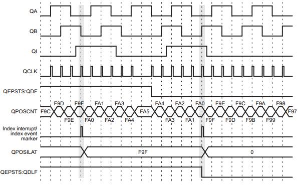

- 选择事件锁存

位置计数器的值在选择输入信号的上升沿被锁存到 `QPOSSLAT` 寄存器中，并且 `QEPCTL[SE1]` 位被清零。如果 `QEPCTL[SE1]` 位被置位，位置计数器的值在正向运动时，选择输入信号的上升沿进行锁存，反向运动时，选择输入信号的下降沿进行锁存。当位置计数器的值锁存到寄存器后，选择事件锁存中断标志（`QFLG[SE1]`）被置位。

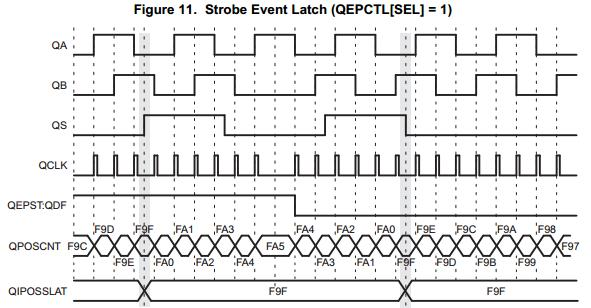

3. 位置计数器初始化

位置计数器可以由以下事件进行初始化：
(1)索引事件
(2)选择事件
(3)软件初始化

索引事件初始化（`IEI`）：`QEPI` 索引输入在索引输入上升沿或者下降沿的时候可以触发位置计数器的初始化。如果 `QEPCTL[IEI]=10`，那么位置计数器在索引输入上升沿时会初始化 为寄存器 `QPOSINIT` 的 值 ，相反 ，如果`QEPCTL[IEI]=11`，位置计数器的值在输入索引的下降沿初始化。当位置计数器初始化为 `QPOSINIT` 的值后，索引事件初始化中断位（`QFLG[IEI]`）被置位。

选择事件初始化（`SEI`）：如果 `QEPCTL[IEI]=10`，那么位置计数器在选择输入上升沿时会初始化为寄存器 `QPOSINIT` 的值。如果 `QEPCTL[IEI]=11`，位置计数器的值在正转时会在选择输入的上升沿初始化为 `QPOSINIT` 的值，否则在反转时，在选择输入的下降沿初始化。当位置计数器初始化为 `QPOSINIT` 的值后，选择事件初始化中断位（`QFLG[IEI]`）被置位。

软件初始化（`SWI`）：将 `QEPCTL(SWI)` 位设置为 1 时，位置计数器由软件初始化，而 `QEPCTL(SWI)`位在初始化后会自动清除。

#### 位置比较单元

eQEP 模块包含一个位置比较单元，用于产生同步信号输出或者产生匹配中断。

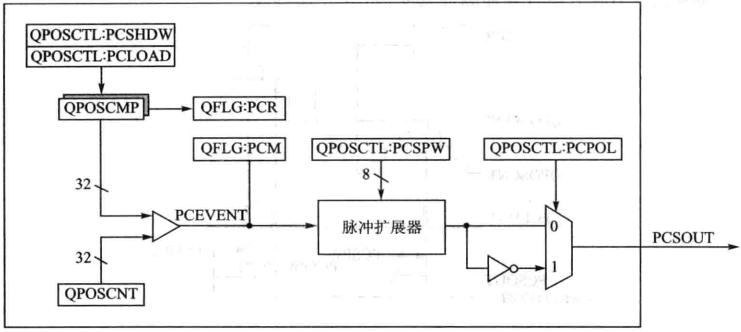

位置比较寄存器 `QPOSCMP` 有影子寄存器，影子寄存器模式可以通过 `QPOSCTL[PSSHDW]`使能或者禁止。如果影子寄存器模式禁止时，CPU 直接写到有效位置比较寄存器即可。

在影子寄存器模式使能时，可以配置位置比较单元（`QPOSCTL[PCLOAD]`）位以将影子寄存器内的值在下列事件来临时装入有效寄存器并且在装载完成以后，会产生位置比较就绪中断位（`QFLG[PCR]`）。
(1)比较匹配装载
(2)位置计数器清零装载

当位置计数器的值（`QPOSCNT`）与工作位置比较寄存器（`QPOSCMP`）的值匹配时，位置比较位（`QFLG[PCM]`）被置位，并且会产生位置比较同步可调宽脉冲以触发外部设备。

位置比较的脉冲扩展逻辑在位置比较匹配时可以输出一个可编程的位置比较同步脉冲，当前一个位置比较脉冲仍在工作并且产生新的位置比较匹配时，脉冲扩展器会根据新的位置比较事件延伸脉冲宽度，

#### 边沿捕获单元

eQEP 模块包括一个集成的边沿捕获单元来测量转速。

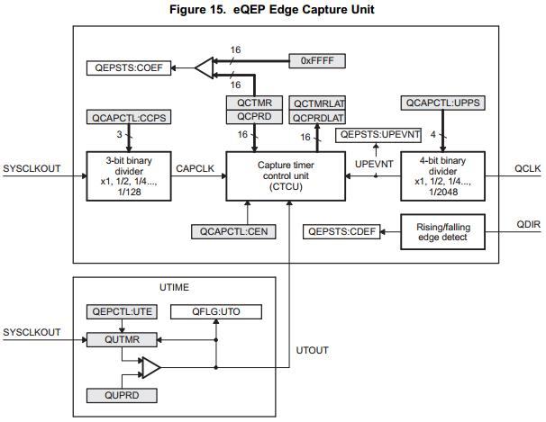

1. 低速测量

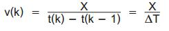

低速测量思想就是在设定编码器脉冲数时，计量在此脉冲数内所消耗的时间，从而计算出速度，即 T 法。

> 捕获时钟（`QCTMR`）以系统时钟分频后的时基作基准运行，在每个单位位置事件发生时，`QCTMR` 的值会自动加载到捕获周期寄存器 `QCPRD` 中，之后捕获时钟自动清零，同时 `QEPSTS` 中的 `UPEVNT` 标志位会置 1，表明有新值锁存到 `QCPRD` 寄存器，通知 CPU 进行操作。
>
> 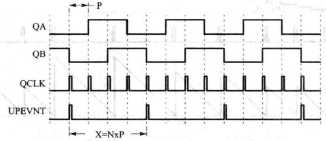

注意，低速测量必须满足：**单元位置事件之间不能超过捕获时钟的最大值65535且没有换向发生**。

2. 高速测量

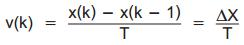

高速测量思想是在设定的单位时间里面，计量采集到的脉冲数，即可确定速度值，即 M 法。

捕获时钟寄存器和捕获周期寄存器可以配置成如下事件发生时，会把值锁存到 `QCTMRLAT` 和 `QPPRDLAT` 中。
(1)CPU 读 QPOSCNT 寄存器时。
(2)单位时间事件发生时。

如果 `QEPCTL[QCLM]`位被清零了，那么当 CPU 读取位置计数器时，捕获时钟和
捕获周期寄存器的值分别被锁存到 `QCTMRLAT` 和 `QPPRDLAT` 寄存器中。

如果 `QEPCTL[QCLM]` 位置 1，那么当单位时间事件发生时，位置计数器、捕获时钟寄存器和捕获周期寄存器的值分别锁存到 `QPOSLAT`、`QCTMRLAT` 和 `QCPRDLAT`中。

#### 看门狗单元
eQEP 模块包括一个 16 位的看门狗计数器，用来监测正交编码器脉冲状态。若有正交脉冲到来，看门狗计数器可以复位，如果正交编码脉冲没有到来，当看门狗计数器的值与其周期寄存器的值匹配时，可以产生中断信号给 CPU。该看门狗单元可以通过软件使能或者禁止。

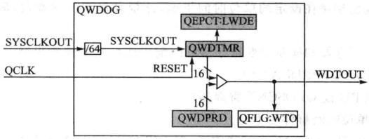

#### 时基单元

eQEP 模块还包括了一个 32 位定时器（`QUTMR`），由 `SYSCLKOUT` 提供时钟，可以产生用于速度计算的周期性中断。当定时器（`QUTMR`）与周期寄存器（`QUPRD`）匹配时，单位超时中断（`QFLG[UTO]`）被置位。

一个单位事件超时时，`eQEP` 可以配置为锁存位置计数器、捕捉定时器和捕捉
周期值，从而用这些锁存的值来计算速度。

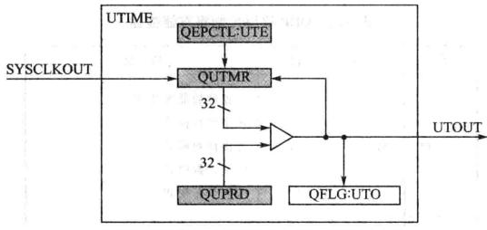

#### 中断单元

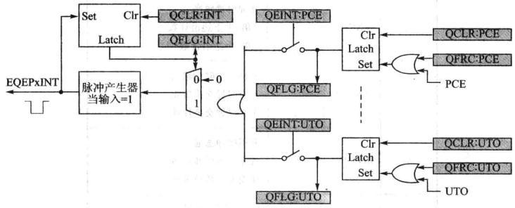

eQEP 一共可以产生 11 个中断事件，分别是 PCE、PHE、QDC、WTO、PCU、PCO、PCR、PCM、SEL、IEL、UTO。这些中断可以通过中断控制寄存器 `QEINT` 来设置使能或者禁止。如果每个中断都使能，那么中断源会产生中断脉冲送给 PIE 模块，进而送给 CPU。这些中断标志可以通过中断清除寄存器 `QCLR` 来清除。而且还可以通过中断强制寄存器来软件强制中断事件，这样对系统测试比较有利。

## 2. F28335 eQEP配置

<font color=LightGreen>1. 使能 eQEP 外设时钟</font>

```c
EALLOW; // This is needed to write to EALLOW protected registers
SysCtrlRegs.PCLKCR1.bit.EQEP1ENCLK = 1; // eQEP1
EDIS;
```

<font color=LightGreen>2. 选择 GPIO 复用功能</font>

```c
InitEQep1Gpio();
```

<font color=LightGreen>3. eQEP 外设相关参数设置</font>

```c
EQep1Regs.QUPRD=1500000; 			// Unit Timer for 100Hz at 150MHz SYSCLKOUT

EQep1Regs.QDECCTL.bit.QSRC=2; 		// Up count mode (freq.measurement)
EQep1Regs.QDECCTL.bit.XCR=0; 		// 2x resolution (cnt falling and rising edges)

EQep1Regs.QEPCTL.bit.FREE_SOFT=2;
EQep1Regs.QEPCTL.bit.PCRM=00; 		// QPOSCNT reset on index evnt
EQep1Regs.QEPCTL.bit.UTE=1; 		// Unit Timer Enable
EQep1Regs.QEPCTL.bit.QCLM=1; 		// Latch on unit time out
EQep1Regs.QPOSMAX=0xffffffff;
EQep1Regs.QEPCTL.bit.QPEN=1; 		// QEP enable

EQep1Regs.QCAPCTL.bit.UPPS=2; 		// 1/4 for unit position at 150MHz SYSCLKOUT

EQep1Regs.QCAPCTL.bit.CCPS=7; 		// 1/128 for CAP clock
EQep1Regs.QCAPCTL.bit.CEN=1; 		// QEP Capture Enable
```

