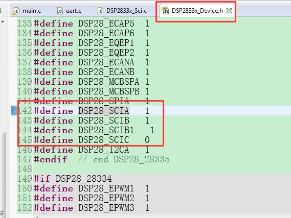

# DSP TI C2000 13_SCI(串口)

关于串口通信可以参考 STM32 的对应部分。

## 1. F28335 SCI简介


- F28335 SCI 特性
  - 2 个外部引脚：SCITXD 是 SCI 数据发送引脚，SCIRXD 是 SCI 数据接收引脚。两个引脚为多功能复位引脚，如果不使用可以作为通用数字量 IO。
  - 可编程通信速率，可以设置 64K 种通信速率。
  - 数据格式：
    - 一个启动位。
    - 1 - 8 位可编程数据字长度。
    - 可选择奇校验、偶校验或无效校验位模式。
    - 1 或 2 位的停止位。
  - 4 种错误检测标志位：奇偶错误、超越错误、帧错误和间断检测。
  - 2 种唤醒处理方式：空闲线唤醒和地址位唤醒。
  - 全双工或半双工通信模式。
  - 双缓冲接收和发送功能。
  - 发送和接收可采用中断和轮询两种方式。
  - 独立的发送和接收中断使能控制（BRKDT 除外）。
  - NRZ（非归零）通信格式。
  - 自动通信速率检测。
  - 16 级发送/接收 FIFO。

- F28335 SCI 框图

  

  > 1. 一个发送器（TX）及相关寄存器。
  >
  >    `SICTXBUF`：发送数据缓冲寄存器，存放所要发送的数据（由 CPU 装载）。
  >
  >    `TXSHF` 寄存器：发送移位寄存器，从 `SCITXBUF` 寄存器接收数据，并将数据移位到 `SCITXD` 引脚上，每次移 1 位数据。
  >
  > 2. 一个接收器（RX）及相关寄存器。
  >
  >    `SCIRXBUF`：接收数据缓冲寄存器，存放 CPU 所要读取的数据，来自远程处理器的数据装入寄存器 `RXSHF`，然后又装入接收数据缓冲寄存器 `SCIRXBUF` 和接收仿真缓冲寄存器 `SCIRXEMU` 中。
  >
  >    `RXSHF` 寄存器：接收移位寄存器，从 `SCIRXD` 引脚移入数据，每次移 1 位。
  >
  > 3. 一个可编程的波特率产生器。
  >
  > 4. 数据存储器映射的控制和状态寄存器。

- SCI 数据格式：SCI 的发送和接收都采用不归零码格式。

  > 1. 1 位起始位。
  > 2. 1 - 8 位数据。
  > 3. 1 个奇偶校验位（可选择）。
  > 4. 1 位或 2 位停止位。
  > 5. 区分数据和地址的附加位（仅在地址位模式存在）。

  1. 在 SCI 通信中，带有格式信息的数字字符称为帧。

    

    可以使用 SCI 通信控制寄存器（`SCICCR`）配置 SCI 通信采用的数据格式。

  2. SCI 异步通信可采用半双工通信方式，每个数据位占用 8 个 SCICLK 时钟周期。

    

    接收器在收到一个起始位后开始工作，4 个连续 SCICLK 周期的低电平表示有效的起始位，如上图所示。如果没有连续 4 个 SCICLK 周期的低电平，则处理器重新寻找另一个起始位。对于 SCI 数据帧的起始位后面的位，处理器在每位的中间进行 3 次采样，确定位的值。3 次采样点分别在第 4、5 和 6 个SCICLK 周期，3 次采样中 2 次相同的值即为最终接收位的值。

  3. 由于接收器使用帧同步，外部发送和接收器不需要使用串行同步时钟，时钟由器件本身提供。
  
- SCI 通信过程

  - SCI 数据接收

    满足下列条件时，接收器的信号时序如下：

    

    > 1. 地址位唤醒模式（地址位不出现在空闲模式中）；
    > 2. 每个字符有 6 位数据；

    1. 标志位 `RXENA`（`SCICTL1` 位 0）为 1，使能接收器接收数据。
    2. 数据达到 `SCIRXD` 引脚后，检测起始位。
    3. 数据从 `RXSHF` 寄存器移位到接收缓冲器（`SCIRXBUF`），产生一个中断申请，标志位 `RXRDY`(`SCIRXST` 位 6)为 1，表示已接收一个新字符。
    4. 程序读 `SCIRXBUF` 寄存器，标志位 `RXRDY` 自动被清除。
    5. 数据的下一个字节达到 `SCIRXD` 引脚时，检测启动位。
    6. 位 `RXENA` 变为低，禁止接收器接收数据。继续向 `RXSHF` 转载数据，但不移入到接收缓冲寄存器中。

  - SCI 数据发送

    满足下列条件时，发送器的信号时序如下：

    

    > 1. 地址位唤醒模式（地址位不出现在空闲模式中）；
    > 2. 每个字符有 3 位数据；

    1. 位 `TXENA`(`SCICTL1` 位 1)为 1，使能发送器发送数据；
    2. 写数据到 `SCITXBUF` 寄存器，从而发送器不再为空，`TXRDY` 为低。
    3. `SCI` 发送数据到移位寄存器（`TXSHF`）。发送器准备传送第 2 个字符（`TXRDY`变高），并发出中断请求（使能中断，位 `TXINTENA`，`SCICTL2` 中的第 0 位置 1）。
    4. 在 `TXRDY` 变高后，程序写第 2 个字符到 `SCITXBUF` 寄存器（在第 2 个字节写入到 `SCITXBUF` 后，`TXRDY` 又变低）。
    5. 发送完第 1 个字符，开始将第 2 个字符移位到寄存器 `TXSHF`。
    6. 位 `TXENA` 变低，禁止发送器发送数据，SCI 结束当前字符的发送。
    7. 第 2 个字符发送完成，发送器变空准备发送下一个字符。

- SCI 的 FIFO

  - 复位：在上电复位时，SCI 工作在标准 SCI 模式，禁止 FIFO 功能。FIFO 的寄存器 `SCIFFTX`、`SCIFFRX` 和 `SCIFFCT` 都被禁止。

  - FIFO 使能：通过 `SCIFFTX` 寄存器的 `SCIFFEN` 位置 1，使能 FIFO 模式。在任何操作状态下 `SCIRST` 都可以复位 FIFO 模式。

  - 中断：FIFO 模式有两个中断，一个是发送 FIFO 中断 `TXINT`，另一个是接收 FIFO 中断 `RXINT`。FIFO 接收、接收错误和接收 FIFO 溢出共用 `RXINT` 中断。标准 SCI 的 `TXINT` 将被禁止，该中断将作为 SCI 发送中断使用。

  - 缓冲：发送和接收缓冲器增补了 2 个 16 级的 FIFO，发送 FIFO 寄存器是 8位宽，接收 FIFO 寄存器是 10 位宽。

    标准 SCI 的一个字的发送缓冲器作为发送 FIFO 和移位寄存器间的发送缓冲器。只有移位寄存器的最后一位被移出后，一个字的发送缓冲才发送 FIFO 装载。使能 FIFO 后，经过一个可选择的延迟（`SCIFFCT`），`TXSHF` 被直接装载而不再使用 `TXBUF`。

  - 延迟发送：FIFO 中的数据传送到发送移位寄存器的速率是可编程的，可以通过 `SCIFFCT` 寄存器的位 `FFTXDLY`（7 - 0）设置发送数据间的延迟。`FFTXTDLY`（7 - 0）确定延迟的 SCI 波特率时钟周期数，8 位寄存器可以定义从 0 个波特率时钟周期的最小延迟到 256 个波特率时钟周期的最大延迟。
  
    当使用 0 延迟时，SCI 模块的 FIFO 数据移出时，数据间没有延时，一位紧接一位的从 FIFO 移出，实现数据的连续发送。
  
    当选择 256 个波特率时钟的延迟时，SCI 模块工作在最大延迟模式，FIFO 移出的每个数据字之间有 256 个波特率时钟的延迟。在慢速 SCI/UART 的通信时，可编程延迟可以减少 CPU 对 SCI 通信的开销。
  
  - FIFO 状态位：发送和接收 FIFO 都有状态位 `TXFFST` 或 `RXFFST`（位 12~0），这些状态位显示当前 FIFO 内数据的个数。
  
    当状态位为0时，发送 FIFO 复位 `TXFIFO `和接收复位位 `RXFIFO` 会被设置为 1，会将 FIFO 指针复位为 0，FIFO 重新开始运行。
  
  - 可编程的中断级：发送和接收 FIFO 都能产生 CPU 中断，只要发送 FIFO 状态位 `TXFFST`（位 12-8）与中断触发优先级 `TXFFIL`（位 4-0）相匹配，就产生一个中断触发，从而为 SCI 的发送和接收提供一个可编程的中断触发逻辑。
  
    
  
- SCI 自动波特率检测

  当 `CDC` 为 1，如果 `ABD` 也置位，表示自动波特率检测开始工作，就会产生 SCI 发送 FIFO 中断（`TXINT`）。同时在中断服务程序中必须使用软件将 `CDC` 位清零，否则如果中断服务程序执行完 `CDC` 仍然为 1，后面就不会产生中断。

  1. 将 `SCIFFCT` 中的 `CDC` 位置位，清除 `ABD` 位（位 15），使能 SCI 的自动波特率检测模式。
  2. 初始化波特率寄存器为 1 或限制在 500kbps 内。
  3. 允许 SCI 以期望的波特率从一个主机接收字符 `A` 或字符 `a`。如果第
     一个字符是 `A` 或者 `a`，则说明自动波特率检测已经检测到 SCI 通信的速率，然后将 `ABD` 位置 1。
  4. 自动检测硬件将用检测到的波特率的十六进制值刷新波特率寄存器的值，这个刷新逻辑也会产生一个 CPU 中断。
  5. 通过向 `SCIFFCT` 寄存器的 `ABDCLR` 位写入 1 清除 `ABD` 位，响应中断。写 0 清除 `CDC` 位，禁止自动波特率逻辑。
  6. 读到接收缓冲器的字符 `A` 或者 `a` 时，清空缓冲和缓冲状态位。

- SCI 多处理器通信

  在同一条串行连接线上，多处理器通信模式允许一个处理器向串行线上其他
  多个处理器发送数据，但是一条串行线上，每次只能实现一次数据传送，也就是在一条串行线上一次只能有一个节点发送数据。多处理通信方式主要包括**唤醒**和**地址位**两种多处理器通信模式。

  > 1. **地址字节**：发送节点发送信息的第一个字节是一个地址字节，所有接收节点都读取该地址字节。只有接收数据的地址字节与接收节点的地址字节相符时，才能中断接收节点。如果接收节点的地址和接收的地址不符，接收节点将不会被中断，等待接收下一个地址字节。
  >
  > 2. **Sleep 位**：连接到串行总线上的所有处理器都将 SCI `SLEEP` 位置 1，这样只有检测到地址字节后才会被中断。
  >
  >    尽管当 `SLEEP` 位置 1 时接收器仍然工作，但它并不能将 `RXRDY`、`RXINT` 或任何接收器错误状态位置 1，只有在**检测到地址位且接收的帧地址位是 1 **时才能将这些位置 1。SCI 本身并不能改变 `SLEEP` 位，必须由用户软件改变。
  >
  > 3. 识别地址位：处理器根据所使用的多处理器模式（空闲线模式或地址位模式），采用不同的方式识别地址字节：
  >
  >    > - **空闲线模式**：在地址字节预留一个静态空间，该模式没有额外的地址/数据位。它在处理包含 10 个以上字节的数据块传输方面比地址位模式效率高。空闲线模式一般用于非处理器的 SCI 通信。
  >    > - **地址位模式**：在每个字节中加入一个附加位（也就是地址位）。由于这种模式数据块之间不需要等待，因此在处理小块数据时比空闲线模式效率更高。
  
  用户可以使用软件通过 `ADDR/IDLE MODE` 位选择多处理器模式，两种模式都使用 `TXWAKE`（`SCICTL1` 位 3）、`RXWAKE`（`SCIRXST` 位 1）个 SLEEP 标志位控制 SCI 的发生器和接收器的特性。
  
  接收步骤：
  
  > 1. 在接收地址块时，SCI 端口唤醒并申请终中断（必须使能 `SCICTL2` 的 `RX/BKINT ENA` 位申请中断），读取地址块的第一帧，该帧包含目的处理器的地址。
  > 2. 通过中断检测接收的地址启动软件例程，然后比较内存中存放的器件地址和接收到数据的地址字节。
  > 3. 如果上述地址相吻合表明地址块与 DSP 的地址相符，则 CPU 清除 `SLEEP` 位并读取块中剩余的数据，否则退出软件子程序并保持 `SLEEP` 置位，直到下一个地址块开始才接收中断。
  
  - 地址位多处理器通信
  
    在地址位多处理器协议中（在 SCICCR 寄存器中的位 3 `ADDR/IDLE MODE` 位为 1），**所有帧的最后一个数据位后有一个附加位，称为地址位，用以区分地址帧和数据帧**。
  
    数据在发送过程中，将数据块的第一个帧的地址位设置为 1，其他帧的地址位设置为 0。
  
    
  
    发送一个地址需要完成下列操作：
  
    > 1. `TXWAKE` 位置 1，写适合的地址值到 `SCITXBUF` 寄存器。当地址值被送到 `TXSHF`寄存器后又被移出时，地址位的值被作为 1 发送。这样串行总线上其他处理器就读取这个地址。
    > 2. `TXSHF` 和 `WUT` 加载后，向 `SCITXBUF` 和 `TXWAKE` 写入新值（由于 `TXSHF` 和 `WUT` 是双缓冲的，它们能被立即写入）。
    > 3. `TXWAKE` 位保持 0，发送块中无地址的数据帧。
  
  - 空闲线多处理器通信
  
    在空闲线多处理器协议中（`ADDR/IDLE MODE` 位为 0），**数据块被各位数据块间的空闲时间分开，该空闲时间比块中数据帧之间的空闲时间要长**。一帧后的空闲时间（10 个或更多个高电平位）表明新数据块传输的开始，每位的时间可直接由波特率的值计算。
  
    
  
    操作步骤：
  
    > 1. 接收到块起始信号后，SCI 被唤醒。
    >
    > 2. 处理器识别下一个 SCI 中断。
    >
    > 3. 中断服务子程序将收到的地址与接收节点的地址进行比较。
    >
    > 4. 如果 CPU 的地址与接收到的地址相符，则中断服务子程序清除 `SLEEP` 位，并接收块中剩余的数据。
    >
    >    如果 CPU 的地址与接收到的地址不符，则 `SLEEP` 位仍然保持在置位状态，直到检测到下一个数据块的开始，否则 CPU 都不会被 SCI 端口中断，继续执行主程序。
  
    块起始信号：
  
    > 1. 特意在前后两个数据块之间增加 10 位或更多的空闲时间。
    > 2. 在写 `SCITXBUF` 寄存器之前，首先将 `TXWAKE` 位置 1。这样就会自动发送 11 位的空闲时间。在这种模式下，除非必要，否则串行通信线不会空闲。在设置 `TXWAKE` 后发送地址数据前，要向 `SCITXBUF` 写入一个无关的数据，以保证能够发送空闲时间。
  
    唤醒临时（`WUT`）标志：与 `TXWAKE` 位相关的唤醒临时（`WUT`）标志位，这是一个内部标志，与 `TXWAKE` 构成双缓冲。当 `TXSHF` 从`SCITXBUF` 装载时，`WUT` 从 `TXWAKE` 装入，`TXWAKE` 清 0。

## 2. F28335 SCI 配置

<font color=LightGreen>1. 使能 SCI 外设时钟及初始化对应 GPIO</font>

```c
EALLOW;
SysCtrlRegs.PCLKCR0.bit.SCIAENCLK = 1; // SCI-A
EDIS;
```

> SCI 的 GPIO 初始化配置，TI 已经在库文件内提供，所以直接调用函数即可，SCI 的 GPIO 初始化函数如下：
>
> ```c
> void InitSciGpio();
> ```
> 使用哪个 SCI 口可通过宏定义决定，该宏定义在 `DSP2833x_Device.h` 头文件内已定义了，使用哪个就将宏值改为 1 即可。
>
> 

<font color=LightGreen>2. SCI 工作方式及参数设置，包括数据格式、波特率、使能发送、接收功能等</font>

```c
// 37500000 是 SCI 外设工作频率 37.5MHZ 值，先计算波特率值，再传入高位和低位寄存器
scibaud=37500000/(8*baud)-1;
scihbaud=scibaud>>8;
scilbaud=scibaud&0xff;

// 初始化 SCI FIFO
SciaRegs.SCIFFTX.all=0xE040;
SciaRegs.SCIFFRX.all=0x204f;
SciaRegs.SCIFFCT.all=0x0;

// Note: Clocks were turned on to the SCIA peripheral
// in the InitSysCtrl() function
SciaRegs.SCICCR.all =0x0007;        // 一位停止位，无校验，8位数据位，异步模式，空闲线模式
SciaRegs.SCICTL1.all =0x0003;       // 初始化 TX，RX和时钟

// 禁止 RX ERR，SLEEP，TXWAKE位
SciaRegs.SCICTL2.all =0x0003;      
SciaRegs.SCICTL2.bit.TXINTENA = 1;
SciaRegs.SCICTL2.bit.RXBKINTENA =1;

// 设置波特率
SciaRegs.SCIHBAUD =scihbaud; 
SciaRegs.SCILBAUD =scilbaud;
// SciaRegs.SCICCR.bit.LOOPBKENA =1; // Enable loop back
SciaRegs.SCICTL1.all =0x0023;        // Relinquish SCI from Reset
```

<font color=LightGreen>3. SCI 发送字节函数</font>

```c
void UARTa_SendByte(int a)
{
    while (SciaRegs.SCIFFTX.bit.TXFFST != 0);
	SciaRegs.SCITXBUF=a;
}
```

<font color=LightGreen>4. SCI 接收字节函数</font>

```c
// Wait for inc character
while(SciaRegs.SCIFFRX.bit.RXFFST !=1);// wait for XRDY =1 for empty state
// Get character
ReceivedChar = SciaRegs.SCIRXBUF.all;
```

