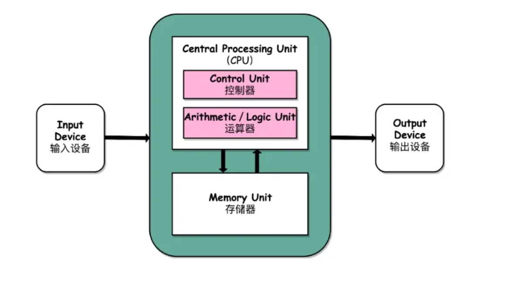
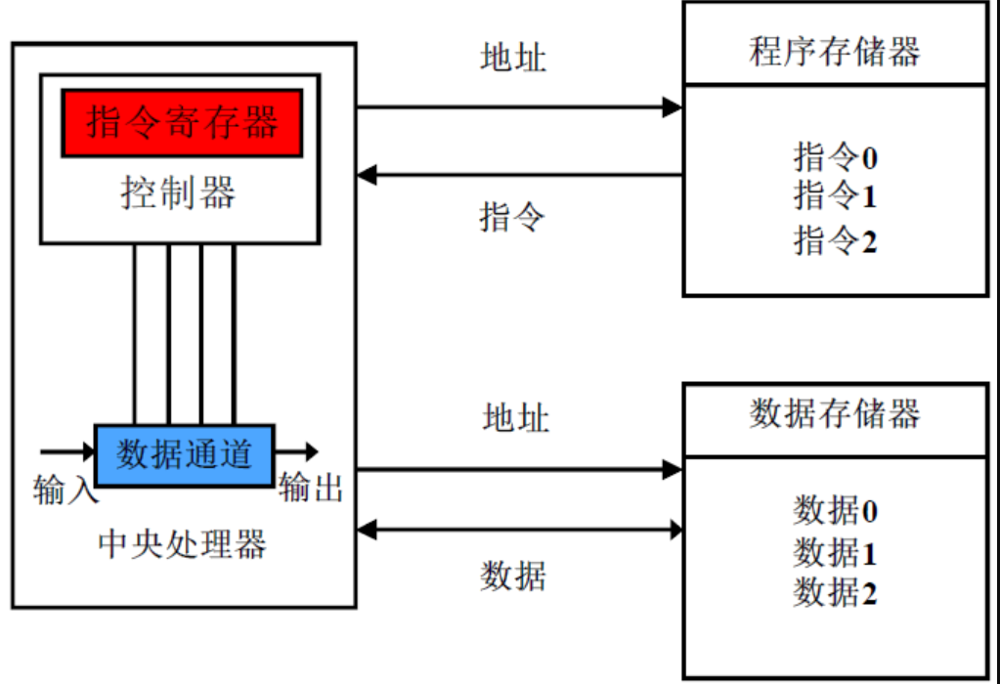
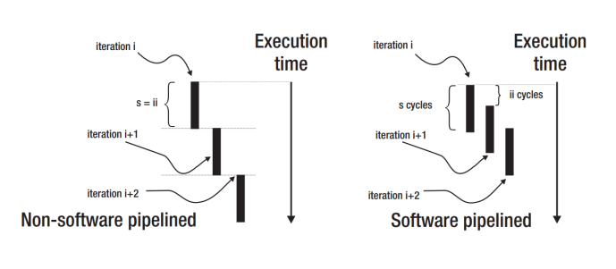
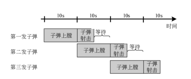
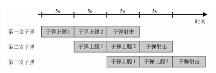
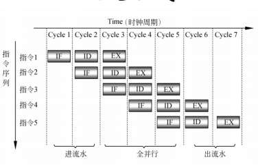
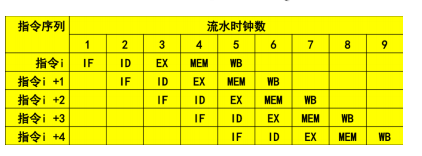
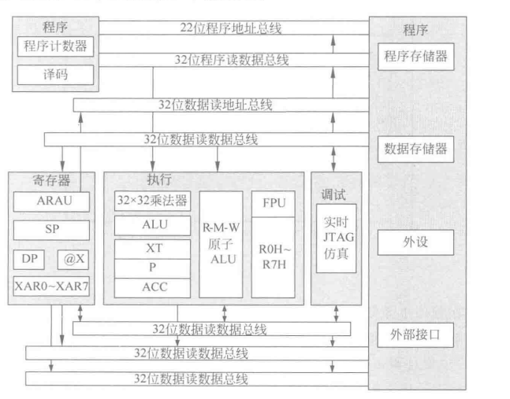
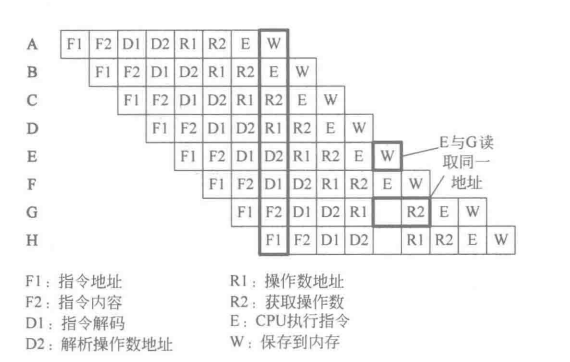
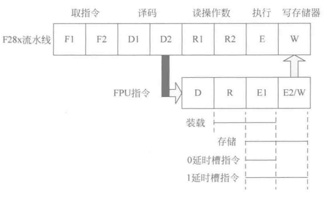

# DSP TI C2000 1_DSP 概述

## 0. 嵌入式系统

嵌入式系统是嵌入到对象体中的专用计算机系统。

> - 三要素
>
> 1. **嵌入性**：嵌入到对象体系中，有对象环境要求；（功能，性能，接口，环境，安全）
> 2. **专用性**：软硬件按照对象要求进行裁减；
> 3. **计算机**：实现对象的智能化功能。

嵌入式系统包括硬件和软件两部分。

> - 软件：应用程序，操作系统
> - 硬件：输入/输出，处理器，存储器

嵌入式系统具有**可靠性，实时性，专用性，小型性，软硬件设计一体化(可移植性差)，需要交叉开发环境(开发在PC上完成)**的特点。

嵌入式系统设计目标是**实现特定的任务**。

嵌入式系统可**按实时性要求**分为**非实时系统**(Linux/Windows)，**软实时系统**(消费级，超时导致性能下降)，**硬实时系统**(军工级，超时会导致任务失败(FreeRTOS绝对延时))，**按芯片封装功能丰富程度**分为MCU，MPU，DSP，Soc。

> - MPU(嵌入式微处理器)：通用计算机CPU的微缩版，体积小，功耗低，速度较慢。需要在片外接存储器。
> - MCU(嵌入式微控制器，单片机)：将CPU，RAM，ROM，TIM和多种I/O接口集成为微处理器，片内自带存储器。
> - DSP(数字信号处理器)：有自身的存储器，包括控制单元，运算单元，寄存器和存储单元，且可外接存储器，可与外接设备进行通信。DSP的本质是微控制器(DSC，数字信号控制器)。
> - Soc(片上系统)：多种芯片模块构成，包括逻辑控制模块，CPU内核模块，DSP模块，存储器模块，通信接口模块，电源功耗管理模块，射频前端模块。

## 1. DSP 的概念

DSP(数字信号处理器)：有自身的存储器，包括控制单元，运算单元，寄存器和存储单元，且可外接存储器，可与外接设备进行通信。DSP的本质是微控制器(DSC，数字信号控制器)。

- DSP 工作原理

DSP接收模拟信号，转换为数字信号，将数字信号进行计算，修改，强化，在其他芯片中将修改后的数字信号转化为模拟信号或进行通信。

- DSP 特点

DSP 运算能力强，计算速度快，主要用于**实时快速的实现数字信号处理算法**。

> - 在一个指令周期内可完成一次乘法(乘法器MUL)，一次加法(累加器ACC)；
> - 程序和数据空间分离(哈佛结构)，可以同时访问指令和数据；
> - 片内有快速RAM，通常可通过独立数据总线在两个块中同时访问；
> - 有低开销或无开销循环及跳转的硬件支持；
> - 快速中断处理和硬件I/O支持；
> - 可以并行执行多种操作；
> - 支持流水线操作，取指令，译码，执行操作可重叠执行。
>
> > **哈佛结构和冯诺依曼结构**
> >
> > 1. 冯诺依曼结构将程序指令存储器和数据存储器合并在一起，取指令和取操作数在同一总线上，通过分时复用方式进行，缺点是在高速运行时，不能达到同时取指令和取操作数，传输速度受限。
> >
> > 
> >
> > (存储器中同时存储程序指令和数据)
> >
> > (推荐Steam上的一款游戏：Turing Complete，它将带你搭建一个冯诺依曼结构的计算机)
> >
> > 计算机在运行时，先(通过地址总线中的地址)从存储器中取出第一条指令，通过控制器的译码，按指令的要求，从存储器中(在数据总线中)取出数据，再取出指令进行指定的运算和逻辑操作(运算器)，然后再按地址把结果送到存储器中去。
> >
> > 2. 哈佛结构将程序指令存储和数据存储分开，每个存储器独立编址，独立访问，减轻运行时的传输压力。
> >
> > 
> >
> > CPU首先(根据程序存储器的地址总线)到程序指令存储器中读取程序指令内容，解码后得到数据地址和指令，再（根据数据储存器的地址总线)到相应的数据储存器中读取数据，并进行下一步操作，最后将数据存回数据存储器。在一个机器周期中能够同时获得指令和数据。
> >
> > 改进型哈佛结构中合并了两个存储器的数据和地址总线。
> >
> > **流水线机制**
> >
> > 
> >
> > 如果某一个处理流程分为若干步骤，数据处理是单流向的，前一个的输出是下一个的输入，可以使用流水线操作。
> >
> > 1. 不规则流水线
> >
> > 指令每一步的操作时间不是等长的，长节拍的步骤会导致流水线效率下降（短节拍的步骤要等待长节拍的步骤执行完毕）。
> >
> > 
> >
> > 2. 规则流水线：通过拆分长节拍增加效率，使得每一步时间趋于一致，减少等待时间。拆分的越多，流水线深度越大。
> >
> > 
> >
> > > ARM7 三级流水线
> > >
> > > 
> > >
> > > IF：取指；
> > >
> > > ID：译码；
> > >
> > > EX：执行。
> >
> > > ARM9 五级流水线
> > >
> > > 
> > >
> > > IF：取指；
> > >
> > > ID：译码；
> > >
> > > EX：执行；
> > >
> > > MEM：访存(从数据存储器中读取)
> > >
> > > WB：写回(将数据写回寄存器)

- ARM 和 DSP

ARM 是对 ARM 公司系列微处理器的通称，速度快，芯片集成度高，具有强大的事务管理功能，丰富的外围接口，低功耗，主要用于消费电子产品。通常的使用 ARM 芯片处理**通用计算事务**， 使用 DSP 芯片处理大量的数学运算和信号处理。

## 2. TI DSP 系列简介

> - **TI C2000，主要用于实时控制应用的需求。用于电机控制，工业控制**；
> - TI C6000，针对于高性能信号处理应用。用于通信和音视频处理；
> - TI C5000，针对于低功耗设备。用于便携式设备。

- 总线结构

> 1. 程序读总线：22位地址线，32位数据线；(DSP不需要程序写总线，其程序由外接PC决定)
> 2. 数据读总线：32位地址线，32位数据线；
> 3. 数据写总线：32位地址线，32位数据线。

- CPU 八级流水线

- FPU 流水线

FPU(浮点处理引擎)为F28335携带的协处理器，其和主CPU为并行关系。

整数/浮点格式转换需要一个延时槽，其余不需要延时槽。

> - 浮点运算无流水线保护；
> - 汇编器检测流水线冲突，编译器阻止流水线冲突；
> - 在浮点流水线中的延时槽中防止非冲突指令可以提高性能。
