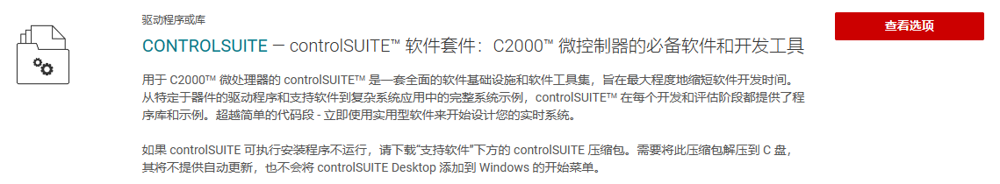
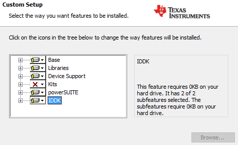
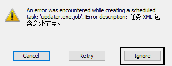

# DSP TI C2000 2_DSP环境配置和工程创建

## 1. CCS 环境配置

### CCS 软件下载

[CCS 下载官网](https://www.ti.com.cn/tool/cn/download/CCSTUDIO/9.1.0.00010)

直接从官网中下载安装即可，十分的简单。

### TI C2000 TMS320F28335 Library 下载

[Library 下载](https://www.ti.com.cn/product/zh-cn/TMS320F28335?keyMatch=TMS320F28335&tisearch=search-everything&usecase=GPN-ALT#software-development)

1. 下载下载器




下载`controlsuiteinstaller.exe`即可。

2. 下载库(需要联网)

Kits项选择：Entire feature will be unavailable。

逐个点击三角选择最后一项：Feature will be installed when required。



展开 device support -> f2833x，选择版本。点击三角图标，选择菜单第一个：Will be installed on local hard drive。

第一遍进度走完之后，会弹出一个软件安装界面，点击确定即可，会再走一遍进度。

第二遍进度走完时，弹出如下提示，请一定要选择忽略。



## 2. CCS 工程模板创建和介绍

### Library 介绍

```
.
|-- DSP2833x_common	
	|-- cmd
		|-- 28335_RAM_Ink.cmd
		|-- F28335.cmd
	|-- gel
		|-- f28335.gel
	|-- include
	|-- lib
	|-- source
|-- DSP2833x_header
	|-- cmd
	|-- gel
	|-- include
	|-- source
```

> - `DSP2833x_common` 文件夹：存放了 DSP2833x 开发所需的外设、内核、DSP
>
>   运算库、CMD 等文件。
>
>   > - `cmd` 文件夹：存放了 DSP 内 RAM 和 FLASH 存储地址和容量的分配启动文件。
>   >
>   > > - `28335_RAM_lnk.cmd` 文件：该文件通常用于仿真调试，一般情况下直接用 TI给的，不需要做修改即可满足调试用，模式较固定，当然你也可以做相应的修改用到哪块 RAM 存储空间，在 CMD 文件里做相应的分配即可。
>   > > - `F28335.cmd` 文件：该文件通常用于 FLASH 烧写，而编写用于 FLASH 烧写的`F28335.cmd` 文件时相对来说较复杂些，根据不同的情况需要做一些修改，TI 提供的这个文件也已经写好，一般的开发也无需改动。
>   >
>   > - `gel` 文件夹：扩展 CCS 功能。
>   > - `include` 文件夹：该文件夹用于存放 F2833x 通用文件的头文件。比如中断、全局变量及函数声明、IQmath 库等。
>   > - `lib` 文件夹：该文件夹用于存放 F2833x 运算库文件。比如 `IQmath.lib`、`rts2800_ml.lib` 等，通常使用的主要是 `IQmath.lib`。
>   > - source 文件夹：该文件夹用于存放 F2833x 内核、外设驱动的源文件。比如`DSP2833x_Adc.c` 、 `DSP2833x_CpuTimers.c `、 `DSP2833x_Gpio.c` 、`DSP2833x_usDelay.asm` 等。
>
> - `DSP2833x_headers` 文件夹：存放了 DSP2833x 开发所需的外设头文件、
>
>   带和不带 BIOS CMD 等文件。
>
>   > - `cmd`文件夹：存放了 BIOS 和 nonBIOS 文件，也是对 DSP 内 RAM 和 FLASH 存储地址和容量的分配启动文件。在程序开发过程中，如果不使用 BIOS 操作系统，在仿真调试程序时，对 DSP内 RAM 和 FLASH 存储地址和容量的分配启动文件只需要 `28335_RAM_lnk.cmd` 和`DSP2833x_Headers_nonBIOS.cmd` 这两个。当程序仿真调试成功后，我们需要将其烧写到芯片内 FLASH 中，所以工程内存储地址和容量的分配启动文件就需要`F28335.cmd` 和 `DSP2833x_Headers_nonBIOS.cmd` 这两个。如果在 DSP 中移植了操作系统那么就需要使用`DSP2833x_Headers_BIOS.cmd` 文件。
>   > - `gel` 文件夹：该文件夹内存放了一个有关 DSP2833x 外设的`DSP2833x_Peripheral.gel` 文件。
>   > - `include` 文件夹：该文件夹存放的是`DSP2833x_Libraries\DSP2833x_common\source`对应的头文件。
>   > - `source` 文件夹：该文件夹内存放了 `DSP2833x_GlobalVariableDefs.c` 文件，里面主要是一些全局变量及条件编译等。

### 工程的构成

1. 仿真调试或者 FLASH 烧写所需的`.cmd` 文件和 DSP 的 BIOS 或`nonBIOS.cmd` 文件，在正常开发过程中，先使用仿真调试的 `.cmd` 文件，待程序调试成功后再使用 FLASH 烧写的`.cmd`文件，如果未使用到操作系统即选择`nonBIOS.cmd`文件。
2. 芯片的`.ccxml`目标配置文件。
3. 芯片内核及外设`.c`源文件；
4. 芯片内核及外设`.h`头文件；
5. DSP `.lib` 库文件。
