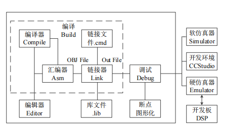
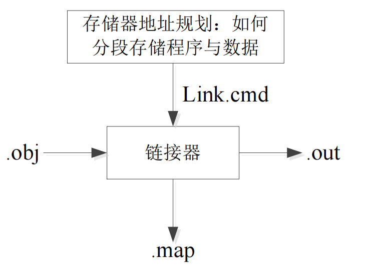
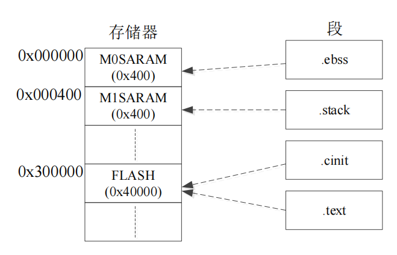
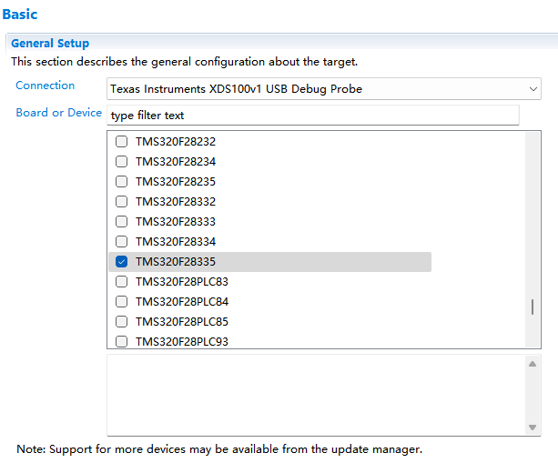
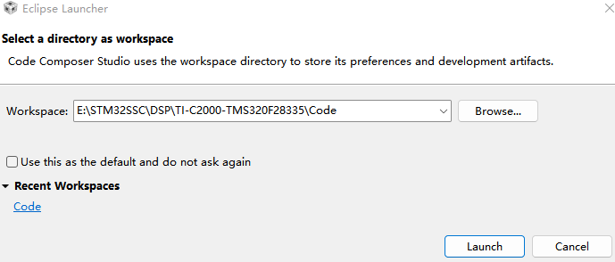
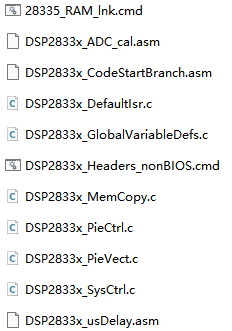

# DSP TI C2000 2_DSP环境配置和工程创建

## 0. CCS 环境介绍



## 1. CCS 环境配置

### CCS 软件下载

[CCS 下载官网](https://www.ti.com.cn/tool/cn/download/CCSTUDIO/9.1.0.00010)

直接从官网中下载安装即可，十分的简单。

### TI C2000 TMS320F28335 Library 下载

[Library 下载](https://www.ti.com.cn/product/zh-cn/TMS320F28335?keyMatch=TMS320F28335&tisearch=search-everything&usecase=GPN-ALT#software-development)

1. 下载下载器


下载`controlsuiteinstaller.exe`即可。

2. 下载库(需要联网)

Kits项选择：Entire feature will be unavailable。

逐个点击三角选择最后一项：Feature will be installed when required。


展开 device support -> f2833x，选择版本。点击三角图标，选择菜单第一个：Will be installed on local hard drive。

第一遍进度走完之后，会弹出一个软件安装界面，点击确定即可，会再走一遍进度。

第二遍进度走完时，弹出如下提示，请一定要选择忽略。


## 2. CCS 工程模板创建和介绍

### Library 介绍

```
.
|-- DSP2833x_common	
	|-- cmd
		|-- 28335_RAM_Ink.cmd
		|-- F28335.cmd
	|-- gel
		|-- f28335.gel
	|-- include
	|-- lib
	|-- source
|-- DSP2833x_header
	|-- cmd
	|-- gel
	|-- include
	|-- source
```

> - `DSP2833x_common` 文件夹：存放了 DSP2833x 开发所需的外设、内核、DSP
>
>   运算库、CMD 等文件。
>
>   > - `cmd` 文件夹：存放了 DSP 内 RAM 和 FLASH 存储地址和容量的分配启动文件。
>   >
>   > > - `28335_RAM_lnk.cmd` 文件：该文件通常用于仿真调试，一般情况下直接用 TI 给的，不需要做修改即可满足调试用，模式较固定，当然也可以做相应的修改用到哪块 RAM 存储空间，在 CMD 文件里做相应的分配即可。（使用该文件断电后不保存程序）
>   > > - `F28335.cmd` 文件：该文件通常用于 FLASH 烧写，而编写用于 FLASH 烧写的`F28335.cmd` 文件时相对来说较复杂些，根据不同的情况需要做一些修改，TI 提供的这个文件也已经写好，一般的开发也无需改动。（使用该文件后断电保存程序）
>   > > - **工程中仅需要两个文件中的一个**。
>   >
>   > - `gel` 文件夹：扩展 CCS 功能。
>   > - `include` 文件夹：该文件夹用于存放 F2833x 通用文件的头文件。比如中断、全局变量及函数声明、IQmath 库等。
>   > - `lib` 文件夹：该文件夹用于存放 F2833x 运算库文件。比如 `IQmath.lib`、`rts2800_ml.lib` 等，通常使用的主要是 `IQmath.lib`。
>   > - source 文件夹：该文件夹用于存放 F2833x 内核、外设驱动的源文件。比如`DSP2833x_Adc.c` 、 `DSP2833x_CpuTimers.c `、 `DSP2833x_Gpio.c` 、`DSP2833x_usDelay.asm` 等。
>
> - `DSP2833x_headers` 文件夹：存放了 DSP2833x 开发所需的外设头文件、
>
>   带和不带 BIOS CMD 等文件。
>
>   > - `cmd`文件夹：存放了 BIOS 和 nonBIOS 文件，也是对 DSP 内 RAM 和 FLASH 存储地址和容量的分配启动文件。在程序开发过程中，如果不使用 BIOS 操作系统，在仿真调试程序时，对 DSP 内 RAM 和 FLASH 存储地址和容量的分配启动文件只需要 `28335_RAM_lnk.cmd` 和`DSP2833x_Headers_nonBIOS.cmd` 这两个。当程序仿真调试成功后，我们需要将其烧写到芯片内 FLASH 中，所以工程内存储地址和容量的分配启动文件就需要`F28335.cmd` 和 `DSP2833x_Headers_nonBIOS.cmd` 这两个。如果在 DSP 中移植了操作系统那么就需要使用`DSP2833x_Headers_BIOS.cmd` 文件。**工程中仅需要两个文件中的一个**。
>   > - `gel` 文件夹：该文件夹内存放了一个有关 DSP2833x 外设的`DSP2833x_Peripheral.gel` 文件。
>   > - `include` 文件夹：该文件夹存放的是`DSP2833x_Libraries\DSP2833x_common\source`对应的头文件。
>   > - `source` 文件夹：该文件夹内存放了 `DSP2833x_GlobalVariableDefs.c` 文件，里面主要是一些全局变量及条件编译等。

#### 链接命令文件`.cmd`

`.cmd`文件用于给各个段分配空间，便于区分程序和数据。



1. RAM FLASH 分配



```
MEMORY
{ 
    PAGE 0: /* Program Memory(程序存储) */
    FLASH: origin = 0x300000, length = 0x40000
    PAGE 1: /* Data Memory(数据存储) */
    M0SARAM: origin = 0x000000, length = 0x400
    M1SARAM: origin = 0x000400, length = 0x400
}
```

**RAM 中的数据掉电清空，FLASH 数据掉电保存，调试是先在 RAM 中调试程序，最后在 FLASH 中烧录程序**。

2. 段分配

| 段名(初始化的段) | 描述                   | 链接位置 |
| ---------------- | ---------------------- | -------- |
| `.text`          | 代码                   | FLASH    |
| `.cint`          | 全局和静态变量的初始值 | FLASH    |
| `.econst`        | 常数                   | FLASH    |
| `.switch`        | switch 表达式的表格    | FLASH    |
| `.pinit`         | 全局函数构造表         | FLASH    |

| 段名(未初始化段) | 描述                     | 链接位置     |
| ---------------- | ------------------------ | ------------ |
| `.ebss`          | 全局和静态变量           | RAM          |
| `.stack`         | 堆栈空间                 | 低64K字的RAM |
| `.esysmem`       | `Far malloc`函数存储空间 | RAM          |

```
SECTIONS
{
    .text:> FLASH PAGE = 0
    .ebss:> M0SARAM PAGE = 1
    .cinit:> FLASH PAGE = 0
    .stack:> M1SARAM PAGE = 1
}
```

### 工程的构成

1. 仿真调试或者 FLASH 烧写所需的`.cmd` 文件和 DSP 的 `BIOS.cmd` 或 `nonBIOS.cmd` 文件，在正常开发过程中，先使用仿真调试的 `.cmd` 文件，待程序调试成功后再使用 FLASH 烧写的`.cmd`文件，如果未使用到操作系统即选择`nonBIOS.cmd`文件。
2. 芯片的`.ccxml`目标配置文件。
3. 芯片内核及外设`.c`源文件；
4. 芯片内核及外设`.h`头文件；
5. DSP `.lib` 库文件。

### 配置烧录器

View -> Target Configureations 

创建`F28335_XDS100V1.ccxml`文件（根据自身烧录器配置），配置如下：



### 创建工程模板

1. 打开CCS，选定工作空间（工作空间下可以存在多个工程）；



2. 创建新工程，选择芯片型号和烧录器。

3. 创建BSP（硬件驱动层），Library（基础驱动库），User（用户）三个文件夹；

在Library中添加以下文件：



后续使用外设时会添加对应文件。

4. 删除重复文件。

5. User 文件夹中创建`main.c`，添加以下内容：

```c
#include "DSP2833x_Device.h"
#include "DSP2833x_Examples.h"

void delay(void)
{
    Uint16 i;
    Uint32 j;
    for(i=0;i<32;i++)
        for (j=0;j<100000;j++);
}

void LED_Init(void)
{
    EALLOW;
    SysCtrlRegs.PCLKCR3.bit.GPIOINENCLK = 1;

    //LED Init
    GpioCtrlRegs.GPCMUX1.bit.GPIO66=0;
    GpioCtrlRegs.GPCDIR.bit.GPIO66=1;
    GpioCtrlRegs.GPCPUD.bit.GPIO66=0;
    GpioDataRegs.GPCSET.bit.GPIO66=1;
    EDIS;
}

int main()
{
    InitSysCtrl();
    InitPeripheralClocks();

    LED_Init();

    while(1)
    {
        GpioDataRegs.GPCTOGGLE.bit.GPIO66=1;
        delay();
    }
}
```

6. 点击以下图标进行编译。


存在两个选项：1. Debug 编译；2. Release 编译并生成输出文件。

7. 点击以下图标进行调试。


RAM 中的调试必须使用 Resume 使得程序连续运行。
