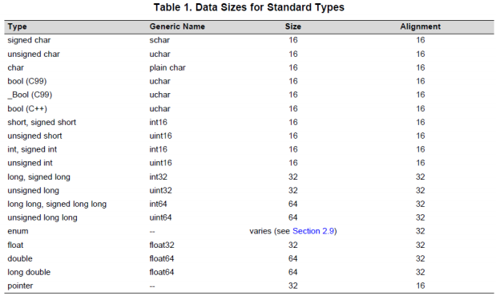
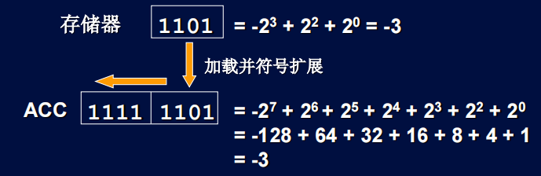
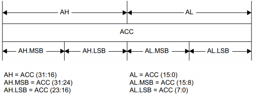
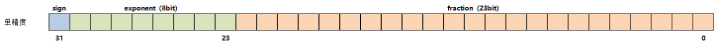
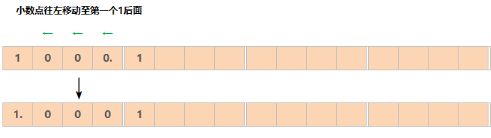
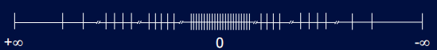
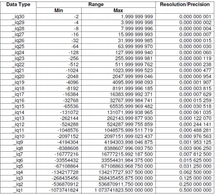

# DSP TI C2000 3_数字处理

## 1. TI C2000 的数字处理方式

DSP 的数据类型如下：

### 整型数据的存储和处理

- DSP 中的整型数据通过补码进行运算

> 首先在绝对值的二进制数前加入符号位，正数为0，负数为1，形成原码；
>
> 对于正数：原码 = 反码 = 补码；
>
> 对于负数：反码为原码除符号位外所有位取反，补码为反码加一。

- DSP 有符号数运算：**使用补码运算，如果有最高位进位可以舍去**。
- DSP 符号扩展

短数据类型的符号位填充到长数据类型的高字节位（即比短数据类型多出的那一部分），保证扩展后的数值大小不变。只适用于有符号数，符号不变，负数扩展之后还是负数。

符号扩展由`ST0`寄存器的`SXM`位控制。`SXM=1`时，符号扩展自动进行。

> TI C2000 的 ACC 累加器如下：
>
> 

### 浮点数据的存储和处理

对于浮点数而言，小数部分的精度取决于用多少位进行表示，位数越高则精度越高。而整数部分位数越高，表示的范围越广。

- 定点存储方法

表示一个占用 (m+n) bit 的Q型定点数。Qm.n 能够说明这个整数和实际数值之间的比值$2^n$。如果 m=1 可以简写为 Qn。

> 对于Q15格式定点数，**定点数除以 32768 可以得到对应的小数。**

为了兼顾精度和范围，可以改变小数点的位置形成浮点数。

- IEEE-754单精度浮点（需要FPU）

> 1. IEEE-754单精度浮点构成
>
> 
>
> 符号位（sign）：符号位，表示该浮点类型的正负，0为正，1为负
>
> 指数位（exponent）：指数位，表示该浮点类型数据的大小容量，8位，容量高达256种不同形态，通过阶计算而来，计算方式为**阶 + 偏移量 = 指数**，阶码取值范围为[-127,128]，单精度偏移量为127，双精度偏移量为1023，偏移是为了是指保持指数的存储始终为正数，指数位越多可存储的浮点类型数据就越大。
>
> 尾数位（fraction）：尾数位，也叫有效数字，表示该浮点类型数据的精度，通过浮点数的二进制规范化而来，会将第一位的 1. 隐藏起来，尾数位越多存储的浮点类型数据精度就越高。
>
> 2. IEEE-754单精度浮点存储
>
> - 存储符号位：0表示浮点数为正数，1为负数。
> - 规范化：将已经转换为二进制小数的的小数点往左边移动，移动至小数点左边第一位为1为止，这个过程中小数点移动的位数就是这个浮点类型的阶码，此时得到的小数即为尾数。
>
> 
>
> > 规范化也会出现小数反向移动的情况，如果浮点类型没有整数，例如十进制数0.5的二进制形式0.1，此时需要向右边反向移动1位，即为1.0，-1就是它的阶码，移动后的尾数第一位始终为1。
> >
> > IEEE-754没有必要将负数阶码存储，阶码也不会单独再分配一个的符号位，于是就有了偏移量，单精度浮点类型的偏移量为127，双精度浮点类型为1023，假设存储一个非常小的单精度浮点类型，规范化时小数点已经需要向右移动127位，即它的指数为-127，加上单精度浮点类型的偏移量127后，也不过是0，它依然是一个正整数；所以这个偏移量存在的必要，就是为了确保它在有限的指数位取值范围中保持正整数。
>
> - 尾数位存储
>
> 规范化后的二进制小数就是它的尾数，1.0001就是尾数，所以一个浮点数主要存储在尾数位，规范化会将小数点左边第一位1移动，所以尾数前面第一位始终都是1.，这个1.是可以省略的。
>
> 如果尾数不足23位，则在低位进行补零。
>
> 3. 精度问题
>
> 随着数字绝对值的增大，整数部分占用的尾数位逐渐增加，整数越大，整数部分占用的尾数位越大，数值精度越低，当整数部分超过$2^{24}$时，小数部分完全丢失。
>
> 

TI C2000中，使用FPU可以使用IEEE-754进行浮点数处理。

- 智能定点格式IQmath（不需要FPU）

I指整数部分，Q指小数部分，`_iqx`指有`x`位小数位，`32-x`位整数位。

> 32位的浮点数和IQ格式表示的定点数，在数轴上都有$2^{32}$种可表示的值。
>
> - 浮点数可表达数值范围大得多，靠近0点精度高得多。
>
> - IQ格式可表达数值范围小，精度一致。
>
> 

使用IQmath库时，包含`IQmathLib.h`头文件，定义全局宏定义`GLOBAL_Q`定义数据格式。

IQmath提供了浮点数与定点数之间的兼容性，使用`_IQxxx()`函数时，编译器可以自动执行相应的转换，适配是否存在FPU的情况。

> FOC算法需要的IQmath数据格式：
>
> | Q的范围    | 稳定程度 Q的范围                              |
> | ---------- | --------------------------------------------- |
> | Q31 to Q27 | 不稳定，表示的数的范围不够                    |
> | Q26 to Q19 | 稳定的                                        |
> | Q18 to Q0  | 不稳定，分辨率/精度不够，产生了较大的量化误差 |
>
> `GLOBAL_Q`的选取需要对所有变量的范围进行预估，然后进行测试。