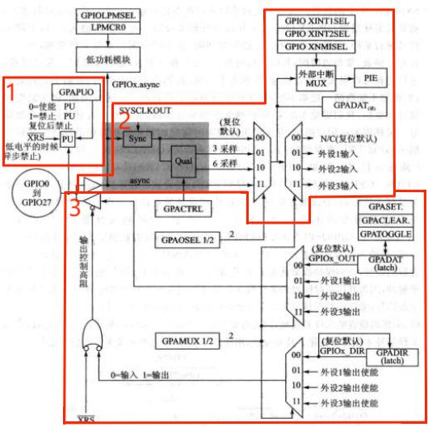

# DSP TI C2000 4_GPIO(general purpose intput output，通用输入输出端口)

## 1. F28335 GPIO

- GPIO 概述

F28335 中共有 88 个 GPIO 引脚，分为A，B，C三组。

A 组：`GPIO0`-`GPIO31`，B 组：`GPIO32`-`GPIO63`，C 组：`GPIO64`-`GPIO87`。

每一个GPIO都具备复用功能，只要通过相应的寄存器设置即可配置对应的复用功能，同一时刻，每个引脚只能使用该引脚的一个功能。

- GPIO 内部结构



> 1. 1部分为上拉电阻设置。PU，通过软件可编程控制其引脚电平是否上拉，控制寄存器为 `GPXPUD` (X为组号A，B，C), 0 的时候上拉有效，1的时候上拉无效。
> 2. 2部分为输入通道，GPIO 输入后经滤波电路，引脚的功能选择由多路选择器控制，每个引脚有 4 种功能选择， 00 为通用 I /O 引脚， 01 、 10 、 11 分别为外设1、2 、3引脚，输入的值进入 `GPADAT` 寄存器。
> 3. 3部分为输出通道，输出值为 `GPADAT` 内的值，在做输出引脚时，可以通过 `GPASET` ，`GPACLEAR`，`GPATOGGLE`寄存器设置该寄存器的值。

> - GPIO 输入配置
>
> 1. GPIO 输入可以通过量化寄存器 `GPxQUAL` 对输入信号进行量化限制，从而可以消除数字量 IO 引脚的噪声干扰。配置` GPAQSEL1`、`GPAQSEL2` 寄存器选择 GPIO 引脚的输入限制类型。对于一个 GPIO 输入引脚，输入限制可以被 `SYSCLKOUT` 同步然后经采用窗进行滤波限制。
>
>    > 对于配置成外设输入的引脚，除同步与采样限制外，也可以是异步输入的。
>
> 2. 引脚在配置为外设输入时，可以采用异步输入模式，该模式仅用于不需要输入同步的外设或外设自身具有信号同步功能，如通信端口 SCI、SPI、eCAN 和 IIC。
>
> 3. 如果引脚是 GPIO 功能则异步功能模式失效，只能采用同步模式。所以引脚复用时默认的就是同步模式。在该模式中，因为引入的信号与时钟信号初始不同步，所以需要 1 个 `SYSCLKOUT` 进行 `SYSCLKOUT` 与输入信号匹配同步，因此输入信号会有 1 个 `SYSCLKOUT` 的延迟。如果还通过采样窗口的办法对输入同步后的信号进行滤波，就需要对采样周期 `GPxCTRL` 与采样窗进行相关设置。为了限制输入信号，对输入信号进行采样，采样总是会有一定的时间间隔，这个时间间隔就是采样周期。采样周期由用户指定，并决定采样间隔时间或相对于系统时钟的比率。采样周期由 `GPxCTRL` 寄存器的 `QUALPRDn` 位来指定，`QUALPRDn` 一位可以用来配置 8 路输入信号。例如，GPIO-GPIO7 由 `GPACTRL[QUALPRD0]`位设置，GPIO8-GPIO15 由 `GPACTRL[QUALPRD1]`位设置。在采样的过程中，信号可能会受到干扰影响而误触发信号，滤波的作用就是通过设置采样窗的周期数，尽量避免一些误触发的毛刺信号。<br/>在限制选择器（`GPXQSEL1`、`GPXQSEL2`）中信号采样次数被指定为 3 个采样或 6 个采样，当输入信号在经过 3 个或 6 个采样周期都保持一致时，输入信号才被认为是个有效信号，否则保持原来的状态不变。
>
> 

## 2. F28335 GPIO 相关寄存器

### `GPXCTRL` 寄存器

`GPXCTRL` 寄存器将为输入引脚指定采样周期。


### `GPAQSEL` 寄存器

`GPAQSEL1` 寄存器用来配置采样数，也可以认为是滤波数，当干扰信号持续采样周期小于该寄存器设置的采样周期数时，干扰信号被滤除。


### `GPXDIR` 寄存器

`GPXDIR` 寄存器用来配置 GPIO 的输入输出方向。


## 3. F28335 GPIO 库函数编程

对 GPIO 的定义操作的函数在 `DSP2833x_Gpio.c` 中。

### GPIO 结构体

```c
struct GPIO_CTRL_REGS
{
    union GPACTRL_REG GPACTRL; // GPIO A Control Register (GPIO0 to 31)
    union GPA1_REG GPAQSEL1; // GPIO A Qualifier Select 1 Register (GPIO0 to 15)
    union GPA2_REG GPAQSEL2; // GPIO A Qualifier Select 2 Register (GPIO16 to 31)
    union GPA1_REG GPAMUX1; // GPIO A Mux 1 Register (GPIO0 to 15)
    union GPA2_REG GPAMUX2; // GPIO A Mux 2 Register (GPIO16 to 31)
    union GPADAT_REG GPADIR; // GPIO A Direction Register (GPIO0 to 31)
    union GPADAT_REG GPAPUD; // GPIO A Pull Up Disable Register (GPIO0 to 31)
    Uint32 rsvd1;
    union GPBCTRL_REG GPBCTRL; // GPIO B Control Register (GPIO32 to 63)
    union GPB1_REG GPBQSEL1; // GPIO B Qualifier Select 1 Register (GPIO32 to 47)
    union GPB2_REG GPBQSEL2; // GPIO B Qualifier Select 2 Register (GPIO48 to 63)
    union GPB1_REG GPBMUX1; // GPIO B Mux 1 Register (GPIO32 to 47)
    union GPB2_REG GPBMUX2; // GPIO B Mux 2 Register (GPIO48 to 63)
    union GPBDAT_REG GPBDIR; // GPIO B Direction Register (GPIO32 to 63)
    union GPBDAT_REG GPBPUD; // GPIO B Pull Up Disable Register (GPIO32 to 63)
    Uint16 rsvd2[8];
    union GPC1_REG GPCMUX1; // GPIO C Mux 1 Register (GPIO64 to 79)
    union GPC2_REG GPCMUX2; // GPIO C Mux 2 Register (GPIO80 to 95)
    union GPCDAT_REG GPCDIR; // GPIO C Direction Register (GPIO64 to 95)
    union GPCDAT_REG GPCPUD; // GPIO C Pull Up Disable Register (GPIO64 to 95)
};
```

### GPIO 输出控制

GPIO 输出控制的方法：

> 1. 使能 GPIO 引脚功能；
> 2. 确定 GPIO 输出方向；
> 3. 使能 GPIO 上拉；
> 4. 配置 GPIO 输出电平。
> 5. 可以通过 `GPxDAT` 寄存器独立读写 IO 信号。
> >  利用 `GPxSET` 寄存器写 1（写 0 无效）对 IO 口置位。
> >  利用 `GPxCLEAR` 寄存器写 1（写 0 无效）对 IO 口清零。
> >  利用 `GPxTOOGLE` 寄存器置 1 后（写 0 无效）翻转 IO 输出电平，原来高电平变成低电平，原来低电平变成高电平。

```c
void GPIO_Init()    
{
	EALLOW;

    // BEEP 端口配置
    GpioCtrlRegs.GPAMUX1.bit.GPIO6=0;	// 使能 GPIO 引脚功能为通用GPIO
    GpioCtrlRegs.GPADIR.bit.GPIO6=1;	// 设置 GPIO 为输出方向
    GpioCtrlRegs.GPAPUD.bit.GPIO6=0;	// 设置 GPIO 可上拉

    EDIS;

    GpioDataRegs.GPACLEAR.bit.GPIO6=1;	// 初始化为低电平
}
```

### GPIO 输入控制

> 1. 使能 GPIO 引脚功能；
> 2. 确定 GPIO 输入方向；
> 3. 使能 GPIO 上拉；
> 4. 可以通过 `GPxDAT` 寄存器独立读写 IO 信号。
