# DSP TI C2000 4_时钟系统

## 1. 系统时钟源

### 时钟源输入

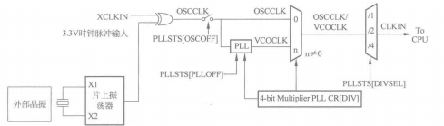

F28335 存在两种时钟源，和STM32相似，存在外部时钟源和内部时钟源：

> 1. 采用外部振荡器作为时钟源（**外部时钟**），即在 XCLKIN 引脚提供一定频率的时钟信号，也可以通过复用的 X1 引脚提供，即由其他数字系统或外部振荡器引入。
>
> > - 采用 3.3V 的外部时钟
> >
> > 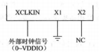
> >
> > - 采用 1.9V 的外部时钟
> >
> > 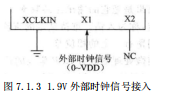
>
> 2. 采用 F28335 内部振荡器作为时钟源（**内部时钟**），在 X1 和 X2 引脚之间连接一个晶振就可以产生时钟源。
>
> 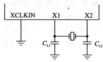

**通常使用内部时钟源**（~~与STM32的外部晶振叫法相反，有点奇怪~~）,使用30MHz晶振。

### 锁相环 PLL

内部信号时钟源与外部信号时钟源通过异或门后选择接入成为 `OSCCLK` 即振荡器时钟信号，该信号受到寄存器 `PLLSTS`（`OSCOFF`）位控制，该位置 1 即开关合上，振荡器信号允许通过，然后分两路传输，一路直接传输，另一路经过 PLL 锁相环模块。**一般不能直接使用 `OSCCLK` 信号，该信号的频率是由石英晶体产生，频率不够高，需要进入锁相环倍频和分频后才能使用**，所以要使能 PLL 锁相环，即对寄存器 `PLLSTS`（`PLLOFF`）位控制。

使能PLL后通过寄存器 `PLLCR` 来设置倍频数，倍频值最大可设置为 10，通常设置倍频数为 10，这样通过 PLL 后的时钟信号 `VCOCLK` 即为 300MHZ。

F28335 芯片最高工作频率是 150MHZ，所以此时还不能直接 CPU 内核使用，还需要对其分频处理，可通过寄存器 `PLLSTS`（`DIVSEL`）位来设置分频系数，为了使 CPU 工作在最高频率下，通常设置分频系数为 2，即最终时钟信号 `CLKIN` 为 150MHZ 供给 CPU。

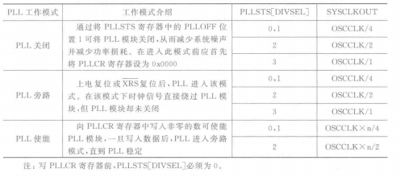

### 振荡器失效检测电路

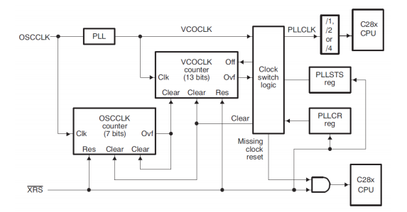

由于外部环境的干扰，外部时钟源有时不能进入DSP或者不能为DSP提供正常的时钟信号。

使用两个计数器来检测`OSCCLK`信号，计数器`OSCCLK Counter`随着`OSCCLK`信号的到来而计数，计数器`VOCLK Counter`是当PLL使能之后，随着`VCOCLK`信号的到来而计数，当7位的`OSCCLK`计数器溢出时，清除13位的`VCOCLK`计数器。所以，只要`OSCCLK`到来，`VCOCLK`计数器就不会溢出。

如果`VCOCLK`信号丢失，PLL模块的输出就会进入默认频率，并保持增长。由于`OSCCLK`信号丢失，那么`OSCCLK`计数器就不再继续增加，`VCOCLK`计数器不能被周期性的清零，经过一段时间，`VCOCLK`计数器就会溢出。当`VCOCLK`计数器溢出之后，检测信号丢失逻辑器`Clock switch logic`就会重置CPU，外设和其他的设备的逻辑电平。这个复位信号被称为`MCLKRES` 信号，这个信号只能由内部产生，外部的`XRS`信号不会被`MCLKRES`信号拉低。

### 片外时钟

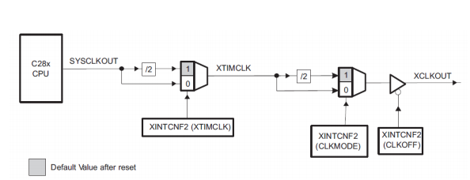

## 2. 系统控制和外设时钟

锁相环模块除了为内核提供时钟外，还通过系统时钟输出提供快速和慢速外设时钟。

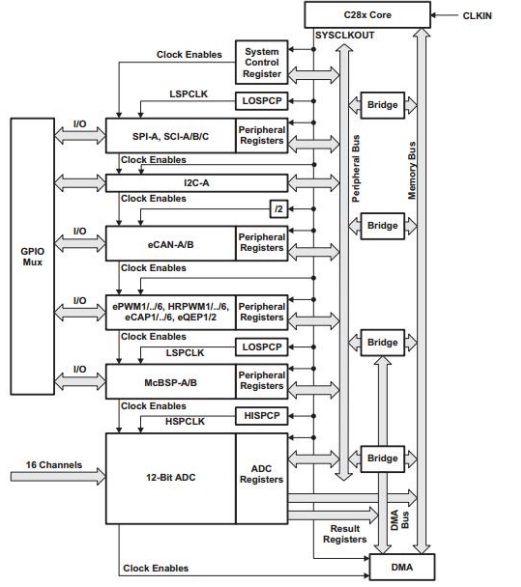

内核时钟输出通过 `LOSPCP` 低速时钟寄存器设置预分频，可设置成低速时钟信号 `LSPCLK`，SPI、I2C、MCBSP 这些串口通信协议都使用低速时钟信号。

内核时钟输出通过`HISPCP`高速时钟寄存器设置预分频，可设置成高速时钟信号`HSPCLK`，A/D 模块采用的是高速时钟信号，方便灵活设置 A/D 采样率。通过 1/2 分频给了 eCAN 模块，直接输出给了系统控制寄存器模块、DMA 模块、EPWM模块、ECAP 模块、EQEP 模块这些高速外设模块。

高速外设基本都有自己的预定标时钟设置寄存器，如果预定标寄存器值为 0，那么 `LSPCLK` 等时钟信号就成为了外设实际使用时钟信号。当然，要使用这些信号需要在外设时钟寄存器`PCLKCR` 中设置对应外设使能。

## 3. 时钟系统寄存器

### 外设时钟控制寄存器 `PCLCCR0/1/3`

1. `PCLKCR0`

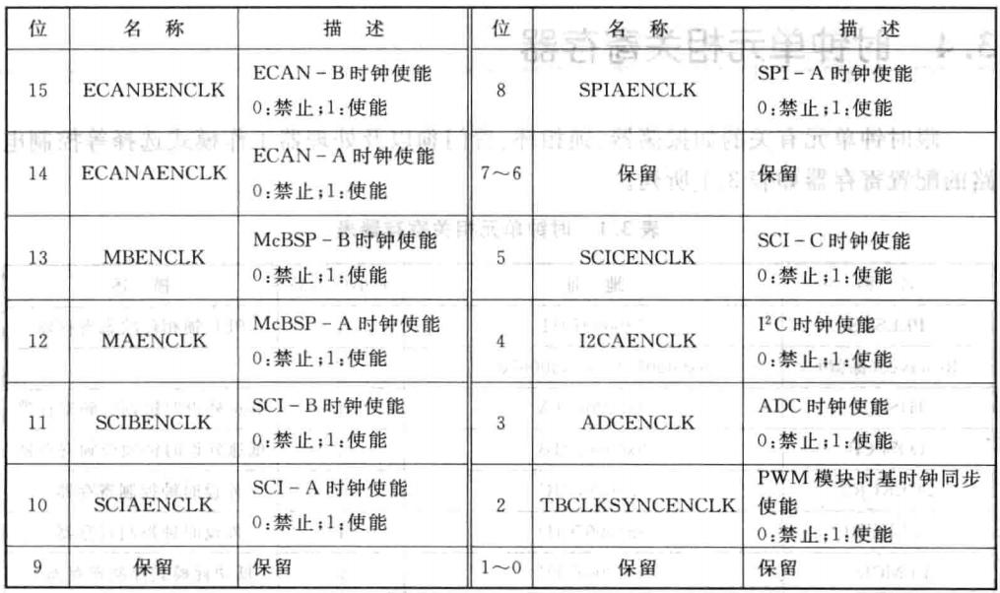

2. `PCLKCR1`

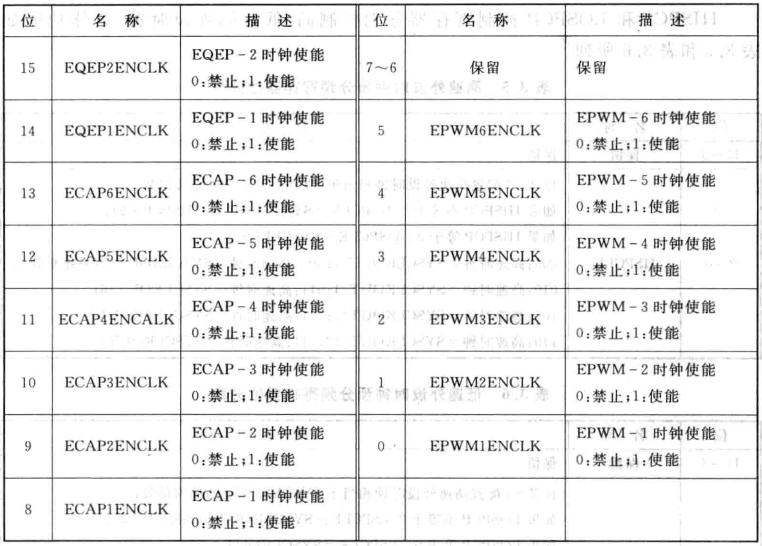

3. `PCLKCR3`

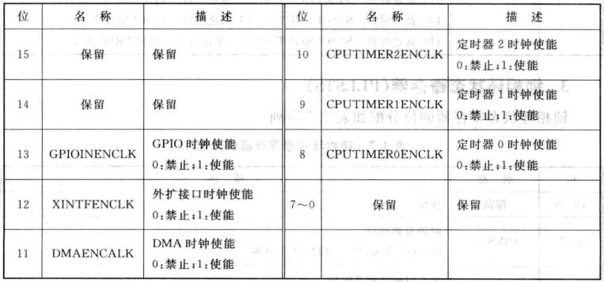

### 高/低速外设时钟预分频寄存器`HISPCP/LOSPCP`

1. `HISPCP`

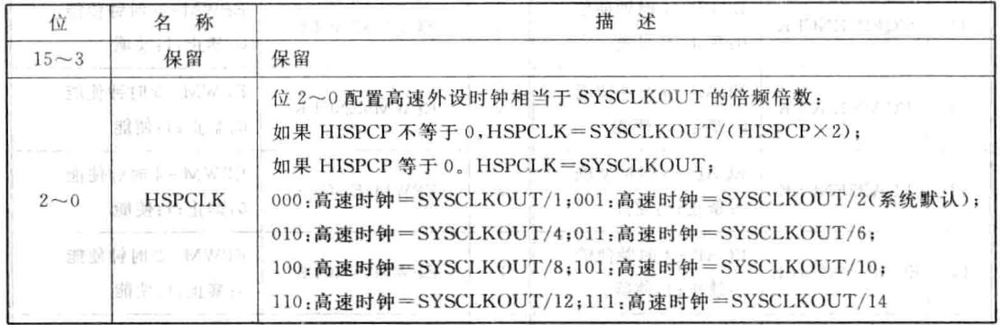

2. `LOSPCP`

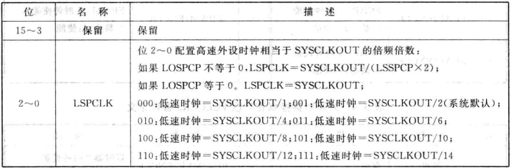

### 锁相环状态寄存器`PLLSTS`

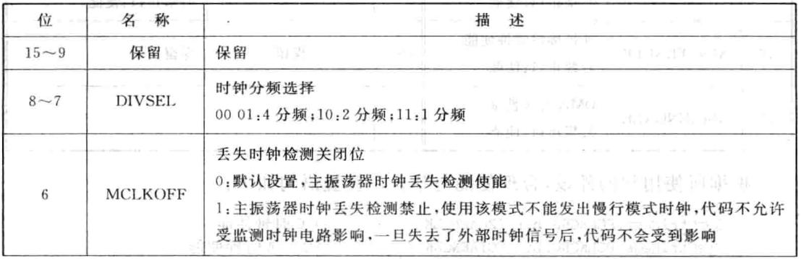

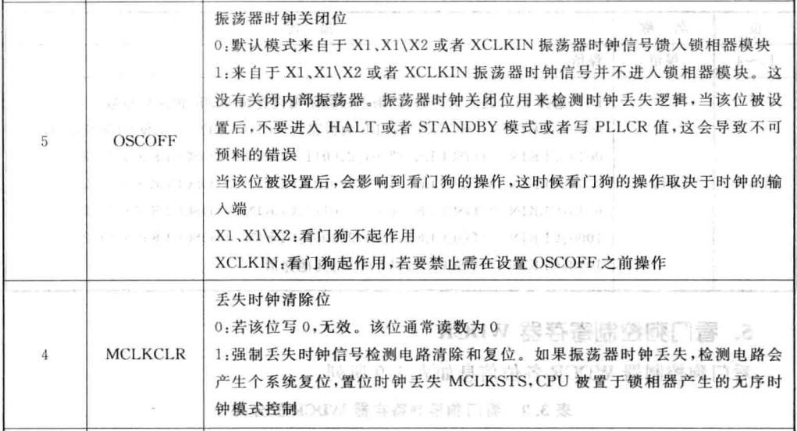

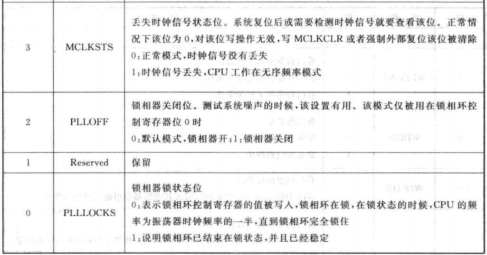

### 锁相环控制寄存器`PLLCR`

锁相环控制寄存器用于控制芯片 PLL 的倍数，在向 PLL 控制寄存器进行写操作之前，需要具备以下两个条件。

> 1. 在 PLL 完全锁住后，即 `PLLSTS[PLLLOCKS]=1`。
>
> 2. 芯片不能工作在 LIMP 模式，`即 PLLSTS[MCLKSTS]=0`。

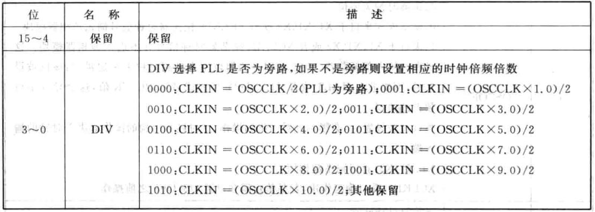

## 4. 看门狗 Watch Dog

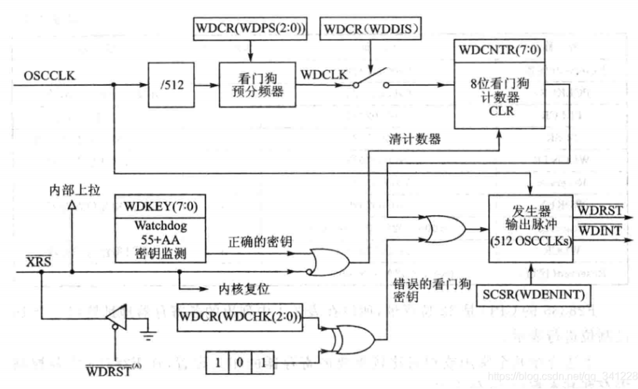

`OSCCLK`经分频和WDCR分频后，若`WDDIS`为0，则看门狗计数器工作。当没有正确的安全狗秘钥，计数器计满后溢出可产生输出512个`OSCCLK`时钟的脉冲信号。该信号作为复位信号`WDRST`还是中断信号`WDINT`由`SCSR`的`WDENNIT`决定。当复位`RST`或者正确的秘钥`WDKEY`会重置看门狗计数器。

看门狗的时钟`WDCLK`是晶振频率经过512分频得到，而不是主频`SYSCLKOUT`。

- 看门狗的使用

```c
// 将中断向量表的WAKEINT指向ISR:wakeint_isr
EALLOW;	// This is needed to write to EALLOW protected registers
PieVectTable.WAKEINT = &wakeint_isr;
EDIS;   // This is needed to disable write to EALLOW protected registers
// 使能看门狗中断
EALLOW;
SysCtrlRegs.SCSR = BIT1;
EDIS;
// 使能看门狗
EALLOW;
SysCtrlRegs.WDCR = 0x0028;   //	WDPS 000 001 不分频
EDIS;

// 喂狗函数
void ServiceDog(void)
{
    EALLOW;
    SysCtrlRegs.WDKEY = 0x0055;
    SysCtrlRegs.WDKEY = 0x00AA;
    EDIS;
}
```

## 5. 自定义系统时钟

### `InitSysCtrl()`函数

```c
void InitSysCtrl(void)
{
    // Disable the watchdog 禁止看门狗电路
    DisableDog();
    // Initialize the PLL control: PLLCR and DIVSEL
    // DSP28_PLLCR and DSP28_DIVSEL are defined in DSP2833x_Examples.h 给 PLLCR 寄存器赋值以获得想要的系统时钟频率
    InitPll(DSP28_PLLCR,DSP28_DIVSEL);
    // Initialize the peripheral clocks 对需要使用的外设时钟进行使能
    InitPeripheralClocks();
}
```

### `InitPll()`函数

该函数内主要实现了对 `PLLCR` 寄存器的 `DIV` 及 `PLLSTS` 寄存器的 `DIVSEL` 位设置，默认 `DIV` 值为 10，`DIVSEL` 值为 2，分别使用宏 `DSP28_PLLCR` 和 `DSP28_DIVSEL` 预先定义，修改系统时钟频率，可以修改宏 `DSP28_PLLCR` 和 `DSP28_DIVSEL` 的值。这两个值在`DSP2833x_Examples.h` 头文件内定义了。
