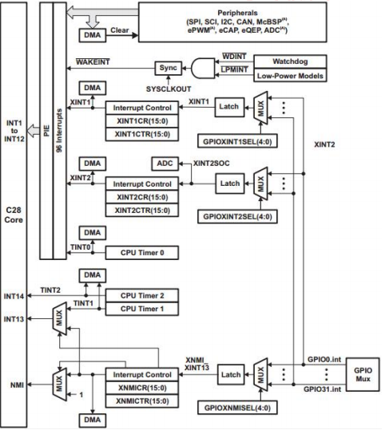
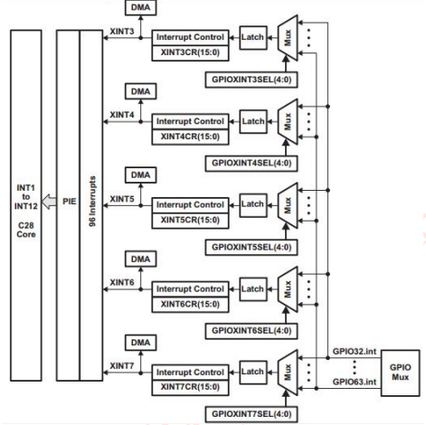
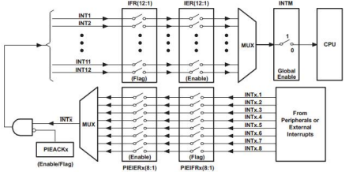

# DSP TI C2000 5_DSP中断系统

## 1. F28335 中断介绍

### F28335 中断概念

F28335 内部有 16 个中断线，其中包括 **2 个不可屏蔽中断（RESET 和 NMI）**与 **14 个可屏蔽中断**。可屏蔽中断通过相应的中断使能寄存器使用或者禁止产生的中断，在这 14 个可屏蔽中断中，其中 **TIM1 和 TIM2 产生的中断请求通过 INT13、INT14 中断线到达 CPU，这两个中断已经预留给了实时操作系统**，因此剩下的 12 个可屏蔽中断可供外部中断和处理器内部单元使用。

### F28335 中断机制

F28335 的中断采用的是 3 级中断机制，分别是**外设级中断、PIE 级中断和 CPU级中断**。

最内核部分为 CPU 级中断，即 CPU 只能响应从 CPU 中断线上过来的中断请求，但 F28335 中断源很多，CPU 没有那么多中断线，在有限中断线的情况下，只能安排中断线进行复用，其复用管理就有了中间层的 PIE 级中断，外设要能够成功产生中断响应，就要**首先经外设级中断允许，然后经 PIE 允许，最终 CPU 做出响应**。

- 外设级中断

CPU 正常处理程序过程中，外设产生了中断事件（比如定时器定时时间到，串口接收数据完成），那么该外设对应中断标志寄存器（IF）响应的位将被自动置位，**如果该外设对应中断使能寄存器（IE）中响应的使能位正好置位（需要软件控制），则外设产生的中断将向 PIE 控制器发出中断申请。**

如果对应外设级中没有被使能，就相当于该中断被屏蔽，不会想 PIE 提出中断申请，更不会产生 CPU 中断响应，但此时**中断标志位寄存器的标志位将保持不变，一直处在中断置位状态，要使该中断信号消失，中断标志寄存器复位，就需要软件编程**,如果没有复位，中断产生以后，一旦中断使能位被使能，同样会向 PIE 申请中断。

**进入中断服务后，有部分硬件外设会自动复位中断标志寄存器，多数外设需要在中断服务中手动复位中断标志寄存器。**

- PIE 级中断

F28335 处理器内部集成了多种外设，每个外设都会产生一个或者多个外设级中断。由于 CPU 没有能力处理所有外设级的中断请求，因此 F28335 的 CPU 让出了 12 个中断线交给 PIE 模块进行复用管理。

PIE 将外设中断分成了 12 个组，分别对应着 CPU 的 12 个可屏蔽中断线，每 1 组由 8 个外设级中断组成，这 8 个外设中断分别对应相应外设接口的中断引脚，PIE 通过一个 8 选 1 的多路选择器将这 8 个外设中断组成 1 组。

和外设级中断类似，在 PIE 模块内每组中断有相应的中断标志位（`PIEIFRx`）和使能位（`PIEIERx.y`）。除此之外，每组 PIE 中断（INT1~INT12）有一个响应标志（`PIEACK`）。

一旦 PIE 控制器有中断产生，相应的中断标志位（`PIEIFRx.y`）将置 1。如果相应的 PIE 中断使能位也置 1，则 PIE 将检查相应的 `PIEACKx` 以确定 CPU 是否准备响应该中断。如果相应的 `PIEACKx` 位清零，PIE 向 CPU 申请中断；如果 `PIEACKx` 置 1，PIE 将等待到相应的 `PIEACKx` 清零才向 CPU 申请中断。PIE 通过对 `PIEACKx` 的位控制来控制每 1 组中只有 1 个中断能被响应，一旦响应后，就需要将 `PIEACKX` 相应位清零，以让它能够响应该组中后边过来的中断。

- CPU 级中断

一旦 CPU 申请中断，CPU 级中断标志位（`IFR`）将置 1。中断标志位锁存到标志寄存器后，只有 CPU 中断使能寄存器（`IER`）或中断调试使能寄存器（`DBGIER`）相应的使能位和全局中断屏蔽位（INTM）被使能时才会响应中断申请。CPU 级使能可屏蔽中断采用 CPU 中断使能寄存器（`IER`）还是中断调试使能寄存器（`DBGIER`）与中断处理方式有关。标准处理模式下，不使用中断调试使能寄存器（`DBGIER`）。只有当 F28335 使用实时调试且 CPU 被停止（Halt）时，才使用中断调试使能寄存器（`DBGIER`），此时 INTM 不起作用。如果 F28335 使用实时调试而 CPU 仍然工作运行，则采用标准的中断处理。