# DSP TI C2000 6_DSP中断系统

## 1. F28335 中断介绍

### F28335 中断概念

F28335 内部有 16 个中断线，其中包括 **2 个不可屏蔽中断（RESET 和 NMI）**与 **14 个可屏蔽中断**。可屏蔽中断通过相应的中断使能寄存器使用或者禁止产生的中断，在这 14 个可屏蔽中断中，其中 **TIM1 和 TIM2 产生的中断请求通过 INT13、INT14 中断线到达 CPU，这两个中断已经预留给了实时操作系统**，因此剩下的 12 个可屏蔽中断可供外部中断和处理器内部单元使用。

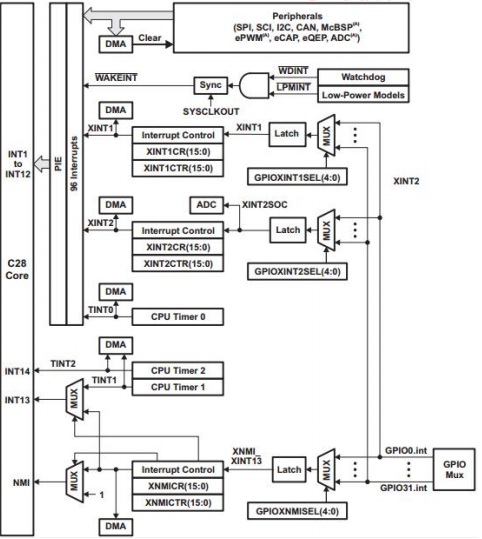

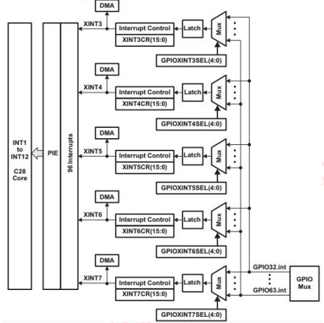

### F28335 中断机制

F28335 的中断采用的是 3 级中断机制，分别是**外设级中断、PIE 级中断和 CPU级中断**。

最内核部分为 CPU 级中断，即 CPU 只能响应从 CPU 中断线上过来的中断请求，但 F28335 中断源很多，CPU 没有那么多中断线，在有限中断线的情况下，只能安排中断线进行复用，其复用管理就有了中间层的 PIE 级中断，外设要能够成功产生中断响应，就要**首先经外设级中断允许，然后经 PIE 允许，最终 CPU 做出响应**。

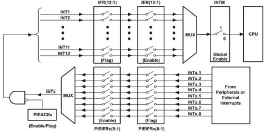

- 外设级中断

CPU 正常处理程序过程中，外设产生了中断事件（比如定时器定时时间到，串口接收数据完成），那么该外设对应中断标志寄存器（IF）响应的位将被自动置位，**如果该外设对应中断使能寄存器（IE）中响应的使能位正好置位（需要软件控制），则外设产生的中断将向 PIE 控制器发出中断申请。**

如果对应外设级中没有被使能，就相当于该中断被屏蔽，不会向 PIE 提出中断申请，更不会产生 CPU 中断响应，但此时**中断标志位寄存器的标志位将保持不变，一直处在中断置位状态，要使该中断信号消失，中断标志寄存器复位，就需要软件编程**，如果没有复位，中断产生以后，一旦中断使能位被使能，同样会向 PIE 申请中断。

**进入中断服务后，有部分硬件外设会自动复位中断标志寄存器，多数外设需要在中断服务中手动复位中断标志寄存器。**

- PIE 级中断

F28335 处理器内部集成了多种外设，每个外设都会产生一个或者多个外设级中断。由于 CPU 没有能力处理所有外设级的中断请求，因此 F28335 的 CPU 让出了 12 个中断线交给 **PIE 模块进行复用管理。**

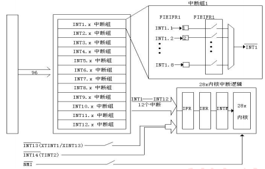

PIE 将外设中断分成了 12 个组，分别对应着 CPU 的 12 个可屏蔽中断线，每 1 组由 8 个外设级中断组成，这 8 个外设中断分别对应相应外设接口的中断引脚，PIE 通过一个 8 选 1 的多路选择器将这 8 个外设中断组成 1 组。

和外设级中断类似，在 PIE 模块内每组中断有相应的中断标志位（`PIEIFRx.y`）和使能位（`PIEIERx.y`）。除此之外，每组 PIE 中断（INT1~INT12）有一个响应标志（`PIEACKx`）。

> 1. 一旦 PIE 控制器有中断产生，相应的中断标志位（`PIEIFRx.y`）将置 1。
> 2. 如果相应的 PIE 中断使能位（`PIEIERx.y`）也置 1，则 PIE 将检查相应的 `PIEACKx` 以确定 CPU 是否准备响应该中断。如果相应的 `PIEACKx` 位清零，PIE 向 CPU 申请中断；如果 `PIEACKx` 置 1，PIE 将等待到相应的 `PIEACKx` 清零才向 CPU 申请中断。

PIE 通过对 `PIEACKx` 的位控制来控制每 1 组中只有 1 个中断能被响应，一旦响应后，就需要将 `PIEACKx` 相应位清零，以让它能够响应该组中后边过来的中断。

- CPU 级中断

一旦 CPU 申请中断，CPU 级中断标志位（`IFR`）将置 1。中断标志位锁存到标志寄存器后，只有 CPU 中断使能寄存器（`IER`）或中断调试使能寄存器（`DBGIER`）相应的使能位和全局中断屏蔽位（`INTM`）被使能时才会响应中断申请。首先自动将`IERx`、`IFRx`、`EALLOW`清零，将`INTM`置1，然后从PIE中断向量列表中读取中断服务函数的地址，转入中断服务函数地址处开始执行，执行完毕后返回。

CPU 级使能可屏蔽中断采用 CPU 中断使能寄存器（`IER`）还是中断调试使能寄存器（`DBGIER`）与中断处理方式有关。标准处理模式下，不使用中断调试使能寄存器（`DBGIER`）。只有当 F28335 使用实时调试且 CPU 被停止（Halt）时，才使用中断调试使能寄存器（`DBGIER`），此时 INTM 不起作用。如果 F28335 使用实时调试而 CPU 仍然工作运行，则采用标准的中断处理。

### F28335 中断向量

CPU 响应中断，就是 CPU 要去执行相应的中断服务程序，其响应过程是 CPU 将现执行程序的指令地址压入堆栈，跳转到中断服务程序入口地址，中断服务程序的入口地址就是中断向量，这个中断向量用 2 个 16 位寄存器存放。

入口地址是 22 位的，地址的低 16 位保存在该向量的低 16 位；地址的高 16 位则保存在它的高 6 位，更高的 10 位保留。

- 中断向量分配

PIE 最多可支持 96 个中断，每个中断都有自己对应的中断向量，即每个中断源都对应着自己的中断服务程序的入口地址，这些中断向量均连续存放在 RAM 中，这就构成了整个系统的中断向量表，用户可以根据需要适当的对中断向量表进行调整，在响应中断时，CPU 将自动的从中断向量表中获取响应的中断向量。

16 条中断线上的中断请求同时到达 CPU 时，需要对中断请求进行优先级定义。

- 中断向量表

在 F28335 中采用 PIE 中断向量表来解决上述问题，通过 PIE 中断向量表使得 96 个可能产生的中断都有各自独立的 32 位入口地址。PIE 向量表由 256*16B 的 SRAM 内连续存放，如果这部分空间不用作 PIE 模块时，可用作数据 RAM。复位时，PIE 向量表内容没有定义。

**CPU 的中断优先级有高到低依次是从`INT1`-`INT12`。每组 PIE 控制的 8 个中断优先级依次是从 `INTx.1`-`INTx.8`。**

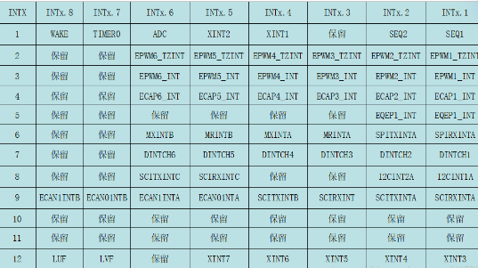

## 2. F28335 中断寄存器

### `PIECTRL`寄存器

PIE 控制寄存器，用于控制中断向量表。

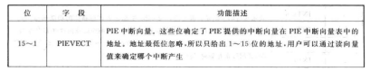

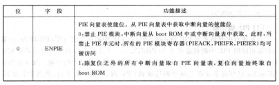

### `PIEACK`寄存器

PIE 中断应答寄存器，用于控制能否从PIE向CPU发送中断请求。

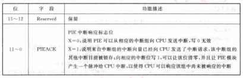

### `PIEIFRx`寄存器

PIE 中断标志寄存器。

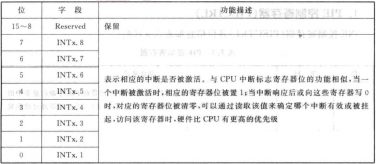

### `PIEIERx`寄存器

PIE 中断使能寄存器。

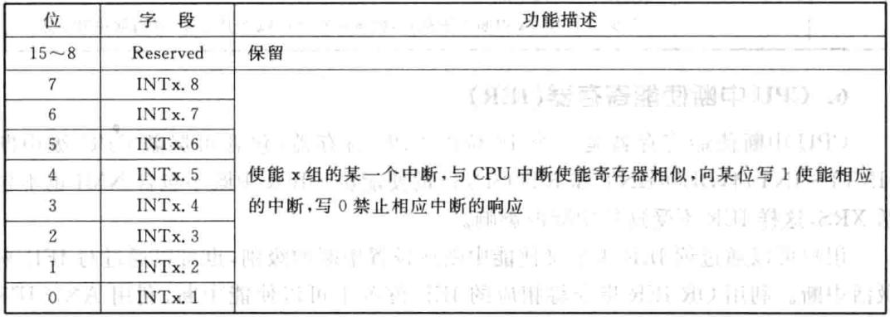

### `IFR`寄存器

CPU 中断标志寄存器，用于标志和清除被执行的中断。

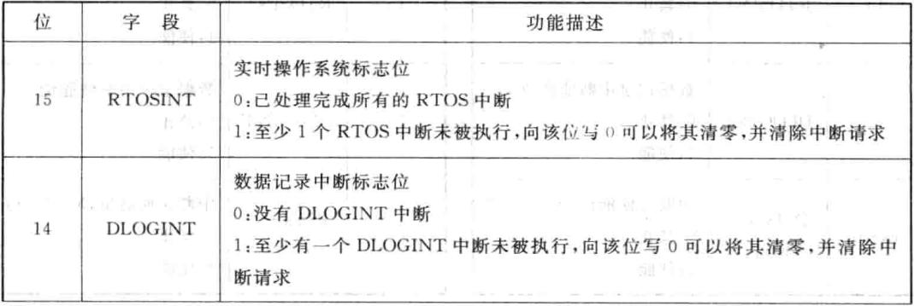

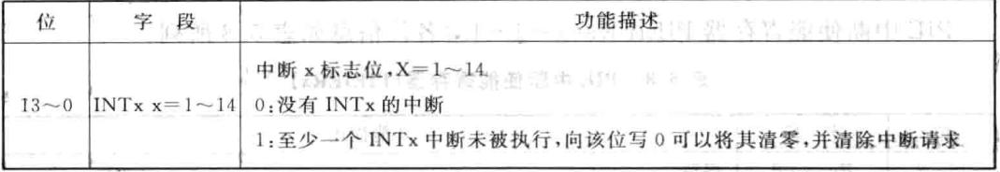

### `IER`寄存器

CPU 中断使能寄存器，包含 CPU 级可屏蔽中断（`INT1`-`INT14`、`DLOGINT` 和 `RTOSINT`）的使能位。

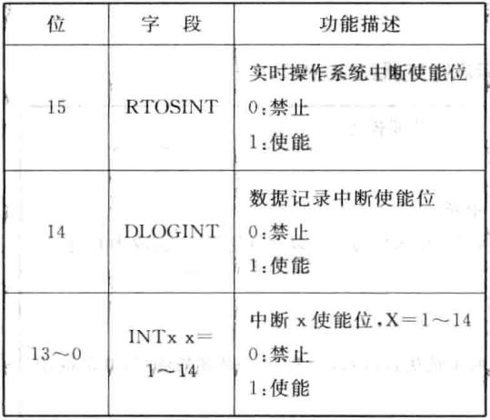

## 3. F28335 中断配置

### 通用配置流程

1. 使能外设对应的 PIE 中断，将对应的`PIEIER`位置1。

```c
PieCtrlRegs.PIEIER1.bit.INTx4 = 1; 	// 使能 PIE 组 1 的 INT4
```

2. 使能外设中断，这个具体是由外设相关中断使能位来控制。

3. 指定中断向量表中断服务函数地址，这个通过对 PIE 中断向量表寄存器的相应位进行设置，中断服务函数名可自定义。在中断函数名前需加上地址符`&`。

```c
EALLOW; 			// 修改被保护的寄存器，修改前应添加 EALLOW 语句
PieVectTable.XINT1 = &EXTI1_IRQn;
EDIS; 				// 不允许修改被保护的寄存器
```

4. 使能 CPU 中断及全局中断。

```c
IER |= M_INT1; 		// 使能 CPU 中断 1（INT1）
EINT; 			    // 开全局中断
```

5. 编写中断服务函数，配置好中断后如果有触发，即会进入中断服务函数，中断服务函数名在前面已定义好，所以要保证一致，否则将不会进入中断服务函数内执行。在 F28335 软件开发中，要在中断服务函数名前加上关键字 `interrupt`。

