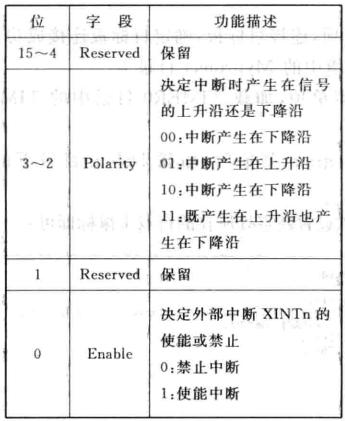

# DSP TI C2000 7_EXTI(Extern Interrupt，外部中断)

## 1. F28335 EXTI简介

F28335 共支持7个外部中断 `XINT1`-`XINT7`， 其中 `XINT1`-`XINT2` 只能对  GPIO0 - GPIO31 配置；`XINT3`-`XINT7` 只对 GPIO32 - GPIO63 配置。`XINT13` 还有一个不可屏蔽的外部中断 XNMI 共用中断源。

每一个外部中断可以被选择为正边沿或负边沿触发，也可以被使能或者禁止（包括 XNMI）。

可屏蔽中断单元包括一个 16 位增计数器，该计数器在检测到有效中断边沿时复位为 0，同时用来准确记录中断发生的时间。

## 2. F28335 EXTI寄存器

### `XINTnCR`寄存器

外部中断控制寄存器。



### `XNMICR`寄存器

外部 NMI 中断控制寄存器。


### `XINTxCTR`寄存器

外部中断计数器。


## 3. F28335 外部中断配置

1. 失能 CPU 级中断，并初始化 PIE 控制器寄存器和 PIE 中断向量表。

```c
InitPieCtrl();
IER = 0x0000;
IFR = 0x0000;
InitPieVectTable();
```

2. 使能 IO 口时钟，配置 IO 口为输入。
3. 设置 IO 口与中断线的映射关系。

```c
EALLOW;
GpioIntRegs.GPIOXINT1SEL.bit.GPIOSEL = 12; // XINT1是GPIO12
EDIS;
```

4. 指定中断向量表中断服务函数地址。

```c
EALLOW; // 修改被保护的寄存器，修改前应添加 EALLOW 语句
PieVectTable.XINT1 = &EXTI1_IRQn;
EDIS; // EDIS 的意思是不允许修改被保护的寄存器
```

5. 使能外设对应的 PIE 中断。

```c
PieCtrlRegs.PIEIER1.bit.INTx4 = 1; // 使能PIE组1的INT4
```

6. 设置外部中断触发方式并使能中断。

```c
XIntruptRegs.XINT1CR.bit.POLARITY = 0; 	// 下降沿触发中断
XIntruptRegs.XINT1CR.bit.ENABLE= 1; 	// 使能XINT1
```

7. 使能 CPU 级中断及全局中断

```c
IER |= M_INT1; 	 // 使能 CPU 中断 1（INT1）
EINT; 			// 开全局中断
ERTM;			// 当使用仿真器调试时可开启 DEBUG 中断
```


