# DSP TI C2000 8_ADC(Analog-Digital Converter，模数转换器)

## 1. F28335 ADC简介

F28335 ADC 转换模块具有 16 个通道，由 2 个独立的 8 通道模块组成，这两个独立的 8 通道模块也可以级联成一个 16 通道模块。尽管 AD 转换器中有多个输入通道和两个序列发生器，但只有一个转换器。

### ADC 框图

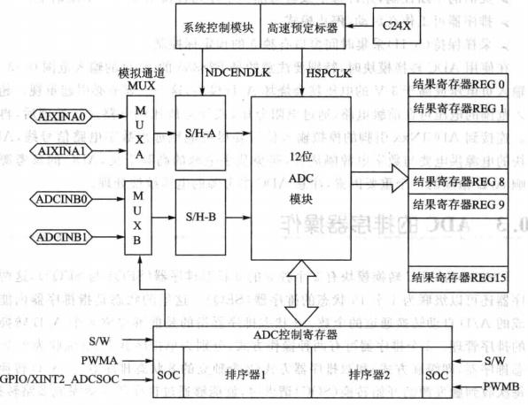

两个 8 通道模块能够自动排序构成一系列转换器，每个模块可以通过模拟的多路开关（MUX）选择 8 个通道中的任何一个通道。在级联模式下，自动序列发生器是 16 通道的。对每一个序列发生器而言，一旦完成转换，所选通道的转换值将存储到相应的 ADCRESULT 寄存器中。自动排序过程允许系统对同一个通道进行多次变换，允许用户进行过采样算法从而得到比一般的单采样更精确的结果。

在使用 ADC 转换模块时，特别要注意的是**F28335 的 AD 的输入范围 0 - 3V**，若输入负电压或高于 3V 的电压就会烧坏 AD 模块，这一点要务必引起重视。超出输入范围的电压可在前级电路，通过电阻进行分压，或经运放比例电路进行处理后再输入。连接到 ADCINxx 引脚的模拟输入信号要尽可能的远离数字电路信号线，ADC 模块的电源供电要与数字电源电源隔离开，避免数字电源的高频干扰.

### ADC  排序器

F28335 的 ADC 转换模块有 2 个独立的 8 状态排序器（`SEQ1` 与 `SEQ2`），这两个排序器还可以级联为 1 个 16 状态的排序器（`SEQ`）。这里的状态是指排序器内能够完成的 AD 自动转换通道的个数。8 状态排序器指的是能够完成 8 个 AD 转换通道的排序管理。

2 个排序器可有两种操作方式，**分别为单排序器方式（级联为 1 个 16 状态排序器，即级联方式）和双排序器方式（2 个独立的 8 状态排序器）。**

AD 转换模块每次收到触发源的开始转换（SOC）请求时，就能够通过排序器自动完成多路转换，将模拟输入信号引入采样保持器与 ADC 内核。转换完成后，将转换结果存入结果寄存器。

每种排序器可以工作在**顺序采样模式和同时采样模式**。顺序采样相当于串行模式，同步采
样相当于并行模式，能保证信号的同时性。

#### 级联操作模式

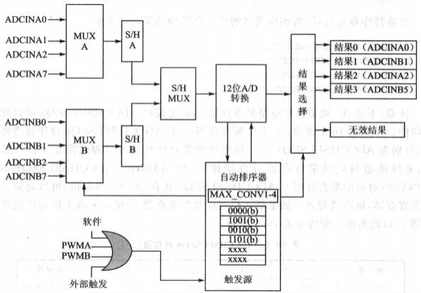

> 1. 初始化转换的最多通道数`MAX_CONV`，这个参数限制了最多有效通道数，对于级联模式，最大为 16，在双排序方式下，最大为 8。
>
> 2. 配置需要的转换输入信号对应的转换次序`CHSELxx`，最终的转换结果存放在各自的结果寄存器`RESULT0`-`RESULT15`，结果寄存器不与输入通道全对应，而是结果寄存器与转换次序对应。`ADCCHSELSEQ`，`ADCCHSELSEQ2`，`ADCCHSELSEQ3`，`ADCCHSELSEQ4`，每个寄存器都是16位的，顺序的4位 决 定 一 个 输 入 通 道 ， **转 换 顺 序 是 从`ADCCHSELSEQ1`最低4位到`ADCCHSELSEQ4`的最高4位**，最多16个。
>
>    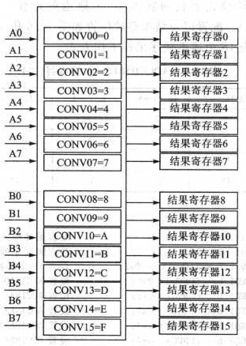
>
>    > - 在顺序采样方式下，2 个 8 状态排序器（SEQ1 和 SEQ2）构成一个 16 状态的排序器 SEQ 控制外部输入的模拟信号的排序，通过控制寄存器 CONVxx 的 4 位值确定输入引脚，其中最高位确定采用哪个采样保持缓冲器，其他 3 位定义具体输入引脚。两个采样保持器对应各自的 8 选 1 多路选择器和 8 个输入通道。
>    > - 在同步采样方式下，设置 `ADCTRL3` 寄存器中的 `SMODE_SEL`
>    >   位为 1。**要求 2 个输入必须有同样的采样和保持偏移量**，`CONVxx` 寄存器的最高位不起作用，每个采样和保持缓冲器对 `CONVxx` 寄存器低 3 位确定的引脚进行采样。**采样保持两路可以同步进行，因为有两个采样保持器，但是转换不可能同时进行**。转换器首先转换采样保持器 A中锁存的电压量，然后转换采样保持器 B 中锁存的电压量。采样保持器 A 转换的结果保存到当前的 `ADCRESULTn` 寄存器（如果排序器已经复位，SEQ1 的结果放到`ADCRESULT0`），采样保持器 B 转换的结果保存到下一个（顺延）`ADCRESULTn` 寄存器（如果排序器已经复位，SEQ1 的结果放到 `ADCRESULT1`），结果寄存器指针每次增加 2。

#### 双排序器操作模式

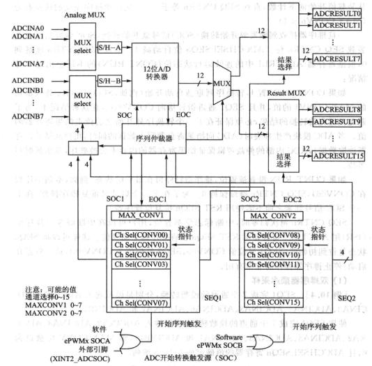

双排序器工作方式可以将 ADC 看成两个独立的 AD 转换单元，每个单元由各自的触
发源触发转换。

在双排序器连续采样模式下，一旦当前工作的排序器完成排序，任何一个排序器的挂起 ADC 开始转换都会开始执行。例如，当 SEQ1 产生 ADC 开始转换请求时，AD 单元正在对 SEQ2 进行转换，完成 SEQ2 的转换后会立即启动 SEQ1。SEQ1排序器有更高的优先级，如果 SEQ1 和 SEQ2 的 SOC 请求都没有挂起，并且 SEQ1 和 SEQ2 同时产生 SOC 请求，则 ADC 完成 SEQ1 的有效排序后，将会立即处理新的 SEQ1 的转换请求，SEQ2 的转换请求处于挂起状态。

- 连续模式/启动停止模式

一旦排序器接收到触发源开始转换（SOC）信号就开始转换，SOC 触发信号也会装载 `SEQ CNTRn` 位，`ADCCHSELSEQn` 位自动减 1。一旦 `SEQCNTRn` 递减到 0，根据寄存器 `ADCTRL1` 中的连续运行状态位`CONT_RUN`的不同会出现 2 种情况：

1. **如果 `CONT_RUN` 置 1，转换序列重新自动开始**（比如 `SEQ_CNTRn` 装入最初的
   `MAX_CONV1` 的值，并且 SEQ1 通道指针指向 `CONV00`）。在这种情况下，为了避免
   覆盖先前转换的结果，必须保证在下一个转换序列开始之前读走结果寄存器的
   值。当 ADC 模块产生冲突时（ADC 向结果寄存器写入数据的同时，用户从结果寄
   存器读取数据），ADC 内部的仲裁逻辑保证结果寄存器的内容不会被破坏，发出
   延时写等待。
2. **如果 `CONT_RUN` 没有置位，排序指针停留在最后的状态**，`SEQ_CNTRn` 继续保
   持 0。为了在下一个启动时重复排序操作，在下一个 SOC 信号到来之前不需使用
   `RST_SETQn` 位复位排序器。

`SEQ_CNTRn` 每次归零时，中断标志位都置位，用户可以在中断服务子程序中用 ADCTRL2 寄存器的 `RST_SETQn` 位将排序器手动复位。这样可以将 `SETQn` 状态复位到初始值（SEQ1 复位值 `CONV00`，SEQ2 复位值 `CONV08`），这一特点在启动/停止排序器操作时非常有用。

### ADC 时钟

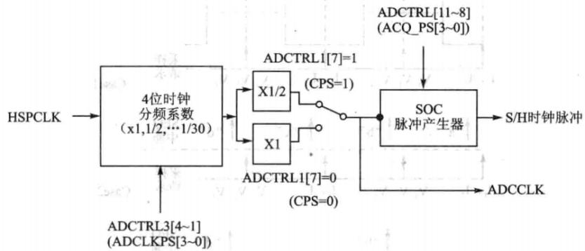

ADC的转换时钟`ADCCLK`由外设时钟`HSPCLK`分频而来。

### ADC 电气特性

1. F28335 处理器的模数转换单元的参考电压有 2 种提供方式，即内部参考电压和外部参考电压，外部参考电压分别为 2.048V、1.5V 或 1.024V。具体选择哪种参考电压由控制寄存器 3 的第 8 位`EXTREF`控制，一般情况下，尽量选择内部参考源。

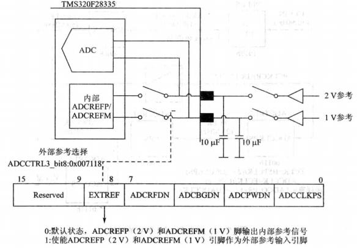

2. 低功耗模式
   ADC 支持 3 种不同的供电模式，分别为：ADC 上电、ADC 断电、ADC 关闭。这
   3 种模式由`ADCTRL4`寄存器控制。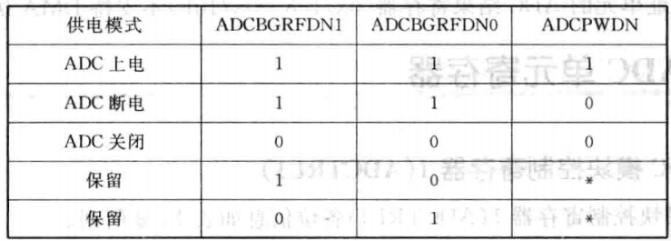

3. 上电次序
   ADC 复位时即进入关闭状态，从关闭状态上时 ADC 应遵循以下步骤：
   - 如果采用外部参考电压时，采用 `ADCREFSEL` 寄存器的 15-14 位使能该外部
     参考模式。必须在带隙上电之前使能该模式。
   - 通过置位 `ADCTRL3` 寄存器的 7-5 位（`ADCBGRFDN[1:0]`，`ADCPWDN`）能够给
     参考信号、带隙和模拟电路一同上电。
   - 在第一次转换运行之前，至少需要延迟 5ms。

在 ADC 断电时，上述 3 个控制位要同时清除。ADC 供电模式可以由软件控制，与器件的供电模式是相互独立的。可通过设置 `ADCPWDN` 将 ADC 断电，但此时带隙和参考信号仍带电，设置 `ADCPWDN` 控制位重新上电后，在进行第一次转换之前需要延迟 20us。

4. ADC 校验
   ADC 校验子程序 `ADC_cal()`由生产商嵌入 TI 保留的 OTP 存储内。根据设备的
   具体校验数据，boot ROM 自动调用 `ADC_cal()`子程序来初始化 `ADCREFSEL` 和
   `ADCOFFTRIM` 寄存器。在通过运行过程中，该校验过程是自动完成的，用户无需
   进行任何操作。当一次采样结束后，采样结果将首先加上/减去偏移校正值，然
   后存放在相应的结果寄存器中。
   如果在系统开发时，禁止了 BOOT ROM，则需要用户来进行 ADCREFSEL 和
   `ADCOFFTRIM` 寄存器的初始化。
   OTP 存储器是保密的，`ADC_cal()`子程序必须由受保护的存储器调用，或者在
   编码安全模块解锁之后由非安全存储器调用。如果 ADC 复位后，子程序也需要被
   重复调用。
5. DMA 接口
   位于外设 0 地址单元的 ADC 结果寄存器（`0x0B00`-`0x0B0F`）支持 DMA 直接访
   问模式，由于 DMA 访问无需通过总线，所以这些寄存器同时支持 CPU 访问。位于
   外设 2 地址单元的 ADC 结果寄存器（`0x7108`-`0x710F`）不支持 DMA 访问。

## 2. F28335 ADC寄存器

### ADC 模块控制寄存器 1`ADCTRL1`

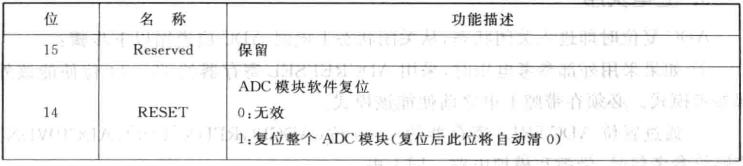

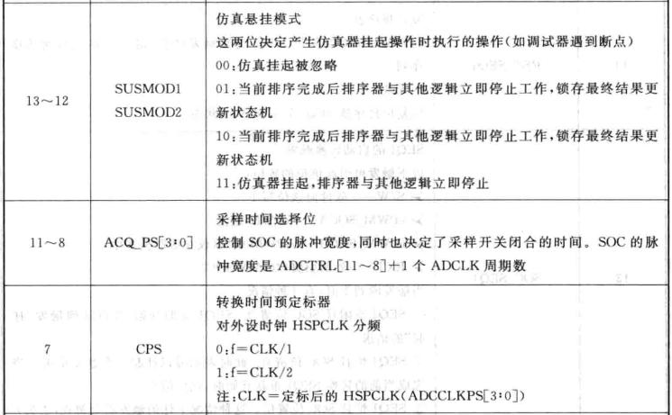

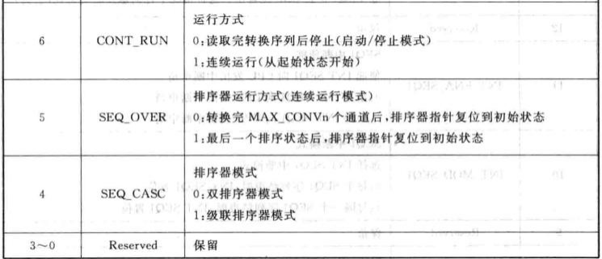

### ADC 模块控制寄存器 2`ADCTRL2`

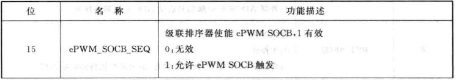

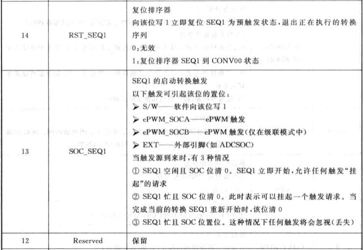

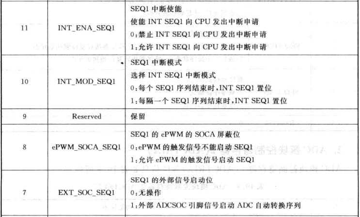

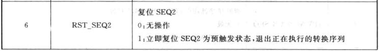

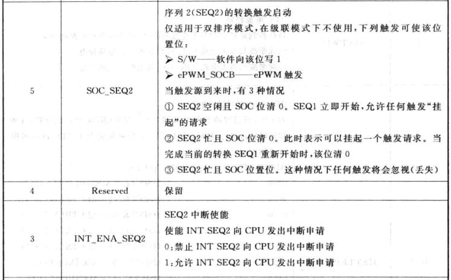

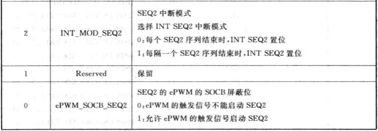

### ADC 模块控制寄存器 3`ADCTRL3`

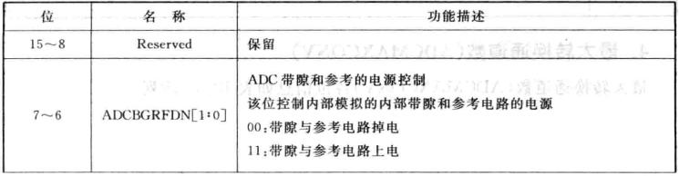

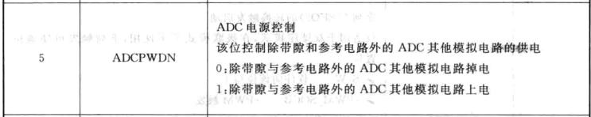

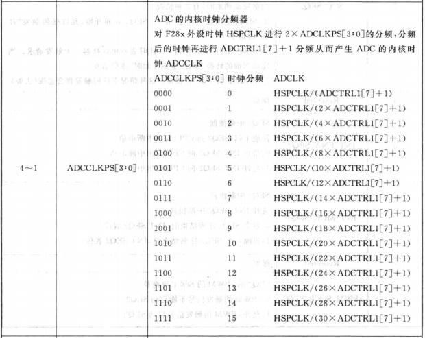

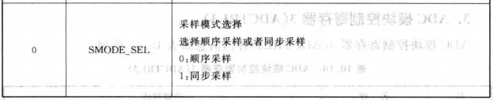

### 最大转换通道数`ADCMAXCONV`

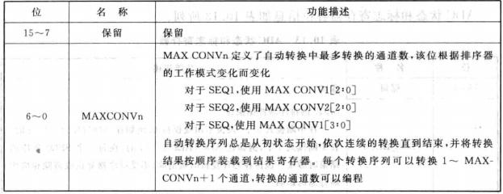

### 自动排序状态寄存器`ADCASEQSR`

### ADC 状态和标志寄存器

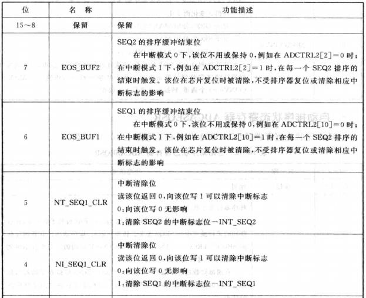

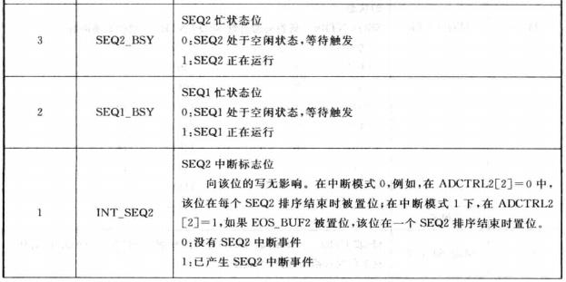

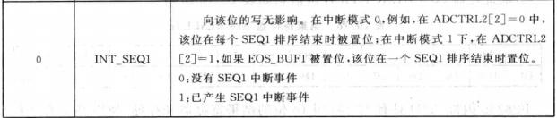

### ADC 输入通道选择排序控制寄存器

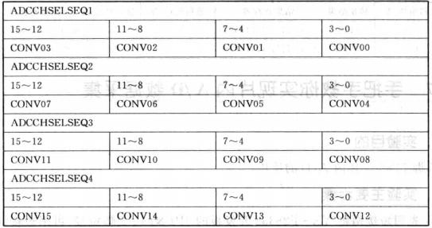
