# DSP TI C2000 9_ePWM(enhanced PWM，增强型脉宽调制模块)

## 1. F28335 ePWM简介

### ePWM 模块

每个 ePWM 模块由两路 ePWM 输出组成，分别为 ePWMxA 和 ePWMxB，这一对 PWM输出，可以配置成两路独立的单边沿 PWM 输出，或者两路独立的但互相相对称的双边沿 PWM 输出，或者一对双边沿非对称的 PWM 输出。

共有 6 对这样的 ePWM 模块，因为每对 PWM 模块中的两个 PWM 输出均可以单独使用，所以也可以认为有 12 路单路 ePWM，除此之外还有 6 个 APWM，这 6 个 APWM 通过 CAP 模块扩展配置，可以独立使用，所以 F28335 最多可以有 18 路 PWM 输出。

每一组 ePWM 模块都包含以下 7 个模块：**时基模块 TB、计数比较模块 CC、动作模块 AQ、死区产生模块 DB、PWM 斩波模块 PC、错误联防模块 TZ、时间触发模块 ET**。

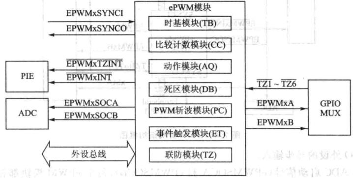

- ePWM 的输入输出信号

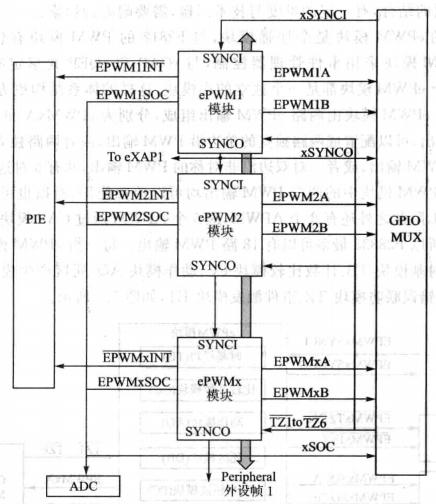

> 1. PWM 输出信号（ePWMxA 和 ePWMxB）：PWM 输出引脚与 GPIO 引脚复用，具体配置时需参考 GPIO 引脚配置。
> 2. 时间基础同步输入（ePWMxSYNCI）和输出（ePWMxSYNCO）信号：同步时钟信号将 ePWM 各个模块的所有单元联系在一起，每个 ePWM 模块都可以根据需要被配置为使用同步信号或忽略它的同步输入成为独立单元。时钟同步输入和输出信号仅由 ePWM1 引脚产生，ePWM1 的同步输出也与第一个捕获模块（eCAP1）的同步信号相连接。
> 3. 错误联防信号（TZ1~TZ6）：当外部被控单元符合错误条件时，诸如 IGBT 等功率器件模块过电压、过电流或过热时，这些输入信号为 ePWM 模块发出错误警告。每个模块都可以被配置使用或忽略错误联防信号，同时 TZ1~TZ6 可以设置为 GPIO 外设的异步输入。
> 4. ADC 启动信号（ePWMSOCA 和 ePWMSOCB）：每个 ePWM 模块都有两个 ADC 转换启动信号，任何一个 ePWM 模块都可以启动 ADC。触发 ADC 的转换信号的事件由 ePWM 模块中事件触发子模块来配置。
> 5. 外设总线：外设总线宽度为 32 位，允许 16 位和 32 位数据通过外设总线写入 ePWM 模块寄存器。

- ePWM 模块特性

> 1. 专用**16 位时基计数器**，控制输出的周期和频率。
> 2. **两个互补对称 PWM 输出（ePWMxA 和 ePWMxB）**可以配置如下方式：
>    - 两个独立的单边沿操作的 PWM 输出。
>    - 两个独立的双边沿操作对称的 PWM 输出。
>    - 一个独立的双边沿操作非对称的 PWM 输出。
> 3. 软件实现 PWM 信号异步控制。
> 4. 可编程的相位控制以支持超前或滞后其余的 PWM 模块。
> 5. 逐周期硬件同步相位。
> 6. 双边沿延时死区控制。
> 7. 可编程错误联防。
> 8. 产生错误时可以强制 PWM 输出高电平、低电平或者高阻态。
> 9. **所有的事件都可以触发 CPU 中断和 ADC 开始转换信号**。
> 10. 高频 PWM 斩波，用于基于脉冲变压器的门极驱动。

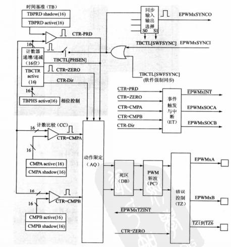

#### 时基模块 TB(Timer Base)

每个 ePWM 模块都有一个自己的时间基准单元（时基单元），用来决定该 ePWM
模块相关的事件时序，通过同步输入信号可以将所有的 ePWM 工作在同一时基信
号下，即所有的 ePWM 模块级联在一起，处于同步状态。

- TB 模块的功能

> 1. **确定 ePWM 时基模块的频率或者周期，配置时基模块的时钟基准，对系统时钟 SYSCLKOUT 进行分频可以得到时基时钟，进一步确定了事件发生的频率**。主
>    要是通过配置 PWM 时基计数器（`TBCTR`）来标定与系统时钟（`SYSCLKOUT`）有关的时基时钟的频率或周期。
> 2. 管理 ePWM 模块之间的同步性。维护 ePWM 与其他 ePWM 模块间的相位关系。
> 3. 设置时基计数器的计数模块。
> 4. 产生事件。

- TB 模块的重要信号

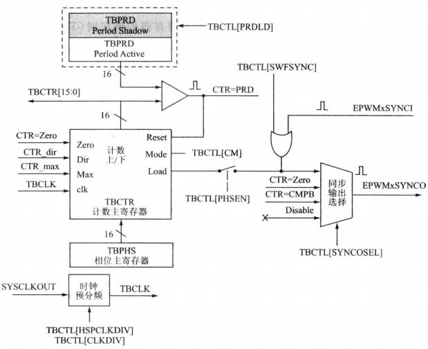

> 1. `ePWMxSYNCI`：时基同步信号输入。输入脉冲用于时基计数器与之前的 ePWM模块同步，每个 ePWM 模块可以通过软件配置（`TBCTL`的`SWFSYNC`位）为使用或者忽略此信号。
>
>    > 对于第一个 ePWM 模块，这个信号从外部引脚或得。随后的模块的同步信号可以由其他 ePWM模块传递过来。例如第 2 个模块的同步信号可以从第 1 个模块的同步信号输出或得，第 3 个模块由第 2 个模块产生，以此类推。
>
> 2. `ePWMxSYNCO`：时基同步信号输出。输出脉冲用于随后的 ePWM 的时基计数器同步。ePWM 模块产生该信号来源于下列 3 个事件源中的一件。
>    (1) `ePWMxSYNCI`（同步输入脉冲）。
>    (2) `CTR=ZERO`，时基计数器等于 0（`TBCTR=0X0000`）。
>    (3) `CTR=CMPB`，时基计数器等于比较寄存器。
>
> 3. `CTR=PRD`，时基计数器等于指定周期值。当时基计数器的值与激活的周期寄存器（相对于影子寄存器而言）的值相等的时候，就会产生该信号。
>
> 4. `CTR=ZERO`，时基计数器等于 0。当时基计数器的值为 0 的时候，会产生此信号。
>
> 5. `CTR=CMPB`，时基计数器等于比较寄存器。时基计数器的值等于激活的比较
>    寄存器 B 的时候，会产生此信号。该信号由比较计数器模块产生，用于同步输出逻辑。
>
> 6. `CTR_dir`：时基计数器方向。表明时基计数器的计数方向，当高电平时，计数器向上计数，低电平时则向下计数。
>
> 7. `CTR_max`：时基计数器的值为最大值。当时基计数器到最大值时会产生此信号。该信号用作状态指示。
>
> 8. `TBCLK`：时基时钟信号。来源于预分频的系统时钟信号，用于所有的 ePWM 模块。
>

- TB 模块的计数模式

**ePWM 的频率是由时基周期寄存器值（TBPRD）和时基计数器的计数模式（TBCTRL）共同决定的。**

1. 增-减计数模式（双倍周期）

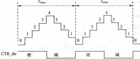
$$
T_{pwm} = 2 \times TBPRD \times T_{TBCLK}
$$

> **同步信号**
>
> 通过设置相位方向`TBCTL[PHSDIR]`确定同步信号到来时是增计数还是减计数。同步信号到来时，将计数器计数值定为`TBPHS`（相位寄存器）值。
>
> > `TBCTL[PHSDIR]=0`
> >
> > 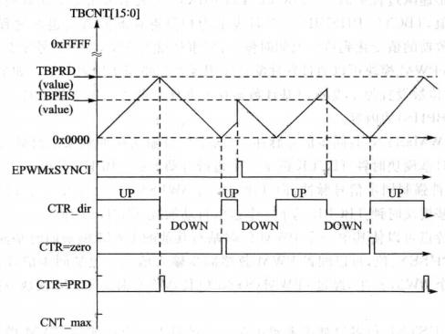
> >
> > `TBCTL[PHSDIR]=1`
> >
> > 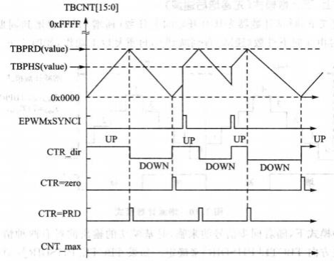
>
> 通过使能`TBCTL[PHSEN]`位使能 ePWM 模块是否响应同步信号，当配置为1时，可以响应`ePWMxSYNCI`和软件强制同步信号脉冲。配置为0时，仅能产生同步脉冲。

2. 增计数模式（单倍周期）

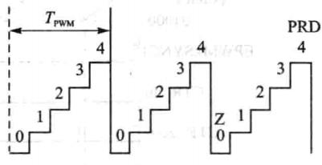
$$
T_{pwm} = (TBPRD + 1) \times T_{TBCLK}
$$

> **同步信号**
>
> 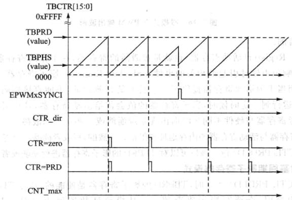

3. 减计数模式（单倍周期）

$$
T_{pwm} = (TBPRD + 1) \times T_{TBCLK}
$$

- TB 模块的影子寄存器

为了能在**不影响当前PWM波形输出的情况下预装载新的PWM参数（如周期、占空比等）**，ePWM 模块引入影子寄存器。

> 1. **预装载新值**：当用户想要改变PWM的参数时，不是直接写入正在使用的寄存器，而是先将新值写入对应的影子寄存器。
> 2. **同步更新**：在特定的时间点（通常是由时间基准计数器触发的某个事件，如计数器的顶部或底部），影子寄存器中的值会被自动复制到活动寄存器中，从而实现参数的平滑更新，避免在PWM波形中产生不希望的跳变。

影子寄存器与活动寄存器的内存地址映射值是一致的，写或者读哪一个寄存器，主要取决于 `TBCTL[PRDLD]` 位。该位可以对 TBPRD 的影子寄存器进行使能或者禁止。

- TB 模块的寄存器概要

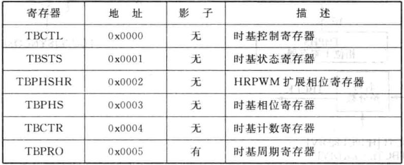

#### 计数比较模块 CC(Counter Compare)

CC 以时基计数器的值作为输入，与比较寄存器 CMPA 和比较寄存器 CMPB 不断进行比较，当时基计数器的值等于其中之一时，就会产生相应的事件。

> 1. 产生比较事件具体取决于编程时是采用 寄存器A 还是 寄存器 B；
>
> > (1) `CTR=CMPA`：时基计数器的值与比较寄存器 A 的值相等。
> >
> > (2) `CTR=CMPB`：时基计数器的值与比较寄存器 B 的值相等。
>
> 2. 动作模块 AC 恰当配置后可以控制 PWM 的占空比。
> 3. 采用影子寄存器来更新比较值可以有效防止在 PWM 周期内出现故障以及毛
>    刺。

- CC 模块的功能

1. 计数器比较模块可以产生两个独立的比较事件，对于向上（递增）或者向下（递减）计数模式来说，在一个 PWM 周期内，比较事件只发生一次。而对于向上向下（先递增后递减）计数器模式来说，如果比较寄存器的值在 0 - `TBPRD` 之间，在一个 PWM 周期内，比较事件就会发生两次。
2. 计数器比较模块比较寄存器 CMPA、CMPB 各自都有一个影子寄存器。CMPA 影子寄存器通过清除`CMPCTL[SHDWAMODE]`位使能，CMPB 影子寄存器通过清零`CMPCTL[SHDWAMODE]`位使能。默认情况下，CMPA 和 CMPB 影子寄存器是使能的。

> 若 CMPA 影子寄存器被使能的话，那么在以下几种情况时，影子寄存器的值
> 会传递到有效寄存器中。
>
> (1)`CTR=PRD`：时基计数器值与周期寄存器值相同。
>
> (2)`CTR=ZERO`：时基计数器为 0。

- CC 模块的关键信号

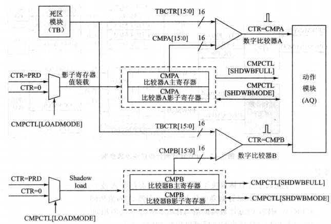

> 1. `CTR=CMPA`：时基计数器的值与 CMPA 的值相同时，PWM 可以根据 AQ 动作。
>
> 2. `CTR=CMPB`：时基计数器的值与 CMPB 的值相同时，PWM 可以根据 AQ 动作。
>
> 3. `CTR=PRD`：时基计数器的值与周期寄存器的值相同，PWM 可以根据 AQ 动作。CMPA 与 CMPB 可以根据相关影子寄存器的值进行更新。
>
> 4. `CTR=ZERO`：时基计数器的值递减到 0 时，PWM 可以根据 AQ 动作。CMPA 与 CMPB 可以根据相关影子寄存器的值进行更新。
>

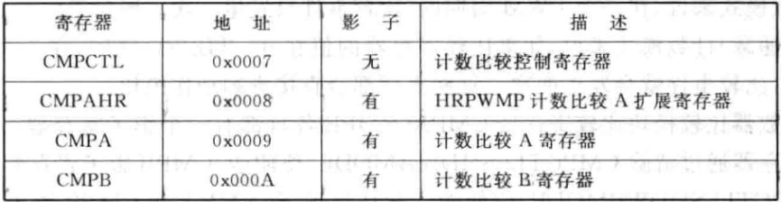

#### 动作限定模块 AQ

AQ 模块决定了相应事件发生时应该输出什么样的电平，从而使 ePWMxA 和 ePWMxB 输出所需要的开关波形。

- AQ 模块功能

1. 动作模块根据事件产生动作（置高、拉低、翻转）。

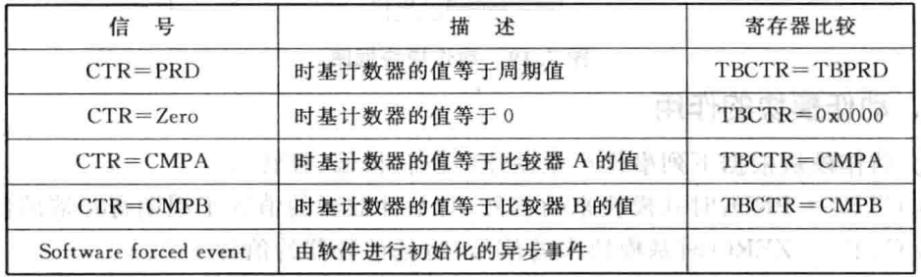

2. 管理事件发生后 PWM 的输出极性。

   > 允许的操作如下：
   （1）置高：将 ePWMxA 或 ePWMxB 的输出设定为高电平；
   （2）置低：将 ePWMxA 或 ePWMxB 的输出设定为低电平；
   （3）翻转：将 ePWMxA 或 ePWMxB 的输出状态翻转；
   （4）无动作：保持 ePWMxA 或 ePWMxB 的输出状态不变。

3. 针对时基计数器递增或者递减时提供独立的动作控制。

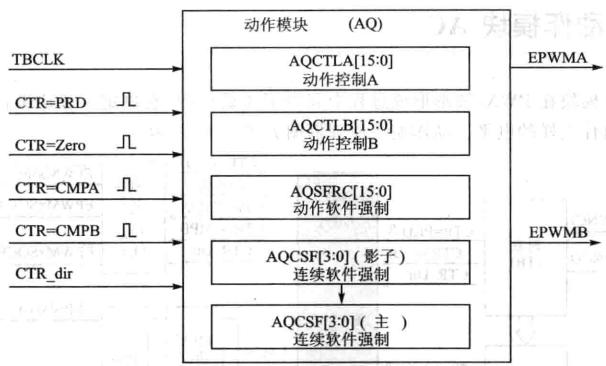

- AQ 事件优先级

在同一时刻，动作模块可能会收到两个及两个以上的事件时，需要硬件提供事件优先级。优先级 1 最高，优先级 7 最低。根据不同的计数模式，优先级定义不同。

（1）增-减计数模式

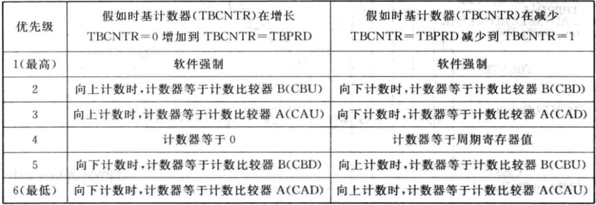

（2）增计数模式

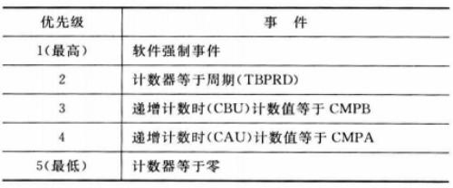

（3）减计数模式

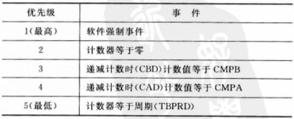
