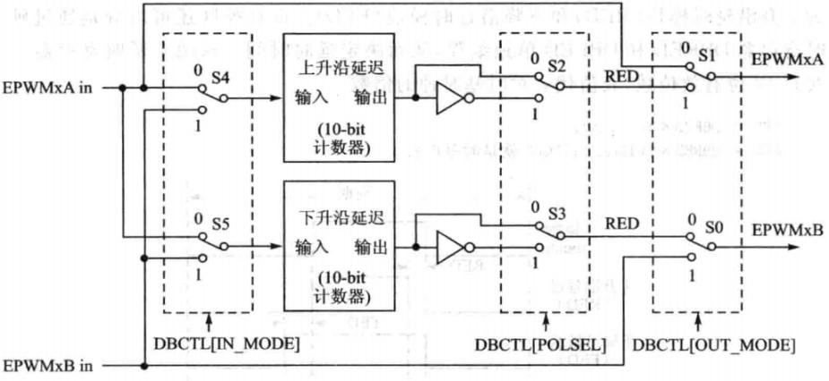
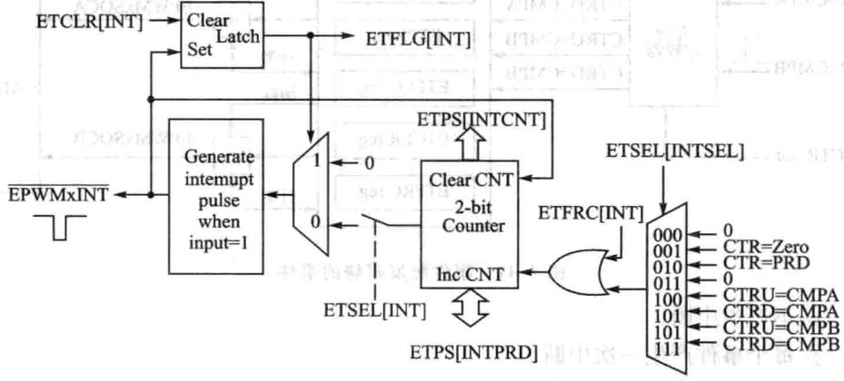

# DSP TI C2000 9_ePWM(enhanced PWM，增强型脉宽调制模块)

## 1. F28335 ePWM简介

### ePWM 模块

每个 ePWM 模块由两路 ePWM 输出组成，分别为 ePWMxA 和 ePWMxB，这一对 PWM输出，可以配置成两路独立的单边沿 PWM 输出，或者两路独立的但互相相对称的双边沿 PWM 输出，或者一对双边沿非对称的 PWM 输出。

共有 6 对这样的 ePWM 模块，因为每对 PWM 模块中的两个 PWM 输出均可以单独使用，所以也可以认为有 12 路单路 ePWM，除此之外还有 6 个 APWM，这 6 个 APWM 通过 CAP 模块扩展配置，可以独立使用，所以 F28335 最多可以有 18 路 PWM 输出。

每一组 ePWM 模块都包含以下 7 个模块：**时基模块 TB、计数比较模块 CC、动作模块 AQ、死区产生模块 DB、PWM 斩波模块 PC、错误联防模块 TZ、时间触发模块 ET**。


- ePWM 的输入输出信号


> 1. PWM 输出信号（ePWMxA 和 ePWMxB）：PWM 输出引脚与 GPIO 引脚复用，具体配置时需参考 GPIO 引脚配置。
> 2. 时间基础同步输入（ePWMxSYNCI）和输出（ePWMxSYNCO）信号：同步时钟信号将 ePWM 各个模块的所有单元联系在一起，每个 ePWM 模块都可以根据需要被配置为使用同步信号或忽略它的同步输入成为独立单元。时钟同步输入和输出信号仅由 ePWM1 引脚产生，ePWM1 的同步输出也与第一个捕获模块（eCAP1）的同步信号相连接。
> 3. 错误联防信号（TZ1~TZ6）：当外部被控单元符合错误条件时，诸如 IGBT 等功率器件模块过电压、过电流或过热时，这些输入信号为 ePWM 模块发出错误警告。每个模块都可以被配置使用或忽略错误联防信号，同时 TZ1~TZ6 可以设置为 GPIO 外设的异步输入。
> 4. ADC 启动信号（ePWMSOCA 和 ePWMSOCB）：每个 ePWM 模块都有两个 ADC 转换启动信号，任何一个 ePWM 模块都可以启动 ADC。触发 ADC 的转换信号的事件由 ePWM 模块中事件触发子模块来配置。
> 5. 外设总线：外设总线宽度为 32 位，允许 16 位和 32 位数据通过外设总线写入 ePWM 模块寄存器。

- ePWM 模块特性

> 1. 专用**16 位时基计数器**，控制输出的周期和频率。
> 2. **两个互补对称 PWM 输出（ePWMxA 和 ePWMxB）**可以配置如下方式：
>    - 两个独立的单边沿操作的 PWM 输出。
>    - 两个独立的双边沿操作对称的 PWM 输出。
>    - 一个独立的双边沿操作非对称的 PWM 输出。
> 3. 软件实现 PWM 信号异步控制。
> 4. 可编程的相位控制以支持超前或滞后其余的 PWM 模块。
> 5. 逐周期硬件同步相位。
> 6. 双边沿延时死区控制。
> 7. 可编程错误联防。
> 8. 产生错误时可以强制 PWM 输出高电平、低电平或者高阻态。
> 9. **所有的事件都可以触发 CPU 中断和 ADC 开始转换信号**。
> 10. 高频 PWM 斩波，用于基于脉冲变压器的门极驱动。


#### 时基模块 TB(Timer Base)

每个 ePWM 模块都有一个自己的时间基准单元（时基单元），用来决定该 ePWM
模块相关的事件时序，通过同步输入信号可以将所有的 ePWM 工作在同一时基信
号下，即所有的 ePWM 模块级联在一起，处于同步状态。

- TB 模块的功能

> 1. **确定 ePWM 时基模块的频率或者周期，配置时基模块的时钟基准，对系统时钟 SYSCLKOUT 进行分频可以得到时基时钟，进一步确定了事件发生的频率**。主
>    要是通过配置 PWM 时基计数器（`TBCTR`）来标定与系统时钟（`SYSCLKOUT`）有关的时基时钟的频率或周期。
> 2. 管理 ePWM 模块之间的同步性。维护 ePWM 与其他 ePWM 模块间的相位关系。
> 3. 设置时基计数器的计数模块。
> 4. 产生事件。

- TB 模块的重要信号


> 1. `ePWMxSYNCI`：时基同步信号输入。输入脉冲用于时基计数器与之前的 ePWM模块同步，每个 ePWM 模块可以通过软件配置（`TBCTL`的`SWFSYNC`位）为使用或者忽略此信号。
>
>    > 对于第一个 ePWM 模块，这个信号从外部引脚或得。随后的模块的同步信号可以由其他 ePWM模块传递过来。例如第 2 个模块的同步信号可以从第 1 个模块的同步信号输出或得，第 3 个模块由第 2 个模块产生，以此类推。
>
> 2. `ePWMxSYNCO`：时基同步信号输出。输出脉冲用于随后的 ePWM 的时基计数器同步。ePWM 模块产生该信号来源于下列 3 个事件源中的一件。
>    (1) `ePWMxSYNCI`（同步输入脉冲）。
>    (2) `CTR=ZERO`，时基计数器等于 0（`TBCTR=0X0000`）。
>    (3) `CTR=CMPB`，时基计数器等于比较寄存器。
>
> 3. `CTR=PRD`，时基计数器等于指定周期值。当时基计数器的值与激活的周期寄存器（相对于影子寄存器而言）的值相等的时候，就会产生该信号。
>
> 4. `CTR=ZERO`，时基计数器等于 0。当时基计数器的值为 0 的时候，会产生此信号。
>
> 5. `CTR=CMPB`，时基计数器等于比较寄存器。时基计数器的值等于激活的比较
>    寄存器 B 的时候，会产生此信号。该信号由比较计数器模块产生，用于同步输出逻辑。
>
> 6. `CTR_dir`：时基计数器方向。表明时基计数器的计数方向，当高电平时，计数器向上计数，低电平时则向下计数。
>
> 7. `CTR_max`：时基计数器的值为最大值。当时基计数器到最大值时会产生此信号。该信号用作状态指示。
>
> 8. `TBCLK`：时基时钟信号。来源于预分频的系统时钟信号，用于所有的 ePWM 模块。
>

- TB 模块的计数模式

**ePWM 的频率是由时基周期寄存器值（TBPRD）和时基计数器的计数模式（TBCTRL）共同决定的。**

<font color=LightGreen>1. 增-减计数模式（双倍周期）</font>


$$
T_{pwm} = 2 \times TBPRD \times T_{TBCLK}
$$

> **同步信号**
>
> 通过设置相位方向`TBCTL[PHSDIR]`确定同步信号到来时是增计数还是减计数。同步信号到来时，将计数器计数值定为`TBPHS`（相位寄存器）值。
>
> > `TBCTL[PHSDIR]=0`
> >
> > 
> >
> > `TBCTL[PHSDIR]=1`
> >
> > 
>
> 通过使能`TBCTL[PHSEN]`位使能 ePWM 模块是否响应同步信号，当配置为1时，可以响应`ePWMxSYNCI`和软件强制同步信号脉冲。配置为0时，仅能产生同步脉冲。

<font color=LightGreen>2. 增计数模式（单倍周期）</font>


$$
T_{pwm} = (TBPRD + 1) \times T_{TBCLK}
$$

> **同步信号**
>
> 

<font color=LightGreen>3. 减计数模式（单倍周期）</font>


$$
T_{pwm} = (TBPRD + 1) \times T_{TBCLK}
$$

- TB 模块的影子寄存器

为了能在**不影响当前PWM波形输出的情况下预装载新的PWM参数（如周期、占空比等）**，ePWM 模块引入影子寄存器。

> 1. **预装载新值**：当用户想要改变PWM的参数时，不是直接写入正在使用的寄存器，而是先将新值写入对应的影子寄存器。
> 2. **同步更新**：在特定的时间点（通常是由时间基准计数器触发的某个事件，如计数器的顶部或底部），影子寄存器中的值会被自动复制到活动寄存器中，从而实现参数的平滑更新，避免在PWM波形中产生不希望的跳变。

影子寄存器与活动寄存器的内存地址映射值是一致的，写或者读哪一个寄存器，主要取决于 `TBCTL[PRDLD]` 位。该位可以对 TBPRD 的影子寄存器进行使能或者禁止。

- TB 模块的寄存器概要


#### 计数比较模块 CC(Counter Compare)

CC 以时基计数器的值作为输入，与比较寄存器 CMPA 和比较寄存器 CMPB 不断进行比较，当时基计数器的值等于其中之一时，就会产生相应的事件。

> 1. 产生比较事件具体取决于编程时是采用 寄存器A 还是 寄存器 B；
>
> > (1) `CTR=CMPA`：时基计数器的值与比较寄存器 A 的值相等。
> >
> > (2) `CTR=CMPB`：时基计数器的值与比较寄存器 B 的值相等。
>
> 2. 动作模块 AC 恰当配置后可以控制 PWM 的占空比。
> 3. 采用影子寄存器来更新比较值可以有效防止在 PWM 周期内出现故障以及毛
>    刺。

- CC 模块的功能

1. 计数器比较模块可以产生两个独立的比较事件，对于向上（递增）或者向下（递减）计数模式来说，在一个 PWM 周期内，比较事件只发生一次。而对于向上向下（先递增后递减）计数器模式来说，如果比较寄存器的值在 0 - `TBPRD` 之间，在一个 PWM 周期内，比较事件就会发生两次。
2. 计数器比较模块比较寄存器 CMPA、CMPB 各自都有一个影子寄存器。CMPA 影子寄存器通过清除`CMPCTL[SHDWAMODE]`位使能，CMPB 影子寄存器通过清零`CMPCTL[SHDWAMODE]`位使能。默认情况下，CMPA 和 CMPB 影子寄存器是使能的。

> 若 CMPA 影子寄存器被使能的话，那么在以下几种情况时，影子寄存器的值
> 会传递到有效寄存器中。
>
> (1)`CTR=PRD`：时基计数器值与周期寄存器值相同。
>
> (2)`CTR=ZERO`：时基计数器为 0。

- CC 模块的关键信号


> 1. `CTR=CMPA`：时基计数器的值与 CMPA 的值相同时，PWM 可以根据 AQ 动作。
>
> 2. `CTR=CMPB`：时基计数器的值与 CMPB 的值相同时，PWM 可以根据 AQ 动作。
>
> 3. `CTR=PRD`：时基计数器的值与周期寄存器的值相同，PWM 可以根据 AQ 动作。CMPA 与 CMPB 可以根据相关影子寄存器的值进行更新。
>
> 4. `CTR=ZERO`：时基计数器的值递减到 0 时，PWM 可以根据 AQ 动作。CMPA 与 CMPB 可以根据相关影子寄存器的值进行更新。
>


#### 动作限定模块 AQ

AQ 模块决定了相应事件发生时应该输出什么样的电平，从而使 ePWMxA 和 ePWMxB 输出所需要的开关波形。

- AQ 模块功能

1. 动作模块根据事件产生动作（置高、拉低、翻转）。


2. 管理事件发生后 PWM 的输出极性。

   > 允许的操作如下：
   （1）置高：将 ePWMxA 或 ePWMxB 的输出设定为高电平；
   （2）置低：将 ePWMxA 或 ePWMxB 的输出设定为低电平；
   （3）翻转：将 ePWMxA 或 ePWMxB 的输出状态翻转；
   （4）无动作：保持 ePWMxA 或 ePWMxB 的输出状态不变。

3. 针对时基计数器递增或者递减时提供独立的动作控制。


- AQ 事件优先级

在同一时刻，动作模块可能会收到两个及两个以上的事件时，需要硬件提供事件优先级。优先级 1 最高，优先级 7 最低。根据不同的计数模式，优先级定义不同。

（1）增-减计数模式


（2）增计数模式


（3）减计数模式


#### 死区控制模块 DB

对于桥式电路而言，如果上下开关管同时导通，将会造成电源短路。因此输入同一桥臂上的两个开关管的驱动信号必须要进行互补控制。理想的互补输出波形如图：


但是实际使用时，电平的跳变存在延时，所以需要加入死区时间，**同一桥臂上待开通的管子的上升沿只要滞后于另一个管子的下降沿时间即可**，这个时间区域很有可能两个管子都不在导通状态，所以这个时间区域称为死区。死区的存在能够保证有效的关断管子，避免两个管子同时导通。

- DB 模块的主要功能

1. 根据 ePWMxA 输入产生带死区的信号对（ePWMxA 和 ePWMxB），也就是
   输出一对互补 PWM 输出边沿延时。

2. 信号对可编程完成如下操作：
   (1) ePWMA\B 输出高有效（AH）；
   (2) ePWMA\B 输出低有效（AL）；
   (3) ePWMA\B 输出互补高有效（AHC）；
   (4) ePWMA\B 输出互补低有效（ALC）。
3. 加入可编程上升沿延时（RED），可编程下降沿延时（FED）。

- DB 模块的特点



1. 输入源选择。死区模块的输入源来自动作模块输出的 ePWMA 和 ePWMB，通过 `DBCTL[IN_MODE]`位选择输入源。

> (1) ePWMxA 是上升沿和下降沿延时的输入源，系统默认选择。
>
> (2) ePWMxA 是上升沿时的输入源、ePWMxB 是下降沿延时的输入源。
>
> (3) ePWMxA 是下降沿延时的输入源、ePWMxB 是上升沿延时的输入源。
>
> (4) ePWMxB 是上升沿和下降沿延时的输入源。

2. 输出模式选择。输出模式选择是通过 `DBCTL[OUT_MODE]` 位决定的。

3. 极性选择。极性选择是通过 `DBCTL[POLSEL]` 位决定的。


- 死区时间

DB子模块通过`DBRED`和`DBFED`寄存器对上升沿和下降沿配置延时时间。
$$
RED = T_{TBCLK} \times DBRED \\
FED = T_{TBCLK} \times DBFED
$$

#### 斩波模块 PC

1. 需要MHz以上的调制波来驱动开关电源电路中的高频变压器；（单端反激电路）
2. 高频变压器驱动电路；

- PC 模块功能
> 1. 可编程斩波（载波）频率。
  2. 可编程第 1 个脉冲的脉宽。
  3. 可编程第 2 个以及后面的脉冲占空比。
  4. 可以禁止使用 PWM 斩波模块。


载波时钟来源于系统时钟 `SYSCLKOUT`。它的频率和占空比由 `CHPCTL` 寄存器中的 `CHPFREQ` 和 `CHPDUTY` 进行配置。**一次触发模块（one-shot）子模块主要是提供较大能量的第一个脉冲，迅速有效的开通功率开关，改变功率开关的状态**，接下来的脉冲只要维持开关的状态就行。

PWM 斩波器这一功能模块可以用 `CHPEN` 位进行使能控制与禁止。


> 斩波电路可以认为是一个降压电路，从上向下，ePWMxA、ePWMxB 分别为经过前面动作模块与死区模块后的输出波形，为斩波模块的输入波形，中间 `PSCLK` 是斩波模块的时钟信号，输入的 ePWMxA 相当于一个闸门实际是与 `PSCLK` 作与运算，得到 ePWMxA 斩波波形，经斩波后，ePWMxA 的占用能量和平均电压均可以通过占空比等设置进行调整，对于一些功率器件而言，可以降低开通期间的功耗。

- PC 模块配置

1. 第 1 个脉冲的宽度可以通过编程为 16 种值。第 1 个脉宽计算值或周期公式为：
   $$
   T_{1stpulse}=T_{SYSCLKOUT}\times 8 \times OSHTWTH
   $$

   其中，`T_{SYSCLKOUT}`是系统时钟周期，`SHTWTH` 是 4 位控制位（值从 1-16）。


OSHT 的波形设置根据首脉冲宽度要求，输入波形与时钟波形进行与运算再与 OSHT 进行或运算，输出波形与原斩波波形主要差别为首脉冲的宽度得到单独控制，首脉冲的宽度可以根据功率器件的开通特性来设置，以保证功率器件可靠开通。

2. 占空比控制

   基于脉冲变压器的门极驱动电路的设计需要考虑磁极或者变压器及相关电路的特点，要考虑到变压器饱和的情况。为了满足门极驱动的设计要求，第 2 个及其余脉冲占空比可以通过编程设置，确保在功率器件开通周期内脉冲有正确的极性与驱动能力。

   斩波器模块通过对 CHPDUTY 位编程，可以实现 7 种不同占空比，占空比可以选择的范围是 12.5%~87.5%。占空比的设置要根据驱动电路的要求以及器件的开通特性考虑。

#### 错误联防模块 TZ

每个 ePWM 模块都与 GPIO 多路复用引脚中的 6 个 TZn（TZ1-TZ6）信号脚连接。这些信号脚用来响应外部错误或外部触发条件，当错误发生时，PWM 模块可以通过编程来响应这些问题。

- TZ 模块的功能

> 1. 错误联防引脚 TZ1-TZ6 可以灵活的映射到对应的 PWM 模块。
> 2. 针对错误信息，ePWMxA 和 ePWMxB 可以被强制或如下几种状态：
> >   (1) 高电平
>    (2) 低电平
>    (3) 高阻抗
>    (4) 无动作
> 3. 在短路或者过流条件时，支持一次错误联防触发。
> 4. 针对限流操作时，支持周期错误联防触发。
> 5. 每个错误联防输入引脚都可以配置为一次或者周期错误联防触发。
> 6. 任何一个错误联防引脚都可以产生中断。
> 7. 支持软件强制错误联防。
> 8. 如果不需要此模块，可以选择禁止。

- TZ 模块的操作

TZ1-TZ6 的输入引脚为低有效。当这些引脚中的任意一个有效时，表明一个错误事件发生，每个 PWM 模块都可以单独配置为禁止或者使能此错误联防触发引脚。ePWM 模块选择哪一个错误引脚是通过 TZSEL 进行设置的，错误信号可以和系统时钟同步，也可以不同步，同样具有数字滤波功能，跟 `GPIO` 引脚一样。

一个系统时钟的低脉冲输入即可以有效触发错误控制逻辑。

异步触发确保在系统时钟发生错误的情况下，错误引脚仍能触发错误控制逻辑。其余的配置可以参照 GPIO 的引脚配置。每个 TZn 输入引脚可以单独配置一次触发或者周期触发。

> 1. 周期触发：当周期错误联防事件发生时，`TZCTL` 寄存器中的动作立刻输出到 ePWMxA 和 ePWMxB 引脚上，另外，周期错误联防事件标志位（`TZFLG[CBC]`）被置位，同时当 `TZEINT` 寄存器和 PIE 模块的中断使能时，`ePWMx_TZINT` 中断就会产生。
> 2. 单次触发：当单次错误联防事件发生时，同样 `TZCTL` 寄存器中的动作立刻输出到 ePWMxA 和 ePWMxB 引脚上，另外单次错误联防事件标志位（`TZFLG[OST]`）被置位，同时当 `TZEINT` 寄存器和 PIE 模块的中断使能时，`ePWMx_TZINT` 中断就会产生。
>
> 两种模式触发的区别在于**周期错误联防事件标志可以自动清零，但是单次错
> 误联防事件标志需要软件清零。**

#### 事件触发模块 ET

 ET 模块用来产生中断请求或产生ADC启动信号 SOCA/SOCB。


每个 ePWM 子模块有一个中断请求线连接到 PIE，两个 ADC 启动转换信号与 ADC 模块相连。


> 所有的 ePWM 模块的 ADC 启动转换信号是一起做或运算之后连接到 ADC 单元的，因此一个有效的 ADC 转换信号可能对应着多个模块，当两个以上 ADC 转换请求同时发生时，实际为一个请求被识别。

- ET 中断触发



1. 事件触发模块预定标逻辑发出中断请求或 ADC 转换启动，由`ETPS[INTPRD]` 控制有以下 3 种模式：
   (1) 每个事件。
   (2) 每两个事件。
   (3) 每三个事件。

2. 中断选择（`ETSEL[INTSEL]`）位设置产生中断的事件：

   > 1. 时间基准计数器等于 0（`TBCTR=0x0000`）。
   >
   > 2. 时间基准计数器等于周期值（`TBCTR=TBPRD`）。
   >
   > 3. 时间基准计数器在递增计数时等于比较寄存器 A。
   >
   > 4. 时间基准计数器在递减计数时等于比较寄存器 A。
   >
   > 5. 时间基准计数器在递增计数时等于比较寄存器 B。
   >
   > 6. 时间基准计数器在递减计数时等于比较寄存器 B。

3. 通过中断事件计数器（`ETPS[INTCNT]`）寄存器位可以得到事件的数量。当`ETPS[INTCNT]`递增计数直到数值等于 `ERPS[INTPRD]` 确定的值时，停止计数且输出置位 ， 只有当中断发送到 PIE 时 ， 计数器才会清零 。 当`ETPS[INTCNT]=ETPS[INTPRD]`时：

> 1. 如果中断被使能，`ETSEL[INTEN]=1` 并且中断标志清零，`ETFLG[INT]=0`，则产生中断脉冲且中断标志位置位 ， `ETFLG[INT]=1` ，事件计数器清零`ETPS[INTCNT]=0`，再重新对事件计数。
> 2. 如果中断被禁止，`ETSEL[INTEN]=0` 或者中断标志置位，`ETFLG[INT]=1`，则当计数器的值等于周期值即 `ETPS[INTCNT]=ETPS[INTPRD]`，计数器停止计数。
> 3. 如果中断被使能，但是中断标志已经复位，则计数器将输出高电平直到`ETFLG[INT]=0`，这就允许当接收一个中断时，另一个中断进行等待。

- ET ADC 触发


除了产生连续脉冲外，`ETPS[SOCACNT]`计数器和 `ETPS[SOCAPRD]` 周期值同上述中断产生逻辑中的计数器和周期寄存器功能相同，所不同的是此模块产生连续脉冲。

当一个脉冲产生时，脉冲标志 `ETFLG[SOCA]` 被锁存，但是不会停止脉冲的产生。使能/禁止位 ` ETSEL[SOCAEN]`用于停止脉冲的产生，但是输入时间仍就被继续计数直到其值等于周期寄存器的值 。

## 2. F28335 ePWM 使用

<font color=LightGreen>1. 使能 ePWM 外设时钟及失能时基模块时钟</font>

TB 模块时钟待配置好后开启，可以保证同步。

```c
EALLOW;
SysCtrlRegs.PCLKCR0.bit.TBCLKSYNC = 0; // Disable TBCLK within the ePWM
SysCtrlRegs.PCLKCR1.bit.EPWM6ENCLK = 1; // ePWM6
EDIS;
```

<font color=LightGreen>2. 开启 ePWM 对应 GPIO 时钟及初始化配置</font>

TI 提供了 ePWM 模块的引脚初始化代码。

```c
InitEPwm6Gpio();
```

<font color=LightGreen>3. 初始化时基模块，即配置 TB 相关寄存器值</font>

```c
EPwm6Regs.TBCTL.bit.SYNCOSEL = TB_SYNC_DISABLE;   // 禁止同步信号
EPwm6Regs.TBCTL.bit.PHSEN = TB_DISABLE;			 // 失能相位控制
EPwm6Regs.TBPHS.half.TBPHS = 0;					// 相位寄存器值清零
EPwm6Regs.TBCTR = 0x0000; 						// 计数器清零
EPwm6Regs.TBPRD = tbprd;						// 设置周期寄存器
EPwm6Regs.TBCTL.bit.CTRMODE = TB_COUNT_UP; 		  // 设置计数模式
EPwm6Regs.TBCTL.bit.HSPCLKDIV=TB_DIV1;			 // 设置TBCLK频率
EPwm6Regs.TBCTL.bit.CLKDIV=TB_DIV1;				 // 设置分频
```

<font color=LightGreen>4. 初始化比较模块，即配置 CC 相关寄存器值</font>

```c
EPwm6Regs.CMPCTL.bit.SHDWAMODE = CC_SHADOW;			// 使能CMPA影子寄存器
EPwm6Regs.CMPCTL.bit.SHDWBMODE = CC_SHADOW;			// 使能CMPB影子寄存器
EPwm6Regs.CMPCTL.bit.LOADAMODE = CC_CTR_ZERO;		// 影子寄存器在计数到0时装载
EPwm6Regs.CMPCTL.bit.LOADBMODE = CC_CTR_ZERO;		// 影子寄存器在计数到0时装载
EPwm6Regs.CMPA.half.CMPA = 0; 					   // Set compare A value
EPwm6Regs.CMPB = 0; 							  // Set Compare B value
```

<font color=LightGreen>5. 初始化动作限定模块，即配置 AQ 相关寄存器值</font>

```c
EPwm6Regs.AQCTLA.bit.ZRO = AQ_CLEAR; // Set PWM1A on Zero
EPwm6Regs.AQCTLA.bit.CAU = AQ_SET;   // Clear PWM1A on event A, up count
EPwm6Regs.AQCTLB.bit.ZRO = AQ_CLEAR; // Set PWM1B on Zero
EPwm6Regs.AQCTLB.bit.CBU = AQ_SET;   // Clear PWM1B on event B, up count
```

<font color=LightGreen>6. 初始化事件触发模块，即配置 ET 相关寄存器值</font>

```c
EPwm6Regs.ETSEL.bit.INTSEL = ET_CTR_ZERO; // Select INT on Zero event
EPwm6Regs.ETSEL.bit.INTEN = 1;     		  // Enable INT
EPwm6Regs.ETPS.bit.INTPRD = ET_1ST; 	  // Generate INT on 1st event
```

<font color=LightGreen>7. 初始化死区模块、斩波模块，即配置 DB、PC 相关寄存器值</font>

<font color=LightGreen>8. 使能时基计数器时钟</font>

```c
EALLOW;
SysCtrlRegs.PCLKCR0.bit.TBCLKSYNC = 1; // Start all the timers synced
EDIS;
```

