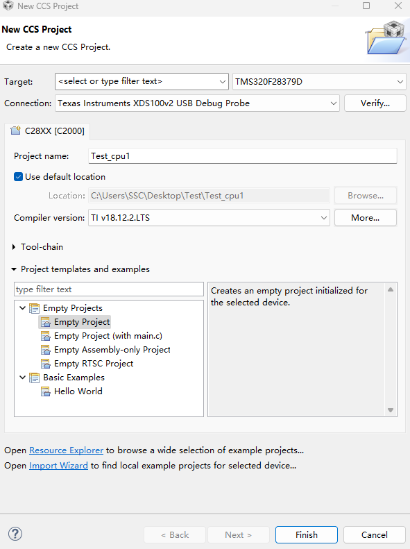
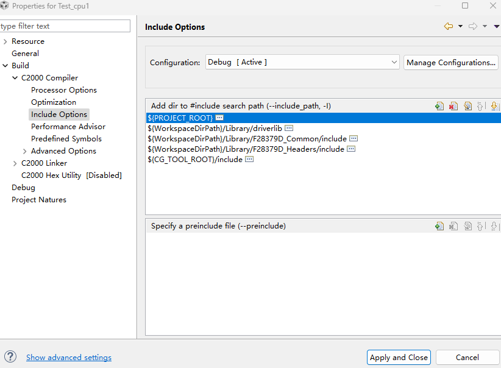
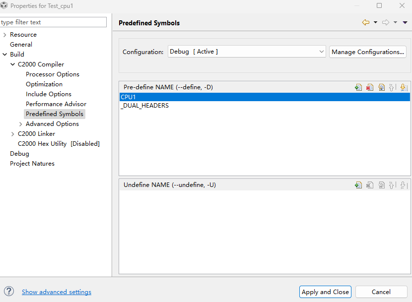
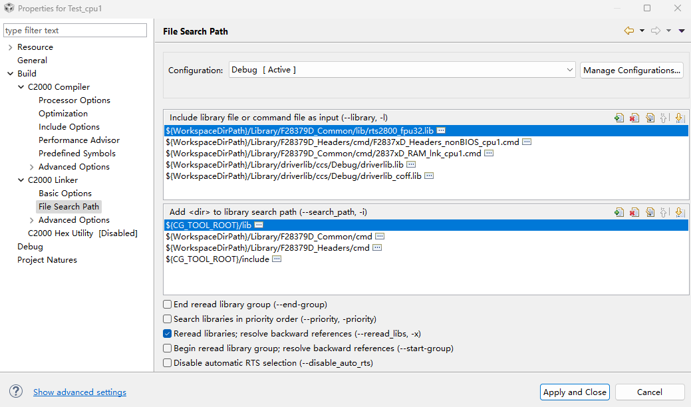
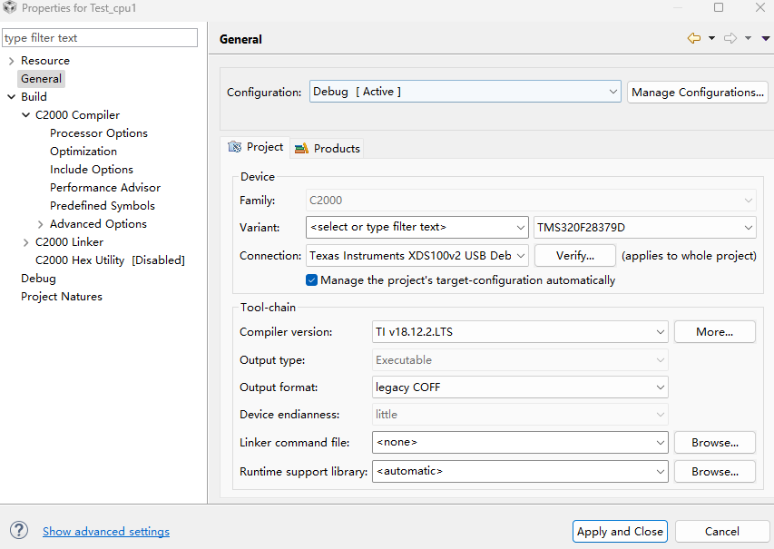
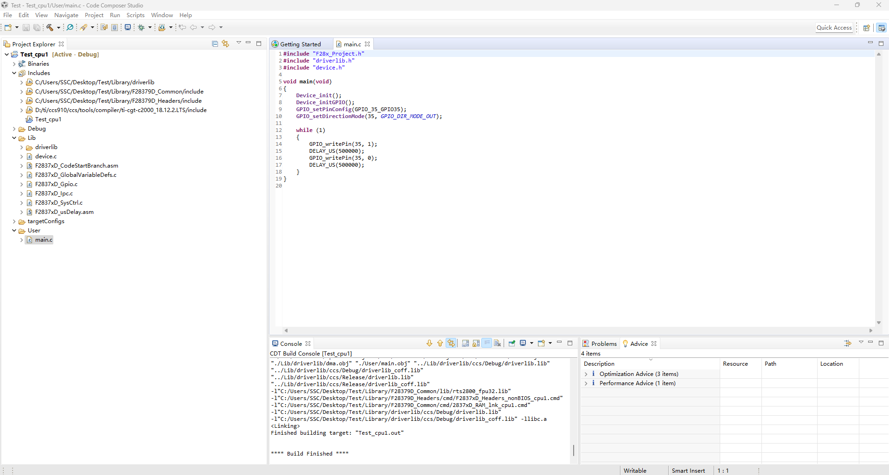
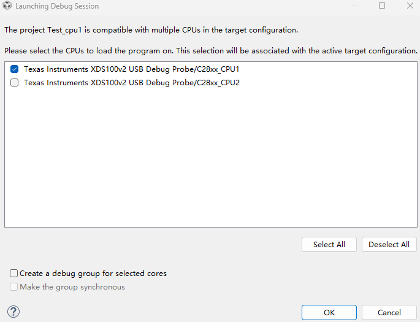

# DSP TI C2000 F28379D 1_环境配置和工程构建

## 1. CCS 环境配置

### CCS 软件下载

见 F28335 配置。

### C2000Ware 下载

C2000Ware 是 TI C2000 的支持工具，内部包含了各个 C2000 系列的代码支持库。


## 2. CCS工程模板创建和介绍

### Library 介绍

```
.
|-- F28379D_Common	
	|-- cmd
		|-- 2837xD_FLASH_lnk_cpu1.cmd
		|-- 2837xD_FLASH_lnk_cpu2.cmd
		|-- 2837xD_RAM_lnk_cpu1.cmd
		|-- 2837xD_RAM_lnk_cpu2.cmd
	|-- include
	|-- lib
	|-- source
|-- F28379D_Headers
	|-- cmd
	|-- include
	|-- source
|-- driverlib
```

> - `F28379D_Common` 文件夹：存放了 F28379D 开发所需的外设、内核、DSP
>
>   运算库、CMD 等文件。
>
>   > - `cmd` 文件夹：存放了 DSP 内 RAM 和 FLASH 存储地址和容量的分配启动文件。由于 F28379D 是双 CPU，所以每个文件都分为 CPU1 文件和 CPU2 文件。
>   >
>   > > - `2837xD_RAM_lnk_cpu1.cmd`/`2837xD_RAM_lnk_cpu2.cmd` 文件：该文件通常用于仿真调试，一般情况下直接用 TI 给的，不需要做修改即可满足调试用，模式较固定，当然也可以做相应的修改用到哪块 RAM 存储空间，在 CMD 文件里做相应的分配即可。（使用该文件断电后不保存程序）
>   > > - `2837xD_FLASH_lnk_cpu1.cmd`/`2837xD_FLASH_lnk_cpu2.cmd` 文件：该文件通常用于 FLASH 烧写，而编写用于 FLASH 烧写的文件相对来说较复杂些，根据不同的情况需要做一些修改，TI 提供的这个文件也已经写好，一般的开发也无需改动。（使用该文件后断电保存程序）
>   > > - **工程中仅需要两个文件中的一个**。
>   >
>   > - `include` 文件夹：该文件夹用于存放 F28379D 通用文件的头文件。比如中断、全局变量及函数声明、IQmath 库等。
>   > - `lib` 文件夹：该文件夹用于存放 F28379D 运算库文件。比如 `IQmath.lib`、`rts2800_ml.lib` 等，通常使用的主要是 `IQmath.lib`。
>   > - source 文件夹：该文件夹用于存放 F28379D 内核、外设驱动的源文件。比如`DSP2833x_Adc.c` 、 `DSP2833x_CpuTimers.c `、 `DSP2833x_Gpio.c` 、`DSP2833x_usDelay.asm` 等。
>
> - `F28379D_Headers` 文件夹：存放了 F28379D 开发所需的外设头文件、带和不带 BIOS CMD 等文件。
>
>   > - `cmd`文件夹：存放了 BIOS 和 nonBIOS 文件，也是对 DSP 内 RAM 和 FLASH 存储地址和容量的分配启动文件。在程序开发过程中，如果不使用 BIOS 操作系统，在仿真调试程序时，对 DSP 内 RAM 和 FLASH 存储地址和容量的分配启动文件只需要 `2837xD_RAM_lnk_cpux.cmd` 和`F2837xD_Headers_nonBIOS_cpux.cmd` 这两个。当程序仿真调试成功后，我们需要将其烧写到芯片内 FLASH 中，所以工程内存储地址和容量的分配启动文件就需要`2837xD_FLASH_lnk_cpux.cmd` 和 `F2837xD_Headers_nonBIOS_cpux.cmd` 这两个。如果在 DSP 中移植了操作系统那么就需要使用`F2837xD_Headers_BIOS_cpux.cmd` 文件。**工程中仅需要两个文件中的一个**。
>     > - `include` 文件夹
>   > - `source` 文件夹：该文件夹内存放了 `F2837xD_GlobalVariableDefs.c` 文件，里面主要是一些全局变量及条件编译等。
>   
> - `driverlib` 文件夹：存放了 F28379D 开发的库函数（相当于HAL库）。`driverlib` 在`\ti\c2000\C2000Ware_5_04_00_00\driverlib` 位置，直接复制到 Library 即可。
>
>   > - `ccs` 文件夹：`driverlib` 运行库，保留 `driverlib.lib` 和`driverlib_coff.lib` 。
>   > - `inc` 文件夹：`driverlib` 头文件。
>   > - 各种库函数。

### 工程构建

**典型的 F2837xD 应用程序由两个独立的 CCS 项目组成：一个用于 CPU1，一个用于 CPU2。这两个项目是完全独立的，就 CCS 而言，它们之间没有真正的联系。**

- 新建工程

  
  
- 添加头文件包含

  ```
  ${WorkspaceDirPath}/Library/driverlib
  ${WorkspaceDirPath}/Library/F28379D_Common/include
  ${WorkspaceDirPath}/Library/F28379D_Headers/include
  ```

  

  > `driverlib` 使用库函数必须添加，使用寄存器可不添加。

- 添加预定义选项

  ```
  CPU1 			// 选择运行的 CPU
  _DUAL_HEADERS 	// driverlib 预定义
  ```

  

- 添加运行库/CMD文件

  ```
  ${WorkspaceDirPath}/Library/F28379D_Common/lib/rts2800_fpu32.lib 					\\ 运行库
  ${WorkspaceDirPath}/Library/F28379D_Headers/cmd/F2837xD_Headers_nonBIOS_cpu1.cmd 	\\ CPU1 无操作系统
  ${WorkspaceDirPath}/Library/F28379D_Common/cmd/2837xD_RAM_lnk_cpu1.cmd 				\\ CPU1 RAM
  ${WorkspaceDirPath}/Library/driverlib/ccs/Debug/driverlib.lib 						\\ driverlib
  ${WorkspaceDirPath}/Library/driverlib/ccs/Debug/driverlib_coff.lib 					\\ driverlib
  ```

  ```
  ${WorkspaceDirPath}/Library/F28379D_Common/cmd
  ${WorkspaceDirPath}/Library/F28379D_Headers/cmd
  ```

  


- Linker Command File 改为 `<none>`。

  

- 添加以下文件

  ```
  F28379D_common\source\F2837xD_CodeStartBranch.asm
  F28379D_common\source\F2837xD_usDelay.asm
  F28379D_common\source\F2837xD_SysCtrl.c
  F28379D_common\source\F2837xD_Gpio.c
  F28379D_common\source\F2837xD_Ipc.c
  F28379D_Common\source\device.c			// driverlib 必要
  F28379D_headers\source\F2837xD_GlobalVariableDefs.c
  driverlib
  ```

- 添加 `main.c`

  ```c
  #include "F28x_Project.h"
  #include "driverlib.h"
  #include "device.h"
  
  void main(void)
  {
      Device_init();
      Device_initGPIO();
      GPIO_setPinConfig(GPIO_35_GPIO35);
      GPIO_setDirectionMode(35, GPIO_DIR_MODE_OUT);
  
      while (1)
      {
          GPIO_writePin(35, 1);
          DELAY_US(500000);
          GPIO_writePin(35, 0);
          DELAY_US(500000);
      }
  }
  ```

  

- 编译完成后，RAM 烧录时选择 CPU 选项

  

  代码正常运行，环境配置完成。
