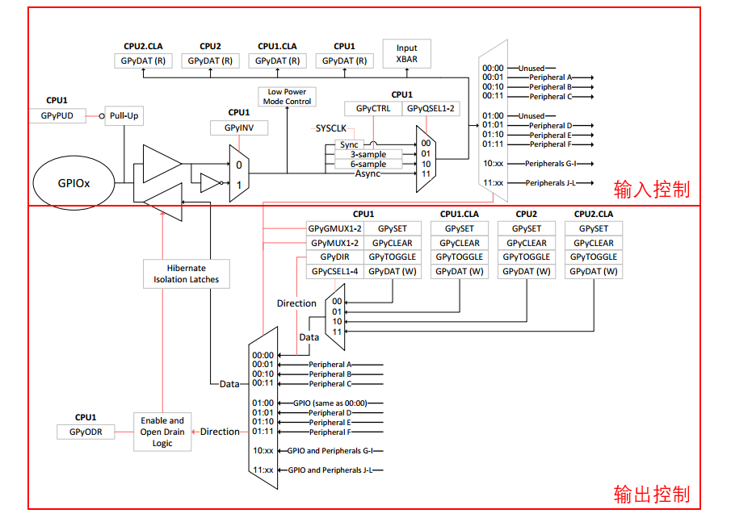
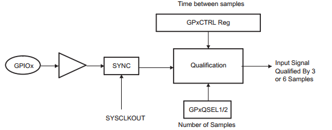
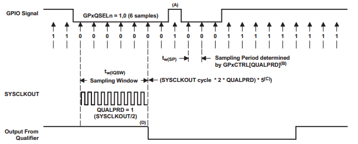
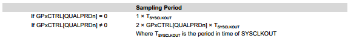

# DSP TI C2000 F28379D 2_GPIO

## 1. GPIO 简介

除了 CPU 控制的 I/O 功能外，单个 GPIO 引脚上可复用多达 12 个独立的外设信号。每个引脚输出可由外设或四个 CPU （CPU1、CPU1.CLA、CPU2 或 CPU2.CLA）之一控制。共有六个 I/O 端口：

| 端口  | GPIO引脚        |
| ----- | --------------- |
| GPIOA | GPIO0-GPIO31    |
| GPIOB | GPIO32-GPIO63   |
| GPIOC | GPIO64-GPIO95   |
| GPIOD | GPIO96-GPIO127  |
| GPIOE | GPIO128-GPIO159 |
| GPIOF | GPIO160-GPIO168 |

GPIO 框图如下：



> 外设复用远离引脚。因此，CPU 和 CLA 始终可以读取引脚的物理状态，而不受 CPU 主控和外设复用的影响。
>
> 输入限定和开漏输出等所有引脚选项对所有主设备和外设都有效。不过，外设复用、CPU 复用和引脚选项只能由 CPU1 配置。

- GPIO 配置流程

  1. 规划设备引脚布局：列出应用所需的所有外设。使用设备数据手册中的外设复用器信息，选择哪些 GPIO 用于外设信号。决定将其余 GPIO 中的哪些用作每个 CPU 和 CLA 的输入和输出。

     选择外设复用后，应通过向 `GPyMUX1/2` 和 `GPyGMUX1/2` 寄存器写入适当的值来实现。更改引脚的 `GPyGMUX` 值时，应首先将相应的 `GPyMUX` 位设置为零(先改高位，再改低位)。默认情况下，所有引脚均为通用 I/O，而非外设信号。

  2. 启用内部上拉电阻器：要启用或禁用上拉电阻器，写入 GPIO 上拉禁用寄存器 `GPyPUD` 中的相应位。所有上拉电阻默认为禁用。当没有外部信号驱动输入引脚时，上拉电阻可用于将其保持在已知状态。

  3. 选择输入限定：如果引脚将用作输入，请指定所需的输入限定（如果有）。输入限定采样周期在 `GPyCTRL` 寄存器中选择，限定定类型则在 `GPyQSEL1` 和 `GPyQSEL2` 寄存器中选择。默认情况下，所有限定均为同步限定，采样周期等于 `PLLSYSCLK`。

  4. 选择任何通用 I/O 引脚的方向。

- GPIO 输出控制

  使用 `GPyDAT` 寄存器可以直接指定某一个 GPIO 引脚的状态。使用中，更加推荐使用 `GPySET` / `GPyCLEAR` / `GPyToggle` 寄存器进行输出配置。

- GPIO 输入限定

  通过配置 `GPyQSEL1` 和 `GPyQSEL2` 寄存器，为每个 GPIO 引脚选择输入鉴定类型。对于 GPIO 输入引脚，可指定仅与 `SYSCLKOUT` 同步或通过采样窗口限定。对于配置为外设输入的引脚，除了与 `SYSCLKOUT `同步或通过采样窗口限定外，输入还可以是异步的。

  - 异步输入

    该模式用于不需要输入同步或由外设本身执行同步的外设。例如通信端口 `McBSP`、`SCI`、`SPI` 和 `I2C`。此外，`ePWM` 断路 (`TZn`) 信号的功能可能需要独立于 `SYSCLKOUT` 的存在。

    如果引脚用作通用数字输入引脚 (GPIO)，则异步选项无效。

  - 与 `SYSCLKOUT` 同步

    所有引脚在复位时的默认限定模式。在该模式下，输入信号仅与系统时钟（`SYSCLKOUT`）同步。由于输入信号是异步的，因此 MCU 的输入**可能需要一个 `SYSCLKOUT` 周期的延迟才能发生变化**。对信号不再进行进一步限定。

  - 使用采样窗口限定(输入滤波器)

    

    

    信号首先与系统时钟`SYSCLKOUT`同步，然后在输入发生变化之前经过指定周期数的鉴定。该操作可以用来消除尖刺噪声。

    输入限定有两个参数： 采样周期以及采样次数。采样周期由 `GPxCTRL` 寄存器中的限定周期 `QUALPRDn` 位指定。

    

    信号的采样次数为三个采样周期或六个采样周期，具体取样次数在`GPAQSEL1`、`GPAQSEL2`、`GPBQSEL1` 和 `GPBQSEL2` 寄存器中指定。当三个或六个连续周期的采样值相同时，输入变化将传递给 MCU。要使输入限定器检测到输入信号的变化，信号电平必须在采样窗口宽度或更长的时间内保持稳定。

## 2. GPIO 库函数

以下为 Driverlib 库函数：

```C
/**
 * @brief	GPIO 读取电平
 * @param	pin  引脚号
 */
uint32_t GPIO_readPin(uint32_t pin);

/**
 * @brief	GPIO 输出电平
 * @param	pin  	引脚号
 * @param	outVal	输出高低电平值
 */
void GPIO_writePin(uint32_t pin, uint32_t outVal);

/**
 * @brief	GPIO 翻转电平
 * @param	pin  	引脚号
 */
void GPIO_togglePin(uint32_t pin);

/**
 * @brief	GPIO 设置方向
 * @param	pin  	引脚号
 * @param	pinIO	引脚方向: GPIO_DIR_MODE_IN/GPIO_DIR_MODE_OUT
 */
void GPIO_setDirectionMode(uint32_t pin, GPIO_Direction pinIO);

/**
 * @brief	GPIO 设置输入限定
 * @param	pin  			引脚号
 * @param	qualification	输入限定: GPIO_QUAL_SYNC/GPIO_QUAL_3SAMPLE/GPIO_QUAL_6SAMPLE/GPIO_QUAL_ASYNC
 */
void GPIO_setQualificationMode(uint32_t pin, GPIO_QualificationMode qualification);

/**
 * @brief	GPIO 设置输入采样周期
 * @param	pin  		引脚号
 * @param	divider		时钟分频
 */
void GPIO_setQualificationPeriod(uint32_t pin, uint32_t divider);

/**
 * @brief	GPIO 设置引脚复用
 * @param	pinConfig  		引脚复用设置(见pin_map.h宏定义配置)
 */
void GPIO_setPinConfig(uint32_t pinConfig);
```

