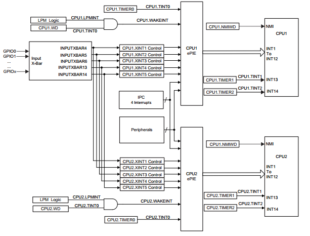
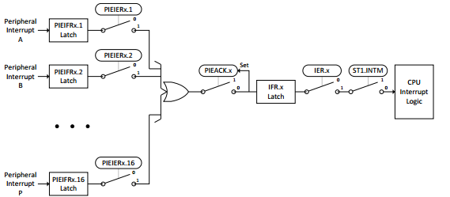
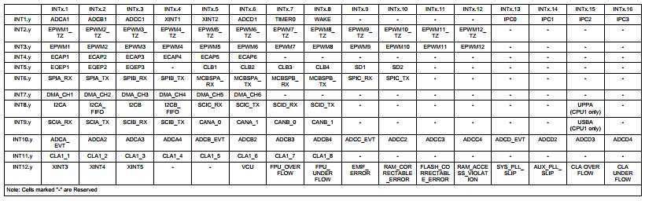
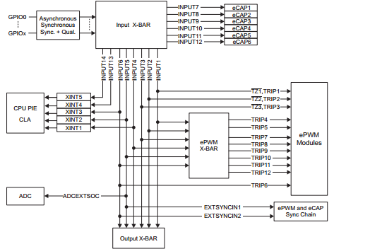

# DSP TI C2000 F28379D 3_中断系统

## 1. 中断系统

F28379D 的中断系统框图如下：



每一个 CPU 有 14 条外设中断线路。其中两条(INT13 和 INT14)分别直接连接到 CPU Timer 1/2。其余十二条通过增强型外设中断扩展模块 PIE 与外设中断信号相连。PIE 最多可将十六个外设中断复用到每个 CPU 中断线路中。它还扩展了向量表，使每个中断都有自己的 ISR。这样，CPU 就能支持大量外设。

中断路径分为三个阶段 —— 外设、PIE 和 CPU。每个阶段都有自己的使能寄存器和标志寄存器。该系统允许 CPU 在其他中断待处理时处理一个中断，在软件中实现嵌套中断并确定其优先级，以及在某些关键任务期间禁用中断。（参考 F28335 中断）

> 1. 外设阶段
>
>    每个外设都有自己独特的中断配置。有些外设允许多个事件触发同一个中断信号。例如，通信外设可能使用同一个中断来表示已收到数据或出现传输错误。可以通过读取外设的状态寄存器来确定中断原因。通常情况下，**必须手动清除状态寄存器中的位，才会产生另一个中断**。
>
> 2. PIE 阶段
>
>    PIE 为每个外设中断信号 (PIE 通道) 提供单独的标志和使能寄存器位。这些通道根据其相关的 CPU 中断进行分组。每个 PIE 组有一个 16 位使能寄存器（`PIEIERx`）、一个 16 位标志寄存器（`PIEIFRx`）和 PIE 确认寄存器（`PIEACK`）中的一个位。`PIEACK` 寄存器位是整个 PIE 组的通用中断屏蔽位。
>
>    CPU 接收到中断时，会从 PIE 中获取 ISR 的地址。PIE 会返回组内最低编号通道的向量，该通道既被标记又被启用。这样，当有多个中断等待处理时，**编号较低的中断就有更高的优先级**。
>
> 3. CPU 阶段
>
>    CPU 为每个中断提供标志和使能寄存器位。有一个使能寄存器（`IER`）和一个标志寄存器（`IFR`），这两个寄存器都是 CPU 内部寄存器。此外，还有一个全局中断掩码，由 ST1 寄存器中的 `INTM` 位控制。可以使用 CPU 的 `SETC` 指令设置和清除该掩码。在 C 代码中，controlSUITE 的 `DINT` 和 `EINT` 宏也可用于此目的。
>
>    对 `IER` 和 `INTM` 的写入是原子操作。特别是，如果 `INTM` 被清零，流水线中的下一条指令将在中断被禁用的情况下运行。无需软件延迟。
>
> 4. 双核处理
>
>    **每个 CPU 都有自己的 PIE。两个 PIE 必须独立配置。**
>
>    有些中断来自共享外设，可由任一 CPU 拥有，如 ADC 和 SPI。**无论外设的所有权归属如何，这些中断都会发送到两个 PIE。**因此，如果一个 CPU 拥有的外设在另一个 CPU 的 PIE 中启用了中断，那么该外设就会在另一个 CPU 上引起中断。
>
>
> 以下为中断过程示意图：
>
> 
>
> > 当外设产生中断时（在 PIE 组 x 通道 y 上），会触发以下一系列事件：
> >
> > 1. 中断被锁存到 `PIEIFRx.y` 中。
> > 2. 如果 `PIEIERx.y` 被设置，则中断传递。
> > 3. 如果 `PIEACK.x` 清除为 0，中断传递，`PIEACK.x` 置位。
> > 4. 中断被锁存于 `IFR.x`。
> > 5. 如果 `IER.x` 置位，中断传递。
> > 6. 如果 `INTM` 清除，CPU 接收中断。
> > 7. 流水线 D2 或更后阶段的任何指令都将运行完成。早期阶段的指令被刷新。CPU 将其上下文保存在堆栈中。
> > 8. `IFR.x` 和 `IER.x` 被清零。`INTM` 置位。`EALLOW` 清除。
> > 9. CPU 从 PIE 获取 ISR 向量。`PIEIFRx.y` 被清零。
> > 10. CPU 切换到 ISR。

中断启用的配置如下：

> 1. 全局禁用中断（`DINT` 或 `SETC INTM`）。
>
> 2. 通过设置 `PIECTRL` 寄存器的 `ENPIE` 位启用 PIE。
>
> 3. 将每个中断的 ISR 向量写入 PIE 向量表中的相应位置。
>
> 4. 为每个中断设置相应的 `PIEIERx` 位。
>
> 5. 为任何包含已启用中断的 PIE 组设置 CPU `IER` 位。
>
> 6. 启用外设中的中断。
>
> 7. 全局启用中断（`EINT` 或 `CLRC INTM`）。
>
> 

中断处理如下：

> ISR 与正常功能类似，但必须执行以下操作： 
>
> 1. 保存和恢复某些 CPU 寄存器的状态（如果使用）。
>
> 2. 清除中断组的 `PIEACK` 位。
>
> 3. 使用 `IRET` 指令返回。
>
> 如果使用 `__interrupt` 关键字定义函数，编译器将自动处理要求 1 和 3。

## 2. X-BAR 和外部引脚中断

### X-BAR 交叉开关模块

X-BAR 提供了以各种配置连接设备输入、输出和内部资源的灵活性。

一共有四个 X-BAR：输入 X-BAR、输出 X-BAR、CLB X-BAR 和 ePWM X-BAR。每个 X-BAR 都根据其接收信号的位置来命名。例如，输入 X-BAR 将外部信号输入到设备。输出 X-BAR 将内部信号 输出到 GPIO。CLB X-BAR 和 ePWM X-BAR 分别将信号传送到 CLB 和 ePWM 模块。这里介绍输入 X-BAR。

输入 X-BAR 用于将信号从 GPIO 路由到许多不同的 IP 模块，如 ADC、eCAP、ePWM 和外部中断。

输入 X-BAR 可以访问每个 GPIO，并将每个信号路由到前面提到的任何（或多个）IP 模块。输入 X-BAR 上还提供 AIO 的数字输入。这种灵活性减轻了外设复用的一些限制，只需任何 GPIO 引脚可用即可。

需要注意的是，在 GPIO 复用器上选择的功能不会影响输入 X-BAR。**输入 X-BAR 只是将输入缓冲器上的信号连接到所选目标。**因此，可以将一个外设的输出信号路由到另一个外设（即使用 eCAP 测量 ePWM 的输出信号，以进行频率测试）。



### 外部引脚中断

以下是使用 driverlib 的示例：

```c
#include "device.h"
#include "driverlib.h"
#include "F28x_Project.h"

interrupt void xint1_isr(void);

void main(void) {
    Device_init();                  // init system
    Device_initGPIO();              // init GPIO
    Interrupt_initModule();         // init Interrupt
    Interrupt_initVectorTable();    // init VectorTable

    // set interrupt
    Interrupt_register(INT_XINT1, &xint1_isr);	// 注册向量表
    Interrupt_enable(INT_XINT1);				// 使能 PIE 中断
    EINT;										// 使能全局中断

    // Set GPIO
    // GPIO35 输出
    GPIO_setPinConfig(GPIO_35_GPIO35);
    GPIO_setDirectionMode(35, GPIO_DIR_MODE_OUT);
    GPIO_setPadConfig(35, GPIO_PIN_TYPE_PULLUP);

    // GPIO79 输入
    GPIO_setPinConfig(GPIO_79_GPIO79);
    GPIO_setDirectionMode(79, GPIO_DIR_MODE_IN);
    GPIO_setQualificationMode(79, GPIO_QUAL_6SAMPLE);
    GPIO_setQualificationPeriod(79, 510);
    GPIO_setPadConfig(79, GPIO_PIN_TYPE_PULLUP);

    // Set X-BAR
    // XINT1 连接 INPUT4 线，连接 INPUT4 到 GPIO79
    XBAR_setInputPin(XBAR_INPUT4, 79);

    // XINT1 配置，下降沿中断
    GPIO_setInterruptType(GPIO_INT_XINT1, GPIO_INT_TYPE_FALLING_EDGE);
    // 使能外部引脚中断
    GPIO_enableInterrupt(GPIO_INT_XINT1);

    while(1)
    {
        ;
    }
}


interrupt void xint1_isr(void)
{
    GPIO_togglePin(35);
    // 清理 PIE Group1
    Interrupt_clearACKGroup(INTERRUPT_ACK_GROUP1);
}

```


