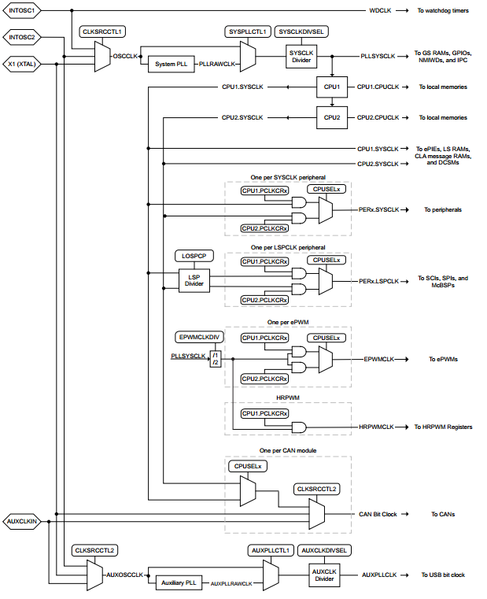
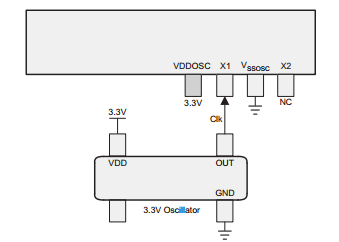
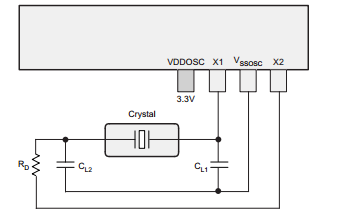
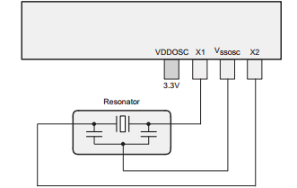
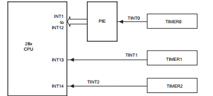

# DSP TI C2000 F28379D 4_CPU Timer

## 1. 系统时钟

F28379D 的时钟系统如下图所示：




- 时钟源

  - 主内部振荡器(INT OSC2)

    主内部振荡器 (INTOSC2) 开机时，设备由片上 10 MHz 振荡器 (INTOSC2) 提供时钟。INTOSC2 是主内部时钟源，也是复位时的默认系统时钟。它用于运行引导 ROM，也可用作应用程序的系统时钟源。请注意，INTOSC2 的频率容差太小，无法满足 CAN 和 USB 的时序要求，因此必须使用外部时钟来支持这些功能。

  - 备用内部振荡器(INT OSC1)

    器件还包括一个冗余的片上 10 MHz 振荡器 (INTOSC1)。INTOSC1 是一个备用时钟源，通常只为看门狗定时器和时钟丢失检测电路 (MCD) 提供时钟。如果启用 MCD 并检测到系统时钟丢失，系统 PLL 将被旁路，所有系统时钟将自动连接到 INTOSC1。也可手动选择 INTOSC1 作为系统和辅助时钟源用于调试。
    
  - 外部振荡器(XTAL)
    
    专用 X1 和 X2 引脚支持外部时钟源 (XTAL)，可用作主系统时钟源和辅助时钟源。
    
    支持以下三种接法：
    
    > 1. 单端 3.3V 外部时钟
    >
    >    
    >
    > 2. 外部晶振
    >
    >    
    >
    > 3. 外部谐振器
    >
    >    
    
  - 辅助时钟输入 (AUXCLKIN) 
    
    GPIO133 (AUXCLKIN) 支持额外的外部时钟源。它必须是单端 3.3V 外部时钟。它可用作 USB 和 CAN 时钟源。
  
- 时钟生成

  **振荡器时钟(OSCCLK)**：必须从 INTOSC2、XTAL 或 INTOSC1 中选择一个作为 CPU 和大多数外设的主参考时钟 (OSCCLK)。OSCCLK 可以直接使用，也可以通过系统 PLL 来达到更高的频率。复位时，OSCCLK 为默认系统时钟，并连接至 INTOSC2。

  **系统 PLL 输出时钟 (PLLRAWCLK)**： 系统 PLL 允许器件以最大额定工作频率运行，在大多数应用中会产生主系统时钟。该 PLL 使用 OSCCLK 作为基准，具有分数乘法器和滑差检测功能。

  **辅助振荡器时钟 (AUXOSCCLK)**； 可从 INTOSC2、XTAL 或 AUXCLKIN 中选择一个作为 USB 模块的辅助参考时钟 (AUXOSCCLK)。(该选择不会影响 CAN 位时钟，后者直接使用 AUXCLKIN）。AUXOSCCLK 可直接使用，也可通过辅助 PLL 提供更高频率。复位时，AUXOSCCLK 连接到 INTOSC2，但只有外部振荡器才能满足 USB 时序要求。

  **辅助 PLL 输出时钟 (AUXPLLRAWCLK)**: 辅助 PLL 用于为 USB 模块生成 60 MHz 的时钟。


- 时钟配置

  如果需要 CAN 或 USB，则必须使用频率精确的外部时钟源作为参考时钟。否则，可以只使用 INTOSC2，而无需更多外部元件。

  - PLL 设置

    每个 PLL 有两个设置需要配置，即乘法器和除法器。
    $$
    f_{PLL\_SYSCLK} = f_{OSCCLK} \times \frac{SYSPLLMULT.IMULT + SYSPLLMULT.FMULT}{SYSCLKDIVSEL.PLLSYSCLKDIV}
    $$

    $$
    f_{AUX\_PLLCLK} = f_{AUX\_OSCCLK}\times\frac{AUXPLLMULT.IMULT + AUXPLLMULT.FMULT}{AUXCLKDIVSEL.PLLSYSCLKDIV}
    $$

    其中，$f_{OSCCLK}$ 是系统振荡器时钟频率，$f_{AUX_OSCCLK}$ 是辅助振荡器时钟频率，`IMULT` 和 `FMULT` 是乘法器的积分和分数部分，`PLLSYSCLKDIV` 是系统时钟分频器，`AUXPLLDIV` 是辅助时钟分频器。

    两个 CPU 共享时钟源和 PLL 配置寄存器。

- driverlib 内的时钟配置

  driverlib 的时钟配置在 `Device_Init()` 函数内完成：

  ```c
  void Device_init(void)
  {
      ...
      SysCtl_setClock(DEVICE_SETCLOCK_CFG);
      ...
  }
  ```

  只需要关注宏定义 `DEVICE_SETCLOCK_CFG` (`device.h`)：

  ```c
  //
  // Define to pass to SysCtl_setClock(). Will configure the clock as follows:
  // PLLSYSCLK = 20MHz (XTAL_OSC) * 20 (IMULT) * 1 (FMULT) / 2 (PLLCLK_BY_2)
  //
  #define DEVICE_SETCLOCK_CFG         (SYSCTL_OSCSRC_XTAL | SYSCTL_IMULT(20) |  \
                                       SYSCTL_FMULT_NONE | SYSCTL_SYSDIV(2) |   \
                                       SYSCTL_PLL_ENABLE)
  ```

  可以看到 SYSCLK 被配置为 200MHz。剩余的定义自行查看。

## 2. CPU Timer

CPU-Timer0 和 CPU-Timer1 可用于用户应用程序。CPU-Timer2 专用于实时操作系统（如 TI-RTOS）。如果应用程序没有使用使用该定时器的操作系统，则可以在应用程序中使用 CPU-Timer2。CPU-Timer0 和 CPU-Timer1 依靠 SYSCLK 运行。CPU-Timer2 通常通过 SYSCLK 运行，但也可以使用 INTOSC1、INTOSC2、XTAL 和 AUXPLLCLK。



CPU 定时器的运行如下：32 位计数寄存器 `TIMH:TIM` 加载周期寄存器 `PRDH:PRD` 中的值， 计数器每（`TPR[TDDRH:TDDR]`+1）个 SYSCLKOUT 周期递减一次，其中 `TDDRH:TDDR` 为定时器分频器。当计数器达到 0 时，定时器中断输出信号将产生一个中断脉冲。

- driverlib 库函数

  ```c
  /**
    * @brief	配置 CPU_Timer 时钟周期
    * @param	base		CPU_Timer 基地址	CPUTIMERx_BASE
    * @param  periodCount	周期寄存器值
    */
  static inline void CPUTimer_setPeriod(uint32_t base, uint32_t periodCount);
  
  /**
    * @brief	配置 CPU_Timer 时钟分频器
    * @param	base		CPU_Timer 基地址	CPUTIMERx_BASE
    * @param  prescaler	分频器值
    */
  static inline void CPUTimer_setPreScaler(uint32_t base, uint16_t prescaler);
  
  /**
    * @brief	停止 CPU_Timer 
    * @param	base		CPU_Timer 基地址	CPUTIMERx_BASE
    */
  static inline void CPUTimer_stopTimer(uint32_t base);
  
  /**
    * @brief	重载 CPU_Timer 计数寄存器
    * @param	base		CPU_Timer 基地址	CPUTIMERx_BASE
    */
  static inline void CPUTimer_reloadTimerCounter(uint32_t base);
  
  /**
    * @brief	使能 CPU_Timer 更新中断
    * @param	base		CPU_Timer 基地址	CPUTIMERx_BASE
    */
  static inline void CPUTimer_enableInterrupt(uint32_t base);
  ```

  以下是一个例子，配置 CPU_Timer0 进行 1Hz 中断

  ```c
  #include "device.h"
  #include "driverlib.h"
  #include "F28x_Project.h"
  
  __interrupt void cpuTimer0_ISR(void);
  
  void initCPUTimer(void);
  void configCPUTimer(uint32_t cpuTimer, float freq, float period);
  
  void main()
  {
      Device_init();
  
      // GPIO init
      Device_initGPIO();
      GPIO_setPinConfig(GPIO_35_GPIO35);
      GPIO_setDirectionMode(35, GPIO_DIR_MODE_OUT);
      GPIO_setPadConfig(35, GPIO_PIN_TYPE_PULLUP);
  
      // PIE and PIE vector init
      Interrupt_initModule();
      Interrupt_initVectorTable();
  
      // CPU Timer init
      Interrupt_register(INT_TIMER0, &cpuTimer0_ISR);
      initCPUTimer();
      configCPUTimer(CPUTIMER0_BASE, DEVICE_SYSCLK_FREQ, 1000000);
      CPUTimer_enableInterrupt(CPUTIMER0_BASE);
      Interrupt_enable(INT_TIMER0);
      CPUTimer_startTimer(CPUTIMER0_BASE);
      EINT;
      ERTM;
  
      while(1)
      {
          ;
      }
  }
  
  __interrupt void cpuTimer0_ISR(void)
  {
      GPIO_togglePin(35);
      Interrupt_clearACKGroup(INTERRUPT_ACK_GROUP1);
  }
  
  void initCPUTimer(void)
  {
      // Set Max Period
      CPUTimer_setPeriod(CPUTIMER0_BASE, 0xFFFFFFFF);
      // Set Prescaler 0
      CPUTimer_setPreScaler(CPUTIMER0_BASE, 0);
      // Stop Timer
      CPUTimer_stopTimer(CPUTIMER0_BASE);
      // Reload Counter
      CPUTimer_reloadTimerCounter(CPUTIMER0_BASE);
  }
  
  /**
   * @brief   initializes the selected timer
   * @param   freq    entered as Hz
   * @param   period  uSeconds
   */
  void configCPUTimer(uint32_t cpuTimer, float freq, float period)
  {
      uint32_t temp;
      temp = (uint32_t)(freq / 1000000 * period);
      CPUTimer_setPeriod(cpuTimer, temp);
      CPUTimer_setPreScaler(cpuTimer, 0);
      CPUTimer_stopTimer(cpuTimer);
      CPUTimer_reloadTimerCounter(cpuTimer);
      // Set Emulation Mode
      CPUTimer_setEmulationMode(cpuTimer, CPUTIMER_EMULATIONMODE_STOPAFTERNEXTDECREMENT);
      // Enable interrupt
      CPUTimer_enableInterrupt(cpuTimer);
  }
  ```

  